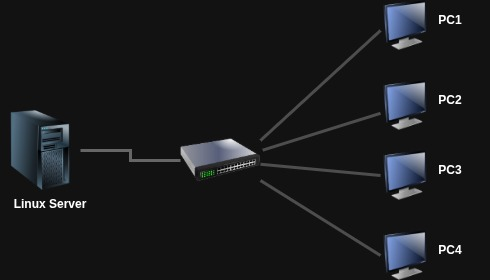

<h1 align="center">Guia de Administração de Sistemas Linux</h1>

<p align="center">
  <em>Um guia prático e progressivo de administração de sistemas Linux, do primeiro arranque à gestão de serviços de rede, com laboratórios e soluções.</em>
</p>

<p align="center">
  
  
  
  
  
</p>

---

## 📌 Sobre o projecto

Este repositório reúne um **guia completo de administração de sistemas Linux**, escrito em português e orientado à prática. Cobre o percurso de um administrador de sistemas desde os fundamentos — o que é um sistema operativo, como instalar e virtualizar — até temas avançados de produção: gestão de utilizadores, processos, scripting, redes, serviços, segurança e armazenamento.

O guia usa o **CentOS Stream** como distribuição de referência (a mesma linhagem do Red Hat Enterprise Linux), e cada bloco teórico é acompanhado de **laboratórios práticos** desenhados para correr em máquinas virtuais, com **soluções explicadas**.

> 👉 Para a navegação completa de todos os temas e secções, consulte o **[Índice Geral (`INDICE.md`)](INDICE.md)**.

---

## 📚 O que inclui

- **📖 Guia teórico** — 8 capítulos em `docs/`, cada um com explicações, exemplos de terminal e boas práticas.
- **🧪 Laboratórios** — 6 conjuntos de exercícios práticos em `labs/`, um por capítulo técnico (Caps. 3–8).
- **✅ Soluções** — resoluções explicadas, passo a passo e com capturas de ecrã, em `labs/solucoes/`.

---

## 🗺️ Mapa de capítulos

| Nº | Capítulo | Temas-chave | Laboratório |
|----|----------|-------------|:-----------:|
| 1 | [Compreensão do Ecossistema Linux](docs/01-introducao.md) | SO, kernel, história Unix/Linux, distribuições, CentOS/RHEL, carreiras | — |
| 2 | [Instalação e Virtualização](docs/02-instalacao-virtualizacao.md) | Virtualização, hypervisors, KVM/Virt-Manager, instalação do CentOS | — |
| 3 | [Acesso ao Sistema e Estrutura de Ficheiros](docs/03-acesso-ao-sistema-e-estrutura-de-ficheiros.md) | root, `su`/`sudo`, FHS, navegação, ficheiros, wildcards, `find`, pacotes | [Lab 1](labs/lab-01-acesso-de-ficheiros.md) |
| 4 | [Fundamentos Operacionais e Manipulação de Dados](docs/04-fundamentos-operacionais-e-manipulacao-de-dados.md) | tipos de comando, `man`, permissões, `chmod`/`chown`, I/O, pipelines, `tar` | [Lab 2](labs/lab-02-fundamentos-operacionais.md) |
| 5 | [Administração de Sistemas Linux](docs/05-administracao-de-sistemas-linux.md) | `vi`/`sed`, contas e grupos, processos, sinais, `cron`/`at`, logs | [Lab 3](labs/lab-03-administracao-de-systemas.md) |
| 6 | [Automação com Shell Scripting](docs/06-shell-scripting.md) | scripts Bash, variáveis, condicionais, ciclos, funções, produtividade | [Lab 4](labs/lab-04-shell-scripting.md) |
| 7 | [Redes, Serviços e Segurança](docs/07-redes-servicos-e-seguranca.md) | rede e diagnóstico, SSH, DNS, DHCP, Apache, `firewalld`, SELinux | [Lab 5](labs/lab-05-redes-servicos-e-seguranca.md) |
| 8 | [Gestão de Armazenamento e Arranque](docs/08-gestao-de-armazenamento-e-boot.md) | arranque/`systemd`, partições, `fstab`, LVM, RAID, `dd`, NFS | [Lab 6](labs/lab-06-gestao-de-armazenamento-e-boot.md) |

---

## 🖥️ Ambiente de laboratório

Os laboratórios foram pensados para um ambiente de virtualização simples e reproduzível:

- **Distribuição:** CentOS Stream.
- **Máquinas:** pelo menos duas VMs — uma em **modo texto** (servidor) e uma com **interface gráfica** (estação de gestão). O Lab 5 usa uma topologia cliente-servidor simulada; quando só existe uma máquina, os exercícios podem ser feitos contra `localhost`.
- **Virtualização:** KVM + Virt-Manager (ver [Capítulo 2](docs/02-instalacao-virtualizacao.md)).

<p align="center">
  
</p>

---

## 🧭 Como usar este guia

1. **Lê o capítulo** em `docs/` correspondente ao tema.
2. **Faz o laboratório** associado em `labs/`, numa VM que possas usar livremente.
3. **Tenta resolver sozinho** antes de abrir a solução — o valor está no processo.
4. **Confirma na solução** em `labs/solucoes/` para perceber o que fizeste ou desbloquear.

> Dica: o **[Índice Geral](INDICE.md)** liga directamente a cada secção de cada capítulo.

---

## 🗂️ Estrutura do repositório

```
linux-admin-guide/
├── README.md          # este ficheiro
├── INDICE.md          # índice geral navegável
├── docs/              # os 8 capítulos do guia
│   ├── 01-introducao.md
│   ├── 02-instalacao-virtualizacao.md
│   └── ... (até 08)
├── labs/              # laboratórios práticos (Labs 1–6)
│   └── solucoes/      # soluções explicadas dos laboratórios
└── assets/
    └── img/           # imagens e capturas de ecrã
```

---

## ⌨️ Convenções de prompt

Ao longo do guia, os exemplos de terminal seguem uma convenção visual consistente que indica **quem está a executar o comando e em que máquina**:

| Prompt | Significado |
|--------|-------------|
| `$` | Utilizador comum numa sessão local |
| `#` | Superutilizador (root) numa sessão local |
| `servidor>` | Sessão activa numa máquina remota via SSH |

O símbolo do prompt **não faz parte do comando** e nunca deve ser copiado para o terminal. Por exemplo, em `$ ls -l /etc`, o comando real é apenas `ls -l /etc`.

Quando um exemplo começa com `#` ou é precedido de `sudo`, significa que a operação requer privilégios administrativos. A distinção importa: correr um comando errado como root pode ter consequências irreversíveis.

---

## 🚧 Estado do projecto

- ✅ **Guia** — 8 capítulos completos.
- ✅ **Laboratórios** — 6 laboratórios completos (Caps. 3–8).
- 🔄 **Soluções** — Lab 1 completa; restantes em desenvolvimento.

---

## 👤 Autor

**Pedro Tovela** — [@thove22](https://github.com/thove22)
