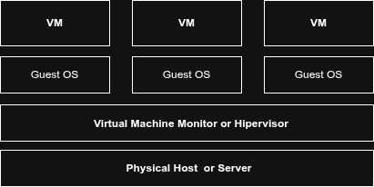
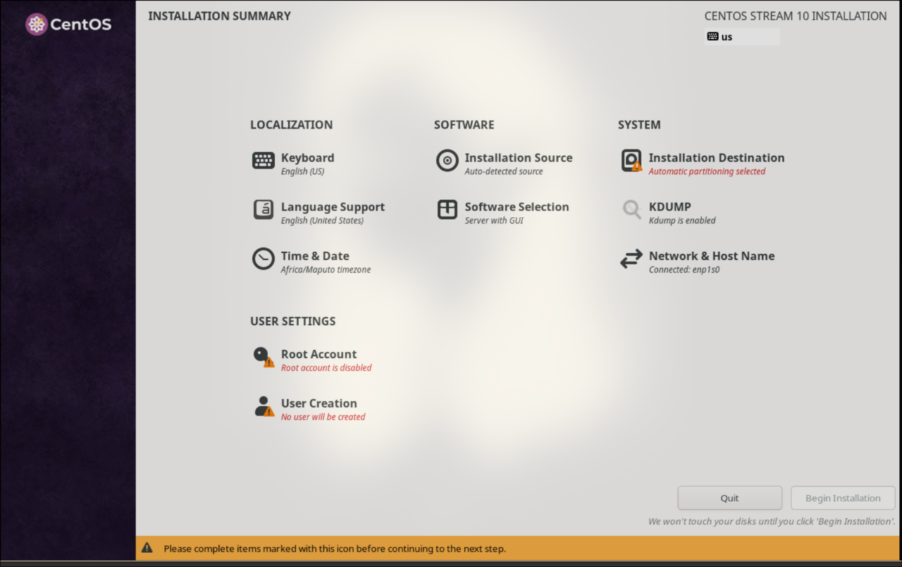
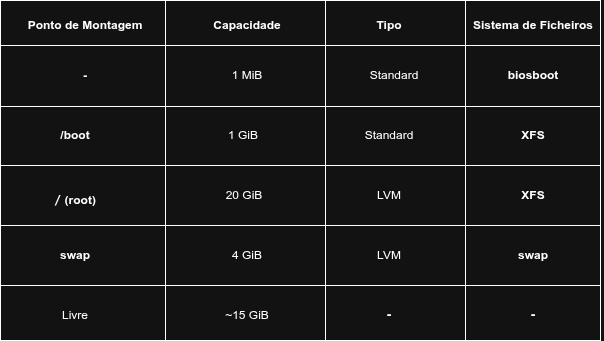
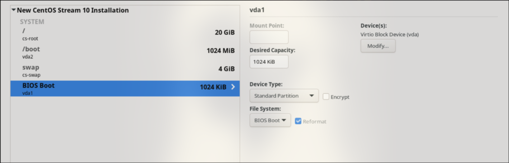

# Instalação e Virtualização de Sistemas

## 1. A Evolução e o Impacto da Virtualização

Nos últimos 50 anos, tendências fundamentais mudaram a forma como os serviços de computação são fornecidos. O processamento em mainframes impulsionou as décadas de 60 e 70; os computadores pessoais e a arquitetura cliente/servidor dominaram as décadas de 80 e 90; e a Internet abrangeu a transição do século. Atualmente, o pilar de qualquer infraestrutura moderna assenta noutra tecnologia transformadora: a virtualização.

Historicamente, os centros de dados debatiam-se com o modelo ineficiente de **"um servidor, uma aplicação"**. Com o aumento exponencial da capacidade de processamento (impulsionado pela Lei de Moore), os servidores físicos acabavam por realizar cada vez menos trabalho em proporção à sua capacidade total, resultando num enorme desperdício de recursos.

A virtualização moderna resolveu este problema. Na sua essência, a computação **virtual** refere-se à criação de uma representação lógica de um recurso físico. Em vez de utilizar diretamente um componente de hardware isolado, o sistema passa a trabalhar com uma abstração.

Exemplos comuns incluem:
- **VLANs**: redes lógicas
- **SANs**: armazenamento lógico

O foco principal da administração de sistemas moderna, no entanto, é a virtualização de computadores inteiros, permitindo que múltiplos sistemas operativos (**workloads**) corram no mesmo hardware em simultâneo, mantendo-se rigorosamente isolados.

## 2. O Monitor de Máquina Virtual (VMM) e os Princípios Fundamentais

Na sua essência, um hypervisor é um árbitro de recursos. Historicamente conhecido como **Monitor de Máquina Virtual (VMM)**, este software atua como a camada intermediária entre o hardware físico de um servidor e as máquinas virtuais (VMs) que nele operam. Sem um hypervisor, múltiplos sistemas operativos a tentar aceder simultaneamente aos mesmos recursos de hardware, como disco ou memória, resultariam em conflitos imediatos e falhas críticas do sistema.
O hypervisor desempenha duas funções vitais para garantir a estabilidade do ambiente:
- **O "Simulador de Realidade" (Abstração de Hardware)**: Tal como um simulador de realidade virtual engana os sentidos humanos, o hypervisor engana o sistema operativo convidado (Guest OS). Ele cria a ilusão de que a máquina virtual tem acesso exclusivo e direto a componentes físicos (CPU, RAM, Discos), quando, na verdade, esta está a interagir com frações de recursos abstratos geridos pelo hypervisor.
- **O "Controlador de Tráfego" (Alocação de Recursos)**: O hypervisor interseta todas as solicitações de Entrada/Saída (I/O) geradas pelas VMs. Quer seja um pedido de leitura no disco ou o envio de um pacote de rede, o hypervisor organiza, prioriza e encaminha esses pedidos para o hardware físico real de forma eficiente e justa, garantindo que nenhuma VM monopoliza o sistema.

<figure align="center">
  
  <figcaption><b>img 1:</b> Hierarquia entre hardware físico, hypervisor e VMs.</figcaption>
</figure>

### 2.1 Os Requisitos de Popek e Goldberg
A primeira iteração de virtualização ocorreu nos mainframes da IBM na década de 1960. Contudo, em 1974, Gerald J. Popek e Robert P. Goldberg formalizaram os requisitos arquitetónicos da virtualização num artigo fundamental.

Segundo a sua definição, para um **Monitor de Máquina Virtual (VMM)**, ou **Hypervisor**, ser considerado eficiente, deve exibir três propriedades cruciais:

- **Fidelidade (Fidelity):** o ambiente criado para a VM tem de ser essencialmente idêntico à máquina física original.
- **Isolamento e Segurança (Isolation/Safety):** o VMM deve manter o controlo absoluto dos recursos do sistema, garantindo que as VMs não interferem umas com as outras nem acedem a áreas de memória não autorizadas.
- **Desempenho (Performance):** a diferença de capacidade de processamento entre a VM e um equivalente físico direto deve ser mínima.

Na sua essência, o hypervisor atua como um árbitro de recursos. Ele desempenha duas funções vitais:

- **Abstração de Hardware:** cria a ilusão de que o sistema operativo convidado (**Guest OS**) tem acesso exclusivo a componentes físicos (CPU, RAM, discos), interagindo com dispositivos virtuais.
- **Alocação de Recursos:** interceta, organiza e encaminha todas as solicitações de Entrada/Saída (**I/O**) geradas pelas VMs para o hardware real, de forma justa e eficiente.

## 3. Classificação de Arquiteturas: Type 1 vs. Type 2

Os hypervisors são categorizados pela forma como são implementados na pilha de hardware do sistema.

### Hypervisors Tipo 1 (Bare-Metal)

- Instalam-se diretamente sobre o hardware físico do servidor, sem a necessidade de um sistema operativo subjacente tradicional.
- **Desempenho:** oferecem o mais alto nível de eficiência e menor latência, comunicando diretamente com os componentes físicos.
- **Segurança:** superfície de ataque reduzida. Uma falha crítica numa máquina virtual fica estritamente contida nas fronteiras dessa VM.

**Exemplos:** KVM, VMware ESXi, Proxmox.

### Hypervisors Tipo 2 (Hosted)

- Funcionam como uma aplicação instalada sobre um sistema operativo tradicional (ex.: Windows, macOS, Linux desktop).
- **Sobrecarga (Overhead):** são menos eficientes. Cada pedido de hardware feito por uma VM tem de passar pelo hypervisor e, subsequentemente, pelo sistema operativo hospedeiro.
- **Casos de Uso:** ideais para ambientes de desenvolvimento local e testes à escala do utilizador individual.

**Exemplos:** Oracle VM VirtualBox, VMware Workstation.
## 4. Anatomia e Gestão da Máquina Virtual (VM)

No topo desta hierarquia (**Hardware -> Hypervisor -> VM**) encontra-se a própria Máquina Virtual. Fundamentalmente, a VM é caracterizada por dois estados de existência:

- **Estado Estático (Ficheiros de Dados):** do ponto de vista do sistema anfitrião, a VM é apenas um conjunto de ficheiros. Os cruciais são o ficheiro de configuração (que enumera o hardware virtual, como a capacidade de RAM) e o ficheiro de disco virtual (uma representação lógica do armazenamento, ex.: `.qcow2`).
- **Estado Dinâmico (Instanciação):** quando em execução, é uma entidade ativa na RAM.

### 4.1 Mecanismos de Gestão de Recursos

A gestão da CPU numa VM recorre a **vCPUs**. Uma vCPU não é um processador físico dedicado, mas sim uma fatia de tempo de execução (**time-slice**). O hypervisor (neste caso, o KVM) utiliza os seus algoritmos para distribuir os ciclos de processamento dos núcleos físicos entre as várias VMs, permitindo taxas de consolidação elevadas.

### 4.2 Funcionalidades Avançadas de Ficheiros

O encapsulamento lógico da VM introduz capacidades de administração de sistemas incomparáveis face ao hardware físico tradicional:

- **Clonagem:** replicação dos ficheiros de uma VM para criar uma instância independente, reduzindo o aprovisionamento de semanas para minutos.
- **Templates:** VMs preconfiguradas e seladas, utilizadas como "moldes" para implantar arquiteturas de software padronizadas.
- **Snapshots (Pontos de Restauro):** congelamento do estado exato do sistema (memória e disco). As operações de escrita subsequentes são redirecionadas para um disco delta. Em caso de falha crítica durante uma atualização do CentOS, por exemplo, o administrador pode reverter a VM instantaneamente para o estado seguro anterior.
- **OVF (Open Virtualization Format):** norma aberta que empacota a VM, permitindo a sua exportação e importação entre hypervisors de diferentes fornecedores.

## 5. Solução Tecnológica Adotada: Ecossistema KVM e Virt-Manager

Para a execução prática deste guia, foi selecionada uma stack tecnológica baseada em soluções open-source de alto desempenho nativas do Linux.
Embora soluções como a VMware e o Xen tenham sido pioneiras na arquitetura x86, o mercado de virtualização expandiu-se com alternativas robustas orientadas ao ecossistema open-source. Em ambientes de engenharia assentes puramente em Linux, a eficiência e a integração profunda com osistema operativo são imperativas.

É neste contexto que se destaca o **KVM (Kernel-based Virtual Machine)**. Inicialmente desenvolvido pela Qumranet (adquirida pela Red Hat em 2008), o KVM representa uma abordagem arquitetónica distinta: em vez de construir um hypervisor de raiz, o KVM é entregue como um módulo do kernel Linux.

Ao carregar este módulo, o próprio kernel Linux é convertido num hypervisor **Bare-Metal (Tipo 1)**. Isto traz vantagens técnicas massivas:

- **Reaproveitamento de Código:** o KVM herda e utiliza as funcionalidades avançadas já existentes no Linux, como o escalonador de processos (**scheduler**) e a gestão avançada de memória, sem necessidade de duplicar estas funções.
- **Adoção e Escalabilidade:** devido à sua performance e integração nativa, o KVM tornou-se a direção de futuro para a infraestrutura empresarial e é a espinha dorsal de soluções de computação em nuvem (**cloud computing**) abertas, como o OpenStack.

### 5.1 A Interface de Gestão: Virt-Manager

Para interagir com o KVM e o daemon libvirt sem depender exclusivamente de extensas linhas de comandos QEMU, utiliza-se o **Virtual Machine Manager (virt-manager)**.

Esta ferramenta gráfica atua como um painel de controlo central, permitindo provisionar, monitorizar e configurar máquinas virtuais (como instâncias CentOS) com um controlo granular sobre o hardware virtualizado, perfeitamente integrado em ambientes desktop Linux modernos de alta performance.

## 6. Criando a Maquina Virtual(VM)

A criação de uma Máquina Virtual deve ser encarada como o provisionamento de um "contentor" de hardware lógico. É fundamental compreender que, nesta fase, a VM é o equivalente a um servidor de hardware físico acabado de sair da fábrica: uma estrutura funcional, mas desprovida de inteligência (sistema operativo).
Para garantir um desempenho estável e alinhado com as exigências de um servidor moderno, adotaremos o seguinte dimensionamento de recursos:
- **Processamento**: 2 vCPUs (fatias de tempo de processamento escalonadas pelo KVM).
- **Memória RAM**: 4 GB (alocação lógica na memória física do host).
- **Armazenamento**: 40 GB (ficheiro de disco virtual, preferencialmente em formato .qcow2).
- **Rede**: 1 Interface de rede virtual (configurada em modo NAT ou Bridge).
### Configuração da Instância
Ao iniciar o assistente de criação no virt-manager, seguiremos a prática de separar a configuração do hardware do processo de instalação do software.
No menu de criação, seleciona a opção "I will install the operating system later" (ou "Instalação Manual"). Esta abordagem é preferível em ambientes de engenharia, pois permite ao administrador validar a hierarquia de recursos e as definições de BIOS/UEFI virtuais antes de comprometer o armazenamento com a imagem do sistema operativo.
Uma vez concluído este passo, teremos o "esqueleto" do nosso servidor pronto para receber o CentOS, processo que será detalhado na fase de implementação de sistemas operativos.

## 7. Instalação  do Sistema Operacional CentOS

Após a correta parametrização da instância virtual garantindo a alocação estratégica de unidades de processamento (vCPUs), memória volátil(vRAM) e armazenamento persistente (vDisk)  e a devida montagem da imagem ISO do CentOS Stream, inicia-se a fase de implementação do sistema. Esta etapa transcende a mera instalação de pacotes; trata-se da definição da arquitetura lógica e da topologia de dados que sustentarão as operações do servidor.

O processo de instalação é o alicerce sobre o qual a estabilidade do sistema é construída. Nesta fase, abordaremos a estruturação do armazenamento através de volumes lógicos, a seleção de sistemas de ficheiros otimizados para alta disponibilidade e a implementação de políticas deacesso e identidade. A configuração subsequente visa criar um ambiente que não seja apenas funcional, mas também escalável e resiliente, seguindo as melhores práticas de engenharia de sistemas Linux.

<figure align="center">
  
  <figcaption><b>img 2:</b> Ecrã inicial do instalador Anaconda (Installation Summary).</figcaption>
</figure>

A imagem acima ilustra o Resumo da Instalação (Installation Summary) do instalador Anaconda. Esta interface atua como o painel de controlo central e não-linear do provisionamento, onde o administrador deve orquestrar a convergência de diversas variáveis críticas (localização, software, rede e armazenamento) antes de consolidar a escrita de dados no disco persistente. É a partir desta consola que se definem as diretrizes estruturais que transformarão o hardware virtualizado num sistema operacional servidor resiliente e funcional.

### 7.1 Seleção de Software e Paradigma de Operação

Na fase inicial do instalador Anaconda, o administrador de sistemas depara-se com a "Seleção de Software" (Software Selection), um passo crítico que define o perfil de carga e a superfície de ataque do servidor. O CentOS oferece diversos perfis, sendo os mais comuns:
- **Workstation:** Destinado a estações de trabalho, incluindo interfaces gráficas completas e ferramentas de produtividade.
- **Server with GUI:** Proporciona um ambiente de servidor com interface gráfica para facilitar a gestão através de ferramentas visuais.
- **Server (Minimal/Base):** Um ambiente minimalista, operado estritamente via linha de comandos (CLI).

Para os propósitos deste guia, optaremos pela variante Server sem interface gráfica. Esta escolha fundamenta-seno princípio da otimização derecursos e segurança proativa. Em ambientes de produção, a ausência de uma GUI reduz drasticamente o consumo de vRAM e ciclos de vCPU, além de mitigar vulnerabilidades associadas a bibliotecas gráficas.

### 7.2 Arquitetura de Armazenamento
Após a definição do perfil de software, procedemos à configuração da persistência de dados. Ao aceder à secção de "Destino da Instalação" (Installation Destination), o sistema permite optar pelo particionamento automático ou manual.
A abordagem aqui detalhada é o **particionamento manual** . Esta opção é imperativa em engenharia de sistemas, pois permite a segmentação granular do disco, a escolha de sistemas de ficheiros específicos para diferentes cargas de trabalho e a implementação de uma estratégia de gestão devolumes que facilite a escalabilidade futura.

#### 7.2.1 LVM (Logical Volume Management) vs. Particionamento Estático
A decisão arquitetural mais significativa nesta etapa é a escolha entre partições padrão (Standard Partitions) e o LVM.
- **Particionamento Estático (Standard):** Mapeia diretamente os pontos de montagem a setores físicos ou partições primárias do disco. Embora simples, carece de flexibilidade; qualquer redimensionamento futuro exigiria a desmontagem do volume e, frequentemente, o risco de perda de dados ou manipulação direta de tabelas de partições em setores contíguos.
- **LVM (Logical Volume Management):** Introduz uma camada de abstração entre o hardware físico (Physical Volumes) e o sistema de ficheiros (Logical Volumes). Através da criação de um **Volume Group (VG)**, o armazenamento é tratado como uma pool de recursos. Esta arquitetura permite a expansão dinâmica de volumes "a quente", a criação de snapshots para backup e a agregação de múltiplos discos físicos num único volume lógico.
#### 7.2.2 Topologia de Partições e Taxonomia do XFS
A topologia proposta para o vDisk de 40 GB segue um modelo de alta disponibilidade e performance. Abaixo, detalha-se a tabela de alocação:

<figure align="center">
  
  <figcaption><b>img 3:</b> Topologia de partições recomendada.</figcaption>
</figure>

##### Detalhamento Funcional da Topologia de Partições

- **Partição biosboot (1 MiB)**: Esta é uma partição de transição, estritamente necessária em sistemas instanciados sob Legacy BIOS que adotam a moderna tabela de partições GPT (GUID Partition Table). Funciona como um repositório cru (sem sistema de ficheiros montável) que acomoda o segundo estágio do carregador de arranque (GRUB2). Sem a alocação deste segmento mínimo, o firmware do BIOS seria incapaz de mapear os vetores de arranque num disco GPT.
- **Partição /boot (1 GiB)**: Segregada do Volume Group principal para garantir acessibilidade ininterrupta durante a fase de bootstrapping (inicialização). Este diretório abriga a imagem estática do kernel do Linux (vmlinuz), o sistema de ficheiros RAM provisório (initramfs) e as diretrizes do GRUB. A opção por não integrar o /boot no LVM mitiga falhas críticas no caso de o gestor de volumes lógicos não carregar atempadamente.
- **Volume Lógico de Troca (swap - 4 GiB)**: Funciona como uma extensão da Memória de Acesso Aleatório (vRAM) no armazenamento persistente. Em cenários de exaustão de memória física, o kernel recorre a este volume para paginação (paging), transferindo blocos de memória inativos da RAM para o disco. O dimensionamento de 4 GB está alinhado com a RAM da máquina virtual, prevenindo a invocação prematura do processo OOM Killer (Out-Of-Memory Killer) sob picos de carga.
- **Volume Lógico Raiz (/ - 20 GiB)**: O nó superior da árvore do sistema de ficheiros. Acomoda os binários essenciais do sistema operativo (/bin, /sbin), as bibliotecas partilhadas (/lib), as definições estruturais (/etc) e, vitalmente num servidor, a geração de logs (/var/log). A sua formatação em XFS garante a integridade transacional necessária para ambientes com elevada concorrência de operações de E/S.

##### Fundamentação do XFS:

O sistema de ficheiros XFS foi selecionado como padrão para as partições de dados (/ e /boot). Ao contrário do ext4, o XFS é um sistema de ficheiros de 64 bits altamente escalável, desenhado para lidar com grandes volumes de dados e operações de E/S paralelas (multi-threaded I/O). A sua robustez na gestão de metadados e a capacidade de recuperação rápida após falhas de energia tornam-no a escolha industrial para distribuições baseadas em RHEL/CentOS.

<figure align="center">
  
  <figcaption><b>img 4:</b> Particionamento manual no instalador Anaconda.</figcaption>
</figure>

### 7.3 Gestão de Utilizadores e Privilégios

Na fase final do provisionamento, através da secção "Definições de Utilizador" (User Settings) do instalador Anaconda, estabelece-se a fundação da segurança do sistema. Nesta etapa, procede-se à habilitação da conta de super-administração (root), à definição da respetiva credencial criptográfica (palavra-passe), à autorização de acesso remoto cifrado via protocolo SSH (Secure Shell) e ao provisionamento de uma conta de utilizador de sistema padrão. Esta estratificação primária é vital para garantir a integridade, a confidencialidade e a auditabilidade doservidor em ambiente de produção.

#### 7.3.1 A Anatomia do Super-Utilizador (Root)

No ecossistema Unix e nas distribuições Linux (como o CentOS), a conta root (cujo Identificador de Utilizador ou UID é invariavelmente 0) representa a entidade de autoridade suprema.

A diferença arquitetural fundamental entre o root e um utilizador comum reside no mecanismo de controlo de acessos do kernel. Enquanto os utilizadores padrão estão estritamente submetidos ao Discretionary Access Control (DAC), o que restringe as suas ações às permissões explícitas de leitura, escrita e execução dos ficheiros que lhes pertencem, o utilizador root atua com isenção total do DAC.
Isto significa que o root tem a capacidade de contornar qualquer restrição de permissão, podendo alterar ficheiros de sistema cruciais, carregar ou descarregar módulos de kernel, abrir portas de rede privilegiadas (abaixo de 1024) e interagir diretamente com o hardware.

##### Privilégios e o Princípio do Privilégio Mínimo

A criação paralela de um utilizador comum durante a instalação não é opcional do ponto de vista da segurança moderna; é uma exigência ditada pelo Princípio do Privilégio Mínimo (Principle of Least Privilege - PoLP).
Este princípio de engenharia de software e sistemas postula que uma entidade (utilizador ou processo) deve possuir apenas os privilégios estritamente necessários para completar a sua tarefa, e por um tempo limitado.
