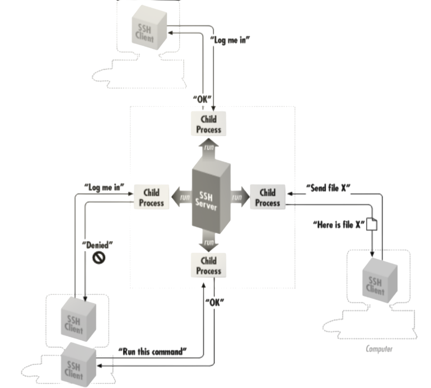

# Acesso ao Sistema e Estrutura de Ficheiros

## Conetividade e Acesso Remoto

### Fundamentação Teórica do Protocolo SSH (Secure Shell) 

O protocolo SSH (Secure Shell) constitui uma das abordagens baseadas em software mais robustas e amplamente adotadas para a segurança de comunicações em redes informáticas. A sua excelência reside na capacidade de fornecer **encriptação transparente**: sempre que dados são transmitidos de um nó para a rede, o protocolo encarrega-se da sua cifragem automática; ao alcançarem o destinatário, os dados são decifrados e restituídos à sua forma original.

Este mecanismo permite que a comunicação ocorra de forma fluida, sem que os utilizadores necessitem de intervir ativamente no processo criptográfico. Empregando algoritmos de cifra modernos e seguros, o SSH atinge um nível de fiabilidade que justifica a sua adoção mandatória em aplicações de missão crítica e nas maiores infraestruturas corporativas.

### Arquitetura Cliente-Servidor e Cifragem Ponto-a-Ponto

O SSH opera sob uma arquitetura estrita de **Cliente-Servidor**. Tipicamente, um programa servidor SSH (o daemon), gerido por um administrador de sistemas, opera em estado de escuta passiva, aceitando ou rejeitando conexões direcionadas à máquina hospedeira. Simultaneamente, utilizadores executam programas clientes SSH a partir de terminais remotos para submeter requisições ao servidor  tais como pedidos de autenticação, transferência de ficheiros ou execução direta de comandos. A característica vital deste modelo é que todo o tráfego transacionado entreo cliente e o servidor é encriptado e protegido contra modificações e interceção (sniffing) por terceiros.

<figure align="center">
  
  <figcaption><b>img 1:</b> Arquitetura cliente-servidor do SSH </figcaption>
</figure>

### O Protocolo SSH: Arquitetura e Pilares de Segurança

É imperativo compreender que o SSH é, primordialmente, um **protocolo** e não um produto isolado. Trata-se de uma especificação técnica que define as diretrizes para a condução de comunicações seguras através de redes informáticas. Enquanto norma, o protocolo SSH endereça três dimensões críticas da segurança da informação: **Autenticação**, **Cifragem** e **Integridade**.

#### Tríade de Segurança do Protocolo

O SSH garante a proteção dos dados em trânsito através de mecanismos fundamentais:
- **Autenticação**: Consiste no processo de determinação fiável da identidade de uma entidade. Ao tentar aceder a um sistema remoto, o SSH exige a apresentação de provas digitais de identidade (sejam elas credenciais, chaves criptográficas ou certificados). Caso a validação seja bem-sucedida, a conexão é autorizada; caso contrário, o acesso é sumariamente rejeitado.
- **Cifragem (Encriptação)**: Encarrega-se de codificar os dados de modo a torná-los ininteligíveis para qualquer observador não autorizado. Este mecanismo assegura a confidencialidade da informação enquanto esta transita pela infraestrutura de rede, garantindo que apenas os destinatários pretendidos possam restaurar a inteligibilidade dos dados.
- **Integridade**: Garante que a informação que viaja pela rede chegue ao destino sem sofrer alterações. Através de algoritmos de verificação, o SSH é capaz de detetar se um terceiro capturou e modificou os dados em trânsito, asseverando que o conteúdo recebido é idêntico ao conteúdo enviado.

#### Taxonomia e Versões do Protocolo

Para uma correta documentação técnica, é necessário distinguir as versões do protocolo das suas implementações de software:
- **SSH (Termo Genérico)**: Refere-se de forma abrangente ao protocolo ou aos produtos de software que o implementam.
- **SSH-1: A primeira versão do protocolo**. Embora tenha passado por várias revisões (como a 1.3 e 1.5), é atualmente considerada obsoleta para fins de produção devido a vulnerabilidades de design conhecidas.
- **SSH-2**: A versão atual e padrão do protocolo, definida pelo grupo de trabalho SECSH do IETF (Internet Engineering Task Force). O SSH-2 introduziu melhorias significativas em termos de segurança, algoritmos de troca de chaves e eficiência.
- **ssh (em minúsculas)**: Refere-se especificamente ao programa cliente incluído na maioria das distribuições. É a ferramenta que o utilizador invoca no terminal para iniciar sessões remotas ou executar comandos.
- **OpenSSH**: Produto oriundo do projeto OpenBSD, constituindo a implementação mais difundida globalmente. É uma suite de software de código aberto que suporta ambas as versões do protocolo (SSH-1 e SSH-2), embora a utilização da versão 1 seja desencorajada por omissão.

