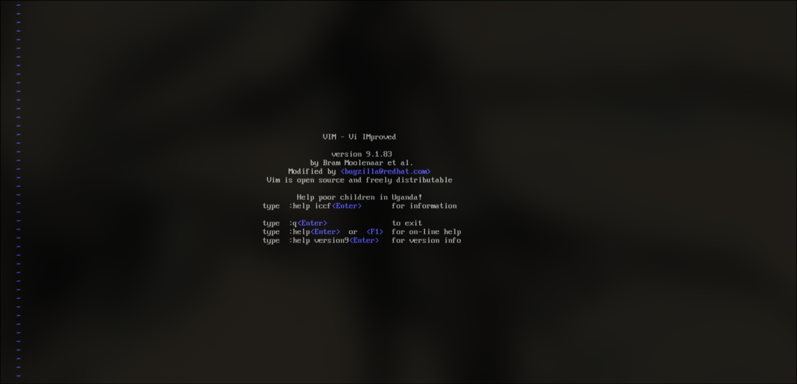

#  Administração de Sistemas Linux

## 1. Edição e Manipulação de Texto no Servidor

### 1.1 O Editor vi 
 
Aprender a linha de comandos do Linux tem algo em comum com aprender a tocar piano: não é uma coisa que se domina numa tarde. Exige prática,repetição e, acima de tudo, compreensão do instrumento. O editor `vi` (pronuncia-se *"vê-í"*) é um desses instrumentos fundamentais  parte do núcleo duro da tradição Unix. A sua interface é famosa por não ser amigável à primeira vista, mas quem observa um utilizador experiente aeditar ficheiros em `vi` assiste a algo próximo de virtuosismo: mãos que nunca abandonam o teclado, navegação fluida, edições cirúrgicas. Neste capítulo não nos tornamos virtuosos, mas saímos a saber tocar o equivalente às primeiras notas.
> **Nota:** Na maioria das distribuições Linux modernas, incluindo o CentOS, o `vi` invocado no terminal é na realidade o **Vim** (*Vi IMproved*), uma versão melhorada com funcionalidades adicionais como realce de sintaxe e desfazer multilevel. O comportamento base é idêntico ao `vi` original, por isso usaremos os dois termos de forma intercambiável ao longo desta secção.

---
#### Por que razão aprender vi?
 
Numa era de editores gráficos intuitivos e editores de texto em modo texto como o `nano`, a questão é legítima. Há, no entanto, razões concretas para não ignorar o `vi`.
 
**Está sempre disponível.** Qualquer sistema Unix ou Linux desde um servidor remoto sem interface gráfica até uma instalação mínima de CentOS, tem `vi`. O `nano` é popular mas não é universal. A norma POSIX, que define os requisitos mínimos de compatibilidade entre sistemas Unix, exige explicitamente a presença do `vi`. Se alguma vez precisar de editar um ficheiro de configuração crítico numa máquina em estado degradado, o `vi` será provavelmente a única ferramenta disponível.
 
**É leve e rápido.** Não há tempo de carregamento, não há dependências gráficas, não há menus para navegar. Para um administrador de sistemas que edita dezenas de ficheiros de configuração por dia em servidores remotos via SSH, `vi` é a diferença entre eficiência e frustração. Um utilizador treinado nunca precisa de levantar os dedos do teclado durante toda a sessão de edição  cada ação, desde a navegação até ao corte de linhas, tem um atalho de teclado.
 
**É o que os administradores sérios usam.** Este motivo é menos técnico mas igualmente real: saber `vi` é uma marca de maturidade no ecossistema Linux. Não é obrigação, mas é uma vantagem.
---

#### Iniciar e sair do vi
 
Para lançar o editor, basta invocar o comando `vi` no terminal. Em sessões de administração remotas (como as que estabelecemos no Capítulo 3 via SSH), este será o método padrão de edição de ficheiros:
 
```bash
$ vi
```
 
Deverá aparecer um ecrã semelhante ao seguinte:
 

<figure align="center">
  
  <figcaption><b>img 1:</b> Ecrã inicial do vi.</figcaption>
</figure>


A primeira coisa a aprender  mesmo antes de escrever uma única letra é como **sair**. Esta é a brincadeira mais antiga da comunidade Linux: o número de pessoas que abriram o `vi` acidentalmente e não conseguiram sair é incalculável. Para sair, em modo de comando (que é o modo inicial, explicado a seguir), escreve-se:
 
```bash
:q
```
 
O símbolo `:` activa a linha de comandos do editor na parte inferior do ecrã, e `q` significa *quit*. Se o editor recusar sair, geralmente porque há alterações não guardadas, força-se a saída descartando as alterações:
 
```bash
:q!
```
 
O ponto de exclamação é a forma de dizer ao `vi` "tenho a certeza, sai mesmo assim".
 
> **Dica:** Se em algum momento se sentir "perdido" dentro do `vi` (teclas a produzir resultados inesperados, texto a aparecer em lugares errados) prima a tecla `Esc` duas vezes. Isso devolve-o ao modo de comando a partir de qualquer estado.
 
---

#### O conceito fundamental: modos de edição
 
Esta é a segunda coisa mais importante a compreender sobre o `vi`, a seguir a saber como sair. O `vi` é um **editor modal**, o que significa que o mesmo teclado se comporta de formas radicalmente diferentes consoante o modo em que o editor se encontra.
 
A maioria dos editores modernos tem apenas um modo: tudo o que se escreve aparece no documento. O `vi` funciona de forma diferente, com dois modos principais:
 
- **Modo de comando** (*command mode*, também chamado *normal mode*): é o modo inicial. Cada tecla é interpretada como um comando de navegação ou manipulação. Premir `j` não escreve a letra "j"  move o cursor uma linha para baixo. Premir `d` não escreve "d"  inicia uma operação de eliminação. É neste modo que se navega, se apagam linhas, se copiam blocos de texto.
- **Modo de inserção** (*insert mode*): é o modo onde o texto é realmente escrito. O editor comporta-se como um editor convencional  as teclas produzem os caracteres correspondentes no documento.
A confusão inicial de quase todos os principiantes com `vi` vem exactamente daqui: entrar no editor, tentar escrever, e produzir um caos de comandos involuntários  porque o editor estava em modo de comando e interpretou cada tecla como uma instrução. Compreender este mecanismo antes de tocar no teclado evita essa frustração.
 
---

#### Criar e editar um ficheiro
 
Vamos criar um ficheiro novo passando o nome desejado como argumento ao `vi`. Se o ficheiro não existir, o editor cria-o; se já existir, abre-o para edição.
 
```bash
$ vi servidor_notas.txt
```
 
O ecrã deverá mostrar algo como:
 

<figure align="center">
  
  <figcaption><b>img 2:</b> Buffer vazio do vi, pronto para edição.</figcaption>
</figure>

 
As linhas com o símbolo `~` (til) à esquerda indicam linhas vazias  linhas que não existem no ficheiro. É a forma do `vi` mostrar que o documento está vazio.
 
**Ainda não escreva nada.** O editor está em modo de comando.

##### Entrar em modo de inserção
 
Para começar a escrever texto, é necessário entrar no modo de inserção. O método mais directo é premir a tecla `i` (*insert*). Após o fazer, deverá aparecer na parte inferior do ecrã a indicação:
 
```
-- INSERT --
```
 
Agora sim, o editor aceita texto normal. Experimente escrever:
 
```
hostname: servidor-01
ip: 192.168.1.10
admin: carlos
estado: producao
```
##### Regressar ao modo de comando
 
Para voltar ao modo de comando (por exemplo, para guardar o ficheiro ou navegar), prima `Esc`. A indicação `-- INSERT --` desaparece da parte inferior do ecrã, confirmando que está novamente em modo de comando.
 
##### Guardar o trabalho
 
Guardar é feito através de um comando ex: uma linha de instrução activada pelo símbolo `:` em modo de comando. Para escrever (guardar) o ficheiro:
 
```
:w
```
 
O editor confirmará com uma mensagem na parte inferior do ecrã semelhante a:
 
```
"servidor_notas.txt" [New] 4L, 67C written
```
 
Onde `4L` indica 4 linhas escritas e `67C` indica 67 caracteres. Para guardar e sair numa única instrução:

```
:wq
```
 
Ou, em alternativa, usando o atalho equivalente em modo de comando:
 
```
ZZ
```
 
---
 
#### Navegar sem usar o rato
 
Em modo de comando, o `vi` oferece um sistema completo de navegação por teclado. As setas de direcção funcionam, mas existe uma razão histórica  e prática  para aprender as teclas alternativas.

Quando o `vi` foi criado, muitos terminais de vídeo não tinham teclas de seta. Os programadores que o desenvolveram mapearam a navegação nas teclas `h`, `j`, `k`, `l`  posicionadas sob a mão direita numa disposição QWERTY  de forma a nunca precisar de mover as mãos para navegar. Para quem passa horas num terminal, isto traduz-se em velocidade real.
 
A tabela seguinte detalha as teclas de movimento disponíveis em modo de comando:
 
| Tecla | Movimento |
|-------|-----------|
| `l` ou seta direita | Um caractere para a direita |
| `h` ou seta esquerda | Um caractere para a esquerda |
| `j` ou seta baixo | Uma linha para baixo |
| `k` ou seta cima | Uma linha para cima |
| `0` (zero) | Início da linha actual |
| `^` | Primeiro caractere não-espaço da linha actual |
| `$` | Fim da linha actual |
| `w` | Início da próxima palavra (incluindo pontuação) |
| `W` | Início da próxima palavra (ignorando pontuação) |
| `b` | Início da palavra anterior (incluindo pontuação) |
| `B` | Início da palavra anterior (ignorando pontuação) |
| `Ctrl-F` ou `Page Down` | Avançar uma página |
| `Ctrl-B` ou `Page Up` | Recuar uma página |
| `G` | Última linha do ficheiro |
| `nG` | Ir para a linha número `n` (ex: `5G` vai para a linha 5) |
| `1G` | Primeira linha do ficheiro |

##### Prefixo numérico: multiplicar comandos
 
Uma das funcionalidades mais poderosas do `vi` é a possibilidade de prefixar qualquer comando de movimento com um número, multiplicando o seu efeito. Por exemplo:
 
- `5j` move o cursor **cinco linhas** para baixo
- `3w` avança **três palavras** para a frente
- `10G` vai directamente para a **linha 10** do ficheiro
Este mecanismo torna a navegação em ficheiros longos  como logs de sistema com milhares de linhas ou ficheiros de configuração extensos  substancialmente mais eficiente do que usar as setas repetidamente.
 
---
 
> **Sobre a nomenclatura:** a documentação oficial do Vim utiliza terminologia ligeiramente diferente da nomenclatura histórica do `vi`. O que aqui chamamos "modo de comando" é designado *normal mode* no Vim, e o que chamamos "comandos ex" (os que começam com `:`) são chamados *command mode*. Para os propósitos deste guia mantemos a nomenclatura mais intuitiva, mas é útil saber desta diferença caso consulte a documentação oficial.
 `
---

#### Edição de texto
 
A maior parte do trabalho de edição resume-se a um conjunto reduzido de operações: inserir texto, apagar texto, e mover texto de um sítio para outro através de corte e colagem. O `vi` suporta todas estas operações, à sua maneira. Suporta também uma forma limitada de desfazer alterações: estando em modo de comando, a tecla `u` desfaz a última alteração efectuada. Este comando vai ser útil à medida que experimentamos os comandos que se seguem.
 
##### Formas de entrar em modo de inserção
 
Já conhecemos o comando `i` para inserir texto na posição actual do cursor. Mas o `vi` oferece outras formas de entrar em modo de inserção, cada uma adequada a uma situação diferente.
 
Imagine que temos o nosso ficheiro `servidor_notas.txt` com o seguinte conteúdo:
 
```
hostname: servidor-01
ip: 192.168.1.10
admin: carlos
estado: producao
```
 
Se quiséssemos acrescentar texto ao fim da primeira linha, o comando `i` não seria suficiente porque não nos deixa posicionar o cursor depois do último caractere da linha. Para isso existe o comando `a` (*append*). Ao mover o cursor para o fim da linha e premir `a`, o cursor avança um caractere além do fim da linha e o editor entra em modo de inserção, permitindo acrescentar texto a seguir.
 
Mas como quase sempre queremos acrescentar texto ao fim de uma linha, o `vi` tem um atalho ainda mais directo: o comando `A` (maiúsculo). Independentemente de onde o cursor estiver na linha, `A` move-o imediatamente para o final e entra em modo de inserção. Por exemplo, posicionando o cursor no início da primeira linha e premindo `A`, podemos acrescentar informação directamente:
 
```
hostname: servidor-01 [actualizado]
```
 
Prima `Esc` para regressar ao modo de comando.

##### Abrir uma linha nova
 
Outra forma de inserir texto é "abrir" uma linha nova entre duas linhas existentes. O `vi` tem dois comandos para isso:
 
| Comando | Abre uma linha |
|---------|----------------|
| `o` | Abaixo da linha actual |
| `O` | Acima da linha actual |
 
Por exemplo, com o cursor posicionado na segunda linha (`ip: 192.168.1.10`), premir `o` cria uma linha em branco imediatamente abaixo e entra em modo de inserção. Podemos então escrever:
 
```
gateway: 192.168.1.1
```

Prima `Esc` para sair do modo de inserção. Se quisermos desfazer esta adição, basta premir `u` em modo de comando.
 
O comando `O` (maiúsculo) faz o mesmo mas abre a linha acima da posição actual do cursor.
 
##### Apagar texto
 
O `vi` oferece vários comandos para apagar texto, todos organizados em torno de dois caracteres base.
 
O comando `x` apaga o caractere na posição actual do cursor. Pode ser precedido de um número para apagar vários caracteres de uma vez: `3x` apaga o caractere actual e os dois seguintes.
 
O comando `d` é mais versátil. Combinado com qualquer comando de movimento, elimina o texto desde a posição actual até ao destino desse movimento. A tabela seguinte mostra os exemplos mais úteis:

| Comando | O que apaga |
|---------|-------------|
| `x` | O caractere actual |
| `3x` | O caractere actual e os dois seguintes |
| `dd` | A linha actual completa |
| `5dd` | A linha actual e as quatro seguintes |
| `dW` | Da posição actual até ao início da próxima palavra |
| `d$` | Da posição actual até ao fim da linha |
| `d0` | Da posição actual até ao início da linha |
| `d^` | Da posição actual até ao primeiro caractere não-espaço da linha |
| `dG` | Da linha actual até ao fim do ficheiro |
| `d20G` | Da linha actual até à vigésima linha do ficheiro |

Note-se que o `vi` original suporta apenas um nível de desfazer. O Vim (que é o que está instalado no CentOS) suporta múltiplos níveis, o que permite desfazer uma sequência de alterações premindo `u` repetidamente.

##### Cortar, copiar e colar
 
O comando `d` não apaga apenas texto, corta-o. Cada vez que se usa `d`, o texto eliminado é copiado para um buffer interno (equivalente à área de transferência). O comando `p` cola o conteúdo desse buffer após o cursor, e `P` (maiúsculo) cola antes do cursor.
 
O comando `y` (*yank*) copia texto sem o eliminar, usando a mesma lógica combinatória do `d`. A tabela seguinte resume os comandos de cópia disponíveis:


| Comando | O que copia |
|---------|-------------|
| `yy` | A linha actual completa |
| `5yy` | A linha actual e as quatro seguintes |
| `yW` | Da posição actual até ao início da próxima palavra |
| `y$` | Da posição actual até ao fim da linha |
| `y0` | Da posição actual até ao início da linha |
| `y^` | Da posição actual até ao primeiro caractere não-espaço da linha |
| `yG` | Da linha actual até ao fim do ficheiro |
| `y20G` | Da linha actual até à vigésima linha do ficheiro |

Para experimentar: com o cursor na primeira linha do ficheiro, primir `yy` copia essa linha. Mover para a última linha com `G` e premir `p` cola a linha copiada imediatamente abaixo. Premir `P` colaria acima. O comando `u` desfaz a colagem.

#### Pesquisa e substituição
 
O `vi` permite mover o cursor para qualquer posição do ficheiro com base numa pesquisa, e também executar substituições automáticas em todo o documento ou numa gama de linhas.
 
##### Pesquisar no ficheiro
 
Para pesquisar uma palavra ou frase, estando em modo de comando, prima `/`. Aparece um `/` na parte inferior do ecrã. Escreva o termo a pesquisar e prima `Enter`. O cursor salta para a próxima ocorrência desse termo no ficheiro.
 
```
/estado
```
 
Para repetir a pesquisa e avançar para a ocorrência seguinte, prima `n`. O mecanismo é idêntico ao que usámos no programa `less` no Capítulo 3.
 
O `vi` permite também pesquisas com expressões regulares, o que torna este mecanismo muito mais poderoso para padrões complexos. As expressões regulares são abordadas em profundidade num capítulo posterior.
 
##### Substituição global
 
Para substituir texto em todo o ficheiro ou numa gama de linhas, o `vi` usa um comando ex com a seguinte estrutura:
 
```
:%s/texto_antigo/texto_novo/g
```
 
Por exemplo, para substituir todas as ocorrências de `producao` por `producção` no ficheiro inteiro:
 
```
:%s/producao/producao/g
```
 
A tabela seguinte explica cada componente deste comando:
 
| Elemento | Significado |
|----------|-------------|
| `:` | Inicia um comando ex |
| `%` | Define o âmbito como todo o ficheiro (equivalente a `1,$`, ou seja, da primeira à última linha). Se omitido, a substituição aplica-se apenas à linha actual |
| `s` | Especifica a operação de substituição (*substitution*) |
| `/producao/producao/` | Define o padrão a procurar e o texto de substituição |
| `g` | Aplica a substituição a todas as ocorrências em cada linha. Se omitido, substitui apenas a primeira ocorrência por linha |
  
É também possível pedir confirmação antes de cada substituição, acrescentando `c` no final:
 
```
:%s/producao/producao/gc
```
 
O editor para em cada ocorrência e apresenta a pergunta:
 
```
replace with producao (y/n/a/q/l/^E/^Y)?
```
 
As opções disponíveis são `y` para confirmar, `n` para saltar, `a` para substituir todas as restantes sem mais confirmação, `q` para cancelar a operação e `l` para substituir esta ocorrência e sair.
 
#### Editar múltiplos ficheiros
 
É comum precisar de trabalhar em mais de um ficheiro ao mesmo tempo, seja para fazer alterações em vários ficheiros relacionados, seja para copiar conteúdo de um para outro. O `vi` permite abrir vários ficheiros numa única sessão, passando-os como argumentos no arranque:
 
```bash
$ vi servidor_notas.txt interfaces.txt
```
 
O editor abre com o primeiro ficheiro visível no ecrã. Para navegar entre os ficheiros abertos, usam-se os seguintes comandos ex:
 
```
:bn        (buffer next: avança para o ficheiro seguinte)
:bp        (buffer previous: recua para o ficheiro anterior)
```
 
O `vi` impede a mudança de ficheiro se houver alterações não guardadas no ficheiro actual. Para forçar a mudança descartando as alterações, acrescenta-se `!`:
 
```
:bn!
```
 
Para ver a lista de todos os ficheiros abertos na sessão actual:
 
```
:buffers
```
 
O editor apresenta uma lista na parte inferior do ecrã com os índices de cada buffer:
 
```
  1 %a   "servidor_notas.txt"         line 1
  2      "interfaces.txt"             line 0
Press ENTER or type command to continue
```
 
Para saltar directamente para um buffer pelo seu número:
 
```
:buffer 2
```
 
##### Abrir um ficheiro adicional durante a sessão
 
Não é necessário fechar a sessão para abrir um novo ficheiro. O comando `:e` (*edit*) seguido do nome do ficheiro adiciona-o à sessão actual:
 
```
:e logs_recentes.txt
```
 
O novo ficheiro fica disponível como um buffer adicional, acessível através dos mesmos comandos `:bn`, `:bp` e `:buffer`.
 
##### Copiar conteúdo entre ficheiros
 
Com múltiplos ficheiros abertos, é possível copiar texto de um para outro usando os mesmos comandos de yank e paste que já conhecemos. O processo é directo: copiar o texto no ficheiro de origem com `yy` ou outro comando `y`, mudar para o buffer de destino com `:buffer`, e colar com `p` ou `P`.
 
##### Inserir o conteúdo completo de um ficheiro
 
Para inserir todo o conteúdo de um ficheiro externo na posição actual do cursor, usa-se o comando `:r` (*read*):
 
```
:r outro_ficheiro.txt
```
 
O conteúdo do ficheiro especificado é inserido imediatamente abaixo da linha onde o cursor se encontra. Isto é útil para, por exemplo, inserir um template de configuração num ficheiro que estamos a construir.
 
#### Guardar o trabalho: resumo dos métodos
 
Ao longo desta secção usámos `:w` para guardar, mas o `vi` oferece várias variantes que convém conhecer:
 
| Comando | Acção |
|---------|-------|
| `:w` | Guarda o ficheiro sem sair |
| `:wq` | Guarda e sai |
| `ZZ` | Guarda e sai (atalho em modo de comando) |
| `:q!` | Sai sem guardar, descartando alterações |
| `:w nome_alternativo.txt` | Guarda uma cópia com outro nome (equivalente a "Guardar como") |
 
O comando `:w` aceita um nome de ficheiro opcional. Isto permite guardar uma versão alternativa do ficheiro que está a ser editado sem abandonar o ficheiro original. Por exemplo, se estivemos a editar `servidor_notas.txt` e queremos guardar uma cópia de segurança antes de continuar:
 
```
:w servidor_notas_backup.txt
```
 
O ficheiro original continua aberto e activo na sessão. A cópia fica guardada em disco com o novo nome.
 
### 1.2 sed: O Editor de Fluxo (Stream Editor)

O `vi` é a ferramenta certa quando precisamos de abrir um ficheiro, navegar pelo seu conteúdo e fazer edições de forma interactiva. Mas existe uma classe inteira de tarefas de administração onde abrir um editor interactivo seria a abordagem errada: quando precisamos de alterar a mesma linha em quarenta ficheiros de configuração, quando queremos extrair apenas as linhas de erro de um log com milhares de entradas, ou quando estamos a construir um script que deve modificar ficheiros automaticamente sem qualquer intervenção humana.

É precisamente para estas situações que existe o `sed` o *stream editor*, ou editor de fluxo. Ao contrário do `vi`, o `sed` não é interactivo. Não se abre um ficheiro, não se navega, não se digita texto directamente. Em vez disso, passa-se uma instrução de edição como argumento na linha de comandos, e o `sed` aplica essa instrução ao texto linha por linha, escrevendo o resultado no *standard output*. O ficheiro original permanece intacto, a menos que se instruza explicitamente o contrário.

Esta diferença de filosofia é fundamental: o `vi` é um editor para humanos lerem e modificarem texto de forma deliberada; o `sed` é uma ferramenta para automatizar transformações de texto em escala, integrável em pipelines e scripts.

---

#### Como o sed processa texto

Para usar o `sed` com confiança, é necessário compreender o ciclo que ele executa internamente para cada linha do ficheiro de entrada:

1. Lê uma linha do ficheiro de entrada e remove o caractere de nova linha no final.
2. Coloca essa linha num espaço de trabalho interno chamado **pattern space** (espaço de padrão).
3. Aplica sequencialmente todos os comandos que foram passados como argumento.
4. Escreve o conteúdo do *pattern space* no *standard output*, adicionando novamente o caractere de nova linha.
5. Limpa o *pattern space* e repete o processo para a linha seguinte.

Este ciclo continua até ao fim do ficheiro. O resultado é um fluxo de texto transformado que pode ser visualizado no terminal, redireccionado para um novo ficheiro, ou passado como entrada para outro comando através de uma pipeline.

Existe ainda um segundo espaço de armazenamento chamado **hold space** (espaço de retenção), que funciona como uma memória auxiliar persistente entre ciclos. O *hold space* não é apagado entre linhas, o que permite operações mais avançadas que envolvem guardar e recuperar conteúdo de linhas anteriores. Para a administração diária de sistemas, o *pattern space* é o que importa na maioria das situações.

---

#### Sintaxe geral

A estrutura de um comando `sed` segue sempre a mesma lógica:

```bash
sed [opções] 'instrução' ficheiro
```

Ou, quando utilizado numa pipeline:

```bash
comando_anterior | sed [opções] 'instrução'
```

As opções mais importantes são:

| Opção | Efeito |
|-------|--------|
| `-n` | Suprime a saída automática. O `sed` só imprime o que for explicitamente instruído a imprimir com o comando `p`. |
| `-i` | Edita o ficheiro directamente (*in-place*), sem necessidade de redireccionamento. |
| `-i.bak` | Edita o ficheiro directamente mas guarda uma cópia de segurança com a extensão `.bak` antes de o modificar. |
| `-e` | Permite encadear múltiplas instruções num único comando. |

---

##### O comando de substituição: s

A operação mais utilizada do `sed` é a substituição, e a sua sintaxe é praticamente idêntica à que já vimos no `vi`:

```bash
sed 's/padrão/substituto/flags' ficheiro
```

Para tornar os exemplos concretos, vamos trabalhar com um ficheiro de configuração de rede típico de um servidor CentOS. Criamos o ficheiro com o seguinte conteúdo:

```bash
$ cat /etc/rede/servidor.conf
hostname=servidor-antigo
ip=10.0.0.5
porta=80
admin=root
estado=inactivo
```

###### Substituição básica

Para substituir a primeira ocorrência de um padrão em cada linha:

```bash
$ sed 's/inactivo/activo/' /etc/rede/servidor.conf
hostname=servidor-antigo
ip=10.0.0.5
porta=80
admin=root
estado=activo
```

O ficheiro original não foi alterado. O resultado foi apenas impresso no terminal. Para verificar:

```bash
$ cat /etc/rede/servidor.conf
hostname=servidor-antigo
ip=10.0.0.5
porta=80
admin=root
estado=inactivo
```

O conteúdo mantém-se igual. O `sed` processou e mostrou o resultado transformado, mas não tocou no ficheiro.

###### O flag global: g

Por defeito, o `sed` substitui apenas a **primeira** ocorrência do padrão em cada linha. Se uma linha contiver o padrão múltiplas vezes e quisermos substituir todas as ocorrências, é necessário adicionar o flag `g` (*global*):

```bash
$ echo "o servidor-antigo substituiu o servidor-antigo temporário" | sed 's/servidor-antigo/servidor-01/g'
o servidor-01 substituiu o servidor-01 temporário
```

Sem o `g`, apenas a primeira ocorrência seria substituída:

```bash
$ echo "o servidor-antigo substituiu o servidor-antigo temporário" | sed 's/servidor-antigo/servidor-01/'
o servidor-01 substituiu o servidor-antigo temporário
```

Este é um dos erros mais comuns com `sed`: esquecer o `g` e depois descobrir que algumas instâncias do padrão não foram alteradas.

###### Alterar delimitadores

O separador utilizado na instrução de substituição é por convenção a barra `/`, mas pode ser qualquer caractere. Isto é útil quando o padrão ou o substituto contém barras, como acontece com caminhos de ficheiros, evitando sequências de escape confusas:

```bash
# Com barras: requer escape para os / do caminho
$ sed 's/\/etc\/rede\//\/etc\/network\//g' ficheiro.conf

# Com outro delimitador: muito mais legível
$ sed 's|/etc/rede/|/etc/network/|g' ficheiro.conf
```

Ambos os comandos produzem o mesmo resultado. A segunda forma é claramente mais fácil de ler e de manter.

---

#### Endereçamento: aplicar comandos a linhas específicas

Por defeito, os comandos do `sed` aplicam-se a todas as linhas do ficheiro. O **endereçamento** permite restringir a actuação a linhas específicas, usando número de linha ou padrão.

##### Por número de linha

Para aplicar uma substituição apenas na linha 2:

```bash
$ sed '2s/10.0.0.5/192.168.1.10/' /etc/rede/servidor.conf
hostname=servidor-antigo
ip=192.168.1.10
porta=80
admin=root
estado=inactivo
```

Para aplicar a um intervalo de linhas, usa-se a notação `início,fim`:

```bash
$ sed '1,3s/=/: /' /etc/rede/servidor.conf
hostname: servidor-antigo
ip: 10.0.0.5
porta: 80
admin=root
estado=inactivo
```

O caractere `$` representa a última linha do ficheiro, o que é útil quando não sabemos o número exacto de linhas:

```bash
$ sed '3,$s/=/: /' /etc/rede/servidor.conf
```

Este comando aplica a substituição da linha 3 até ao fim do ficheiro.

##### Por padrão

Em vez de números, pode-se usar um padrão para seleccionar as linhas onde o comando actua. O padrão é delimitado por barras:

```bash
$ sed '/admin/s/root/carlos/' /etc/rede/servidor.conf
hostname=servidor-antigo
ip=10.0.0.5
porta=80
admin=carlos
estado=inactivo
```

O `sed` aplicou a substituição apenas na linha que continha a palavra `admin`. Todas as outras permaneceram intactas.

---

###### Apagar linhas: d

O comando `d` (*delete*) elimina as linhas endereçadas do fluxo de saída. O ficheiro original não é modificado, mas as linhas eliminadas não aparecem no resultado.

Para remover uma linha específica pelo número:

```bash
$ sed '4d' /etc/rede/servidor.conf
hostname=servidor-antigo
ip=10.0.0.5
porta=80
estado=inactivo
```

A linha 4 (`admin=root`) foi removida da saída. Para remover todas as linhas que contêm um determinado padrão, como linhas de comentário (que em muitos ficheiros de configuração começam com `#`):

```bash
$ sed '/^#/d' ficheiro.conf
```

O símbolo `^` é uma âncora de expressão regular que significa "início da linha". Portanto, `/^#/` significa "linhas que começam com `#`". Esta é uma das operações mais úteis para limpar ficheiros de configuração e ver apenas as directivas activas, sem o ruído dos comentários.

Para remover linhas em branco:

```bash
$ sed '/^$/d' ficheiro.conf
```

`/^$/` significa "linhas onde o início é imediatamente seguido pelo fim", ou seja, linhas vazias.

---

###### Imprimir linhas selectivamente: p com -n

O comando `p` (*print*) imprime o conteúdo do *pattern space*. Sozinho, produz linhas duplicadas porque o `sed` já imprime cada linha por defeito. A sua utilidade real surge em combinação com a opção `-n`, que suprime a saída automática:

```bash
$ sed -n '2,3p' /etc/rede/servidor.conf
ip=10.0.0.5
porta=80
```

Este comando imprime apenas as linhas 2 e 3. Com padrão:

```bash
$ sed -n '/estado/p' /etc/rede/servidor.conf
estado=inactivo
```

A combinação `-n` com `p` transforma o `sed` numa ferramenta de extracção precisa, semelhante ao `grep` mas com controlo adicional sobre intervalos de linhas.

---

###### Edição directa de ficheiros: -i

Até agora, todos os exemplos produziram saída no terminal sem modificar os ficheiros originais. Quando queremos que as alterações sejam escritas directamente no ficheiro, usa-se a opção `-i` (*in-place*):

```bash
$ sed -i 's/servidor-antigo/servidor-01/g' /etc/rede/servidor.conf
```

Após este comando, o ficheiro foi modificado permanentemente. Esta é uma operação irreversível, portanto a prática recomendada em administração de sistemas é sempre testar o comando sem o `-i` primeiro, verificar que o resultado é o esperado, e só depois aplicar com `-i`.

Para situações em que o risco é elevado, como editar ficheiros de configuração de serviços críticos, a opção `-i.bak` cria automaticamente uma cópia de segurança antes de modificar o ficheiro:

```bash
$ sed -i.bak 's/servidor-antigo/servidor-01/g' /etc/rede/servidor.conf
```

Após este comando existem dois ficheiros: `servidor.conf` com o conteúdo modificado, e `servidor.conf.bak` com o conteúdo original. Se algo correr mal, a recuperação é imediata.

> **Aviso:** A opção `-i` sobrescreve o ficheiro sem confirmação. Nunca a use directamente sobre ficheiros críticos do sistema sem antes testar o comando e garantir que existe uma cópia de segurança.

---

###### Encadear múltiplos comandos: -e

A opção `-e` permite aplicar várias instruções de edição em sequência, numa única invocação do `sed`. Cada `-e` introduz uma instrução adicional:

```bash
$ sed -e 's/servidor-antigo/servidor-01/g' \
      -e 's/inactivo/activo/' \
      -e 's/porta=80/porta=443/' \
      /etc/rede/servidor.conf
hostname=servidor-01
ip=10.0.0.5
porta=443
admin=root
estado=activo
```

As três substituições são aplicadas em sequência, linha a linha, num único passo sobre o ficheiro. Isto é equivalente a passar o ficheiro três vezes por `sed` encadeados numa pipeline, mas mais eficiente.

---

#### sed em pipelines

Sendo uma ferramenta de fluxo, o `sed` integra-se naturalmente nas pipelines que aprendemos no Capítulo 4. Pode receber dados de outros comandos e passar o resultado transformado para o comando seguinte:

```bash
$ cat /var/log/messages | sed '/^#/d' | sed '/^$/d' | grep "ERROR"
```

Ou de forma mais concisa, usando `-e`:

```bash
$ cat /var/log/messages | sed -e '/^#/d' -e '/^$/d' | grep "ERROR"
```

Este pipeline remove linhas de comentário e linhas vazias do log antes de procurar por erros, reduzindo o ruído e tornando a análise mais directa.

---

#### Caso prático: actualizar um endereço IP em ficheiros de configuração

Um cenário real que ilustra bem o poder do `sed` em administração de sistemas: o servidor de base de dados foi migrado de `10.0.1.5` para `10.0.1.50`, e esse endereço está referenciado em vários ficheiros de configuração. Em vez de abrir cada ficheiro manualmente com o `vi`, um único comando resolve o problema:

```bash
$ sed -i.bak 's/10\.0\.1\.5/10.0.1.50/g' /etc/app/db.conf /etc/app/cache.conf /etc/cron.d/backup
```

Note-se a diferença entre o padrão (`10\.0\.1\.5`) e o substituto (`10.0.1.50`): no padrão, os pontos são escapados com `\.` porque na linguagem de expressões regulares o ponto é um caractere especial que corresponde a qualquer caractere. Sem o escape, o padrão `10.0.1.5` corresponderia a cadeias como `10X0Y1Z5`, o que não é o pretendido. No texto de substituição, o ponto é tratado literalmente e não precisa de escape.

---

##### sed vs vi: quando usar cada um

Estas duas ferramentas não são concorrentes, são complementares. A escolha entre elas depende do contexto:

| Situação | Ferramenta adequada |
|----------|-------------------|
| Editar um ficheiro de configuração manualmente | `vi` |
| Substituir um valor em 20 ficheiros de uma vez | `sed` |
| Navegar por um ficheiro longo à procura de algo | `vi` |
| Remover comentários de um ficheiro num script | `sed` |
| Reestruturar o conteúdo de um ficheiro com lógica complexa | `vi` |
| Transformar a saída de um comando antes de a guardar | `sed` em pipeline |

> **Para aprofundar:** O `sed` suporta expressões regulares completas nos seus padrões, o que multiplica significativamente o seu poder expressivo. As expressões regulares são abordadas em detalhe no Capítulo 6, que cobre automação com shell scripting. Depois de as dominar, os comandos `sed` que hoje parecem complexos tornam-se naturais.

## 2. Gestão de Identidades e Acessos
 
No Capítulo 3 estabelecemos os fundamentos do modelo de controlo de acesso do Linux: o papel do root, a filosofia do privilégio mínimo, e as ferramentas `su` e `sudo` como mecanismos de delegação. Esta secção continua a partir desse ponto. O objectivo agora é operacional: saber gerir o ciclo de vida das contas de utilizador, monitorizar quem está no sistema, comunicar com utilizadores activos e compreender a infraestrutura de autenticação que torna tudo isto seguro.
 
---
 
### 2.1 Ciclo de Vida de Contas de Utilizador
 
Em Linux, cada pessoa que interage com o sistema tem uma identidade formal: uma conta de utilizador. Esta conta não é apenas um nome, é um conjunto de atributos armazenados em ficheiros de sistema que determinam o que esse utilizador pode fazer, onde pode trabalhar e como se autentica. A administração dessas contas é uma das tarefas mais recorrentes de qualquer sysadmin.
 
#### Os ficheiros que definem os utilizadores
 
Antes de criar ou modificar qualquer conta, é importante compreender onde o sistema guarda essa informação. Há quatro ficheiros centrais:
 
`/etc/passwd` contém uma linha por utilizador com sete campos separados por `:`. Por exemplo:
 
```
carlos:x:1001:1001:Carlos Silva:/home/carlos:/bin/bash
```
 
Os campos são, pela ordem: nome de utilizador, marcador de senha (o `x` indica que a senha real está noutro ficheiro), UID, GID primário, comentário com o nome completo, directório home e shell de login. Este ficheiro é legível por todos os utilizadores do sistema, razão pela qual as senhas foram movidas para `/etc/shadow`.
 
`/etc/shadow` guarda os hashes das palavras-passe e as políticas de expiração. Apenas o root tem acesso de leitura. Um campo com `!` no lugar do hash indica que a conta está bloqueada.
 
`/etc/group` define os grupos do sistema, com o nome do grupo, GID e a lista de membros.
 
`/etc/gshadow` armazena palavras-passe de grupo e administradores de grupo, raramente manipulado directamente.
 
> **Nunca edite estes ficheiros directamente com um editor de texto.** Um caractere trocado pode corromper logins em todo o sistema. Use sempre os comandos dedicados, ou `vipw` e `vigr` se precisar mesmo de editar directamente, pois eles bloqueiam o ficheiro e validam a sintaxe antes de guardar.
 
#### Criar uma conta: useradd
 
O comando `useradd` cria uma nova conta no sistema. A forma mais simples não é suficiente para uso em produção:
 
```bash
# Forma mínima: evitar em produção
$ sudo useradd carlos
```
 
Esta invocação cria a entrada em `/etc/passwd` mas não cria directório home nem define shell. Num servidor real, o mínimo útil é:
 
```bash
$ sudo useradd -m -s /bin/bash -c "Carlos Silva" carlos
```
 
Os parâmetros utilizados têm os seguintes efeitos:
 
| Opção | Efeito |
|-------|--------|
| `-m` | Cria o directório home em `/home/carlos` e povoa-o com os ficheiros padrão de `/etc/skel` |
| `-s /bin/bash` | Define o Bash como shell de login |
| `-c "Carlos Silva"` | Preenche o campo de comentário com o nome completo, útil para identificação |
 
Após criar a conta, é necessário definir uma senha. Sem senha, a conta não pode ser usada para login:
 
```bash
$ sudo passwd carlos
Changing password for user carlos.
New password:
Retype new password:
passwd: all authentication tokens updated successfully.
```
 
Para forçar o utilizador a alterar a senha no primeiro login, o que é boa prática para contas novas:
 
```bash
$ sudo passwd -e carlos
```
 
O `-e` expira imediatamente a senha, obrigando a uma mudança no próximo login.
 
##### Contas de serviço
 
Nem todas as contas são para utilizadores humanos. Serviços como servidores web, bases de dados ou processos de backup precisam frequentemente de uma identidade de sistema para gerir ficheiros e processos sem ser o root. Para estas contas, a prática é criar um utilizador sem directório home, sem shell de login e sem possibilidade de autenticação directa:
 
```bash
$ sudo useradd -r -s /usr/sbin/nologin servico-backup
```
 
A flag `-r` indica que é uma conta de sistema, atribuindo-lhe um UID abaixo do limiar de utilizadores normais (tipicamente abaixo de 1000). O shell `/usr/sbin/nologin` rejeita qualquer tentativa de login interactivo, o que é exactamente o comportamento desejado para um processo automatizado.
 
#### Modificar uma conta: usermod
 
Quando as necessidades de um utilizador mudam, o `usermod` permite alterar praticamente qualquer atributo da conta sem a eliminar e recriar.
 
**Adicionar a um grupo suplementar** é a operação mais comum, e tem uma armadilha importante:
 
```bash
# CORRECTO: adiciona ao grupo sem remover dos existentes
$ sudo usermod -aG developers carlos
 
# PERIGOSO: substitui TODOS os grupos suplementares pelo especificado
$ sudo usermod -G developers carlos
```
 
O flag `-a` significa *append* (acrescentar). Sem ele, o `-G` substitui a lista completa de grupos suplementares do utilizador, retirando-o potencialmente de grupos de que precisava. Este é um dos erros mais comuns e pode silenciosamente revogar acessos que o utilizador precisava.
 
Outras operações frequentes com `usermod`:
 
```bash
# Mudar o shell de login
$ sudo usermod -s /bin/zsh carlos
 
# Mudar o directório home e mover o conteúdo existente
$ sudo usermod -d /srv/users/carlos -m carlos
 
# Definir data de expiração da conta (útil para contractors)
$ sudo usermod -e 2025-12-31 carlos
 
# Bloquear temporariamente a conta sem a eliminar
$ sudo usermod -L carlos
 
# Desbloquear a conta
$ sudo usermod -U carlos
```
 
O bloqueio com `-L` prepende um `!` ao hash da senha em `/etc/shadow`, tornando-a inválida. A conta continua a existir com todos os seus ficheiros e configurações intactos, o que é útil quando um colaborador sai temporariamente ou quando é necessário suspender acesso enquanto se investiga um incidente.
 
#### Eliminar uma conta: userdel
 
Antes de eliminar uma conta, é boa prática bloqueá-la primeiro e verificar que ficheiros existem fora do directório home do utilizador:
 
```bash
# Bloquear enquanto se prepara a remoção
$ sudo usermod -L carlos
 
# Encontrar ficheiros do utilizador fora do seu home
$ sudo find /var /srv /opt -user carlos 2>/dev/null
 
# Eliminar a conta e o directório home
$ sudo userdel -r carlos
```
 
A opção `-r` remove o directório home e o correio do utilizador. Sem ela, a conta desaparece mas os ficheiros ficam órfãos no sistema, com o UID numérico visível onde antes estava o nome, o que dificulta auditorias futuras.
 
> **Não elimine contas de utilizadores que ainda têm processos em execução.** Identifique e termine esses processos primeiro. Eliminar uma conta com sessões activas pode deixar processos "zumbi" difíceis de gerir.
 
---
 
### 2.2 Alternância de Identidade e Delegação de Privilégios
 
O Capítulo 3 introduziu o conceito de `su` e `sudo` e explicou o porquê de cada abordagem. Esta secção aprofunda o uso prático, incluindo a configuração do `sudoers` e os padrões de uso mais comuns em ambientes de servidor.
 
#### O ficheiro /etc/sudoers
 
O `sudo` delega autoridade com base nas regras definidas em `/etc/sudoers`. A estrutura básica de uma entrada é:
 
```
utilizador  MÁQUINA=(COMO_QUEM) COMANDOS
```
 
Por exemplo:
 
```
carlos  ALL=(ALL) ALL
```
 
Esta linha diz que o utilizador `carlos`, em qualquer máquina (`ALL`), pode executar qualquer comando (`ALL`) como qualquer utilizador (`ALL`). É equivalente a dar acesso total de root. Uma configuração mais restrita e mais adequada ao princípio do privilégio mínimo seria:
 
```
carlos  ALL=(root) /usr/bin/systemctl restart httpd
```
 
Aqui, `carlos` só pode reiniciar o serviço Apache, e nada mais.
 
> **Nunca edite `/etc/sudoers` directamente com `vi` ou `nano`.** Use sempre o comando `visudo`, que bloqueia o ficheiro, valida a sintaxe antes de guardar e avisa se a configuração resultante impossibilitaria o uso futuro do `sudo`. Um ficheiro `sudoers` corrompido pode bloquear o acesso administrativo ao sistema.
 
```bash
$ sudo visudo
```
 
#### Grupos com privilégios sudo
 
Em vez de listar utilizadores individualmente no `sudoers`, a prática mais comum em CentOS/RHEL é adicionar utilizadores ao grupo `wheel`. O grupo `wheel` tem uma entrada pré-definida no `sudoers` que concede acesso completo de `sudo`:
 
```bash
# Adicionar utilizador ao grupo wheel
$ sudo usermod -aG wheel carlos
```
 
Após isto, `carlos` pode executar qualquer comando com `sudo` usando a sua própria senha. Esta abordagem é mais fácil de gerir em equipas: para revogar privilégios administrativos de um utilizador basta removê-lo do grupo, sem tocar no ficheiro `sudoers`.
 
#### sudo -i para sessões administrativas prolongadas
 
Quando é necessário executar uma sequência longa de comandos como root, a abordagem recomendada não é `sudo su` mas sim `sudo -i`:
 
```bash
$ sudo -i
[root@servidor ~]#
```
 
Este comando abre uma sessão interactiva de root através dos mecanismos nativos do `sudo`, mantendo o registo de auditoria activo. Para terminar a sessão e regressar ao utilizador normal:
 
```bash
[root@servidor ~]# exit
```
 
A diferença em relação a `sudo su` é que dentro de uma sessão `sudo -i`, os comandos continuam a ser registados no log do sistema com a identidade do utilizador original, enquanto que numa sessão iniciada por `sudo su` o registo de auditoria fica fragmentado após a transição de identidade.
 
---


### 2.3 Monitorização de Sessões Activas
 
Num servidor com múltiplos utilizadores ou com uma equipa de administradores, saber quem está ligado, a partir de onde e o que está a fazer é uma competência de gestão diária. O Linux oferece um conjunto de ferramentas para este fim.
 
#### who: sessões activas
 
O comando `who` é a forma mais directa de ver quem está ligado ao sistema neste momento:
 
```bash
$ who
carlos   pts/0        2025-10-15 09:23 (192.168.1.25)
ana      pts/1        2025-10-15 10:47 (192.168.1.30)
root     pts/2        2025-10-15 11:02 (192.168.1.10)
```
 
Cada linha mostra o nome de utilizador, o terminal em uso (`pts/0` indica uma sessão pseudo-terminal, típica de ligações SSH), a hora de login e o endereço IP de origem.
 
#### w: sessões activas com detalhe de actividade
 
O comando `w` oferece informação mais completa, incluindo o que cada utilizador está a fazer no momento:
 
```bash
$ w
 11:15:32 up 3 days,  2:43,  3 users,  load average: 0.12, 0.08, 0.05
USER     TTY      FROM             LOGIN@   IDLE JCPU   PCPU WHAT
carlos   pts/0    192.168.1.25     09:23    5:32  0.04s  0.02s bash
ana      pts/1    192.168.1.30     10:47    0.00s 0.11s  0.03s vim /etc/nginx/nginx.conf
root     pts/2    192.168.1.10     11:02    2:15  0.03s  0.01s bash
```
 
A primeira linha do output contém informação de estado do sistema: hora actual, tempo desde o último boot, número de utilizadores e a carga média nos últimos 1, 5 e 15 minutos. Para cada utilizador, o campo `WHAT` mostra o último comando executado, o que permite confirmar rapidamente que `ana` está a editar a configuração do Nginx.
 
#### last: histórico de logins
 
O comando `last` consulta o ficheiro `/var/log/wtmp` e mostra o histórico de logins, incluindo sessões já terminadas:
 
```bash
$ last
carlos   pts/0        192.168.1.25     Wed Oct 15 09:23   still logged in
ana      pts/1        192.168.1.30     Wed Oct 15 10:47   still logged in
root     pts/2        192.168.1.10     Wed Oct 15 11:02   still logged in
carlos   pts/0        192.168.1.25     Tue Oct 14 14:15 - 18:30  (04:14)
ana      pts/1        192.168.1.30     Tue Oct 14 09:00 - 17:45  (08:45)
```
 
Para ver o histórico de um utilizador específico:
 
```bash
$ last carlos
```
 
Para ver os últimos logins falhados (tentativas de autenticação sem sucesso):
 
```bash
$ sudo lastb
```
 
O `lastb` requer privilégios administrativos pois consulta `/var/log/btmp`, um ficheiro restrito. A análise dos logins falhados é uma ferramenta de segurança: um número elevado de tentativas falhadas para um utilizador específico pode indicar uma tentativa de ataque por força bruta.
 
---
 
### 2.4 Comunicação entre Utilizadores no Sistema
 
Num ambiente multiutilizador, especialmente em servidores onde várias pessoas trabalham em simultâneo via SSH, existe a necessidade de comunicação directa entre utilizadores activos, sem recorrer a ferramentas externas como email ou mensageiros.
 
#### wall: mensagem para todos os utilizadores
 
O comando `wall` (abreviatura de *write all*) envia uma mensagem para todos os terminais activos no sistema. É a ferramenta standard para avisos de manutenção, reboots planeados ou qualquer comunicação urgente que todos os utilizadores activos precisam de ver imediatamente:
 
```bash
$ sudo wall "Atenção: o servidor vai reiniciar em 10 minutos para aplicação de actualizações. Por favor guardem o trabalho."
```
 
A mensagem aparece imediatamente no terminal de todos os utilizadores com sessão activa, interrompendo o que estiverem a fazer:
 
```
Broadcast message from root@servidor (pts/2) (Wed Oct 15 11:20:00 2025):
 
Atenção: o servidor vai reiniciar em 10 minutos para aplicação de actualizações.
Por favor guardem o trabalho.
```
 
Para enviar uma mensagem mais longa preparada antecipadamente num ficheiro:
 
```bash
$ sudo wall < /tmp/aviso_manutencao.txt
```
 
> **Use o `wall` com critério.** A mensagem aparece de forma abrupta no terminal do utilizador, podendo interromper a visualização de um ficheiro no `vi` ou a saída de um comando em execução. É a ferramenta certa para avisos urgentes, não para comunicação rotineira.
 
#### write: mensagem para um utilizador específico
 
O comando `write` funciona como o `wall` mas direccionado a um único utilizador:
 
```bash
$ write ana pts/1
Olá Ana, podes reiniciar o serviço nginx quando terminares a edição?
[Ctrl+D para enviar]
```
 
O utilizador `ana` recebe a mensagem no seu terminal. Se o utilizador estiver ligado em múltiplos terminais, é necessário especificar qual (`pts/1` no exemplo).
 
Os utilizadores podem controlar se aceitam mensagens directas com o comando `mesg`:
 
```bash
# Desactivar recepção de mensagens
$ mesg n
 
# Activar recepção de mensagens
$ mesg y
```
 
Note-se que o root consegue sempre enviar mensagens via `wall`, independentemente das preferências de `mesg` dos utilizadores. O `write` de utilizadores normais pode ser bloqueado por `mesg n`.
 
---

 
### 2.5 Mecanismos de Autenticação: PAM
 
O modelo de controlo de acesso UNIX tradicional responde à pergunta "o utilizador X tem permissão para fazer Y?", mas há uma pergunta anterior que precisa de ser respondida primeiro: "como é que sabemos que isto é realmente o utilizador X?". É esta questão que os mecanismos de autenticação endereçam.
 
#### O problema da autenticação monolítica
 
Durante décadas, a autenticação em sistemas UNIX era simples e rígida: quando um utilizador fazia login, o sistema comparava a senha fornecida com o hash armazenado em `/etc/shadow`. Se correspondesse, o acesso era concedido. Ponto.
 
Este modelo funcionava num mundo de servidores isolados com utilizadores locais. Mas a realidade de infraestruturas modernas é diferente: servidores ligados a directórios LDAP centrais, autenticação com cartões inteligentes, autenticação de dois factores, políticas de senha diferentes para grupos diferentes. O modelo monolítico de "verificar contra `/etc/shadow`" não consegue acomodar esta diversidade sem modificar o código fonte de cada programa que autentica utilizadores.
 
#### PAM: Pluggable Authentication Modules
 
A solução adoptada pelo Linux foi o PAM  *Pluggable Authentication Modules*, ou Módulos de Autenticação Conectáveis. O PAM é uma camada de abstracção que separa a lógica de autenticação das aplicações que a precisam.
 
A ideia central é simples: em vez de cada programa (login, SSH, sudo, etc.) implementar a sua própria lógica de verificação de credenciais, todos chamam o PAM. O PAM por sua vez consulta a sua própria configuração e chama os módulos específicos que o administrador definiu para aquele contexto.
 
O resultado é que um administrador pode alterar radicalmente a política de autenticação do sistema (por exemplo, exigir autenticação de dois factores para logins SSH, mas manter senha simples para logins locais) sem tocar no código do SSH ou do `login`. Basta alterar a configuração do PAM.
 
#### Estrutura de configuração do PAM
 
As configurações do PAM residem em `/etc/pam.d/`. Cada ficheiro corresponde a um serviço:
 
```bash
$ ls /etc/pam.d/
login   sshd   sudo   passwd   su   system-auth   ...
```
 
Um ficheiro de configuração PAM contém linhas com quatro campos:
 
```
tipo_de_controlo   módulo_de_controlo   módulo.so   argumentos
```
 
Por exemplo, o ficheiro `/etc/pam.d/sudo` em CentOS contém tipicamente:
 
```
auth       include      system-auth
account    include      system-auth
password   include      system-auth
session    optional     pam_keyinit.so revoke
session    required     pam_limits.so
```
 
O campo de tipo define a fase de autenticação: `auth` verifica a identidade, `account` verifica se a conta está activa e autorizada, `password` gere a mudança de senhas e `session` configura o ambiente após o login.
 
O campo de controlo (`include`, `required`, `sufficient`, `optional`) determina o peso de cada módulo na decisão final:
 
| Controlo | Comportamento |
|----------|---------------|
| `required` | O módulo tem de ter sucesso. Uma falha não é imediatamente fatal, mas a autenticação será recusada no final |
| `sufficient` | Se este módulo tiver sucesso e nenhum `required` anterior tiver falhado, a autenticação é aprovada imediatamente |
| `optional` | O resultado deste módulo é ignorado na decisão final (usado para efeitos secundários como logging) |
| `include` | Inclui as regras de outro ficheiro de configuração PAM |
 
#### Módulos PAM comuns
 
Em CentOS, os módulos PAM mais utilizados incluem:
 
`pam_unix.so` é o módulo base que implementa a autenticação tradicional contra `/etc/shadow`. Está presente em praticamente todas as configurações.
 
`pam_pwquality.so` impõe políticas de qualidade de senha: comprimento mínimo, requisito de caracteres especiais, rejeição de senhas baseadas no nome do utilizador. É configurado em `/etc/security/pwquality.conf`.
 
`pam_faillock.so` bloqueia contas após um número configurável de tentativas de autenticação falhadas, protegendo contra ataques de força bruta:
 
```bash
# Ver o estado de bloqueio de um utilizador
$ sudo faillock --user carlos
```
 
`pam_limits.so` aplica limites de recursos definidos em `/etc/security/limits.conf`, como o número máximo de processos ou ficheiros abertos por utilizador.
 
#### Por que isto importa para um administrador
 
O PAM raramente precisa de ser configurado manualmente em operações do dia-a-dia, as distribuições como o CentOS entregam configurações padrão sensatas. Mas compreender a sua existência e estrutura é importante por três razões.
 
Primeiro, quando um utilizador não consegue fazer login e `passwd` confirma que a senha está correcta, o problema está muitas vezes numa regra PAM: conta expirada, número de tentativas falhadas excedido, limite de logins simultâneos atingido.
 
Segundo, quando se integra o servidor numa infraestrutura de autenticação centralizada (LDAP, Active Directory, Kerberos), a configuração do PAM é exactamente onde essa integração acontece.
 
Terceiro, as políticas de senha impostas pelo `pam_pwquality.so` são o mecanismo técnico por trás das regras de complexidade de senha que a organização pode exigir. Saber onde essas regras são definidas é necessário para as ajustar ou diagnosticar problemas.
 
> **Para aprofundar:** O comando `authselect` no CentOS Stream 8 e versões posteriores oferece uma interface de alto nível para gerir perfis de autenticação comuns (local, LDAP, Kerberos) sem editar os ficheiros PAM directamente. É o ponto de entrada recomendado para a maioria das configurações de autenticação em ambientes RHEL modernos.

## 3. Processos e Agendamentos
 
### 3.1 Anatomia de um Processo Linux
 
Quando lançamos um programa no Linux, o kernel não o deixa simplesmente correr de forma autónoma. Cria em torno dele uma estrutura de controlo chamada **processo**, que é a abstracção central através da qual o sistema operativo gere e monitoriza o uso de memória, tempo de CPU e recursos de I/O de tudo o que está a correr. É parte da filosofia fundadora do UNIX que tanto os programas do sistema como os do utilizador operem dentro desta mesma estrutura, sujeitos às mesmas regras. Não há mecanismos especiais reservados para processos do sistema: um único conjunto de ferramentas controla-os a todos.
 
#### O que constitui um processo
 
Um processo é composto por dois elementos fundamentais: um **espaço de endereçamento** e um conjunto de **estruturas de dados mantidas pelo kernel**.
 
O espaço de endereçamento é um conjunto de páginas de memória que o kernel reservou para uso exclusivo daquele processo. Contém o código que está a ser executado, as bibliotecas de que esse código depende, as variáveis do programa, as pilhas de execução (*stacks*) e informação auxiliar que o kernel precisa enquanto o processo corre. Como o Linux é um sistema de memória virtual, não existe uma correspondência directa entre a localização de uma página no espaço de endereçamento de um processo e a sua localização física na RAM ou no swap. O kernel trata desta tradução de forma transparente.
 
As estruturas de dados que o kernel mantém internamente para cada processo registam informação crítica: o mapa do espaço de endereçamento, o estado actual de execução, a prioridade de escalonamento, os recursos consumidos até ao momento, os ficheiros e portas de rede que o processo tem abertos, a máscara de sinais bloqueados e a identidade do seu dono.
 
#### Os atributos mais importantes de um processo
 
**PID: Process ID.** O kernel atribui um número único a cada processo no momento da sua criação. Os PIDs são atribuídos por ordem crescente, começando do zero. Quase todos os comandos e chamadas de sistema que manipulam processos precisam de um PID para identificar o alvo da operação.
 
**PPID: Parent PID.** No Linux não existe uma chamada de sistema que crie directamente um processo a executar um programa diferente. O mecanismo existente é o seguinte: um processo existente clona-se para criar um novo processo. O processo original chama-se **pai** (*parent*) e a cópia chama-se **filho** (*child*). O PPID é o PID do processo pai a partir do qual o processo filho foi criado. Este atributo é muito útil quando se confronta com um processo desconhecido ou com comportamento anómalo: seguir a cadeia de PPIDs até à origem permite perceber quem lançou o processo e em que contexto.
 
**UID e EUID.** O UID de um processo é o identificador numérico do utilizador que o criou. O EUID (*Effective User ID*) é um identificador adicional que determina a que recursos e ficheiros o processo tem efectivamente permissão de aceder em cada momento. Na maioria dos processos, UID e EUID são iguais. A excepção são programas com o bit *setuid* activado, que correm temporariamente com a identidade do dono do ficheiro executável em vez da do utilizador que os lançou. É exactamente este mecanismo que permite a um utilizador comum alterar a sua própria senha através do comando `passwd`, mesmo que o ficheiro `/etc/shadow` onde as senhas estão armazenadas seja restrito ao root.
 
**Niceness.** A prioridade de escalonamento de um processo determina quanto tempo de CPU recebe relativamente aos outros. O kernel usa um algoritmo dinâmico para calcular prioridades, mas tem também em conta um valor configurável chamado **nice value** ou simplesmente *niceness*. O nome vem da ideia de que um processo com alta niceness está a "ser simpático" com os outros utilizadores do sistema, cedendo-lhes CPU. Um valor alto significa baixa prioridade; um valor baixo ou negativo significa alta prioridade. O intervalo vai de -20 (máxima prioridade) a +19 (mínima prioridade). Qualquer utilizador pode aumentar a niceness do seu processo, mas apenas o root pode atribuir valores negativos ou diminuir a niceness de um processo já em execução.
 
**Terminal de controlo.** A maioria dos processos não-daemon tem um terminal de controlo associado, que define as ligações padrão de entrada, saída e erro. É também o terminal que determina para onde são enviados determinados sinais quando o utilizador prime teclas como `Ctrl+C` ou `Ctrl+Z`. Processos daemon, que correm em segundo plano sem interacção directa com o utilizador, não têm terminal de controlo, o que é indicado por um `?` na coluna `TTY` das listagens de processos.
 
#### Como um processo nasce e morre
 
Para criar um novo processo, um processo existente clona-se com a chamada de sistema `fork`. O `fork` cria uma cópia quase idêntica do processo original, com um novo PID e contabilização de recursos própria. Após o `fork`, o processo filho usa normalmente uma das chamadas da família `exec` para começar a executar um programa diferente: é aqui que o programa novo substitui o código e a memória do processo filho.
 
Quando o sistema arranca, o kernel cria autonomamente alguns processos iniciais. O mais importante é o `init` (ou `systemd` nas distribuições modernas), que é sempre o processo número 1. Todos os outros processos do sistema são descendentes do processo 1.
 
Quando um processo termina, chama uma rotina interna para notificar o kernel que está pronto para morrer, fornecendo um código de saída. Por convenção, o código 0 significa terminação normal bem-sucedida. Para que um processo possa ser completamente removido, o kernel exige que o pai reconheça a morte do filho com uma chamada `wait`. Se o pai morrer antes do filho, o kernel re-atribui o processo órfão como filho do `init`, que aceita estes processos e trata do `wait` necessário para os limpar quando morrem.
 
---
 
### 3.2 Estados de um Processo

Um processo não está automaticamente elegível para receber tempo de CPU só porque existe. O kernel controla o acesso ao processador atravésde um conjunto de estados de execução. Em qualquer momento, cada processo encontra-se num destes estados:
 
| Estado | Significado |
|--------|-------------|
| Runnable | O processo está pronto para executar. Adquiriu todos os recursos de que necessita e aguarda apenas tempo de CPU disponível. |
| Sleeping | O processo está à espera que um evento específico aconteça, como a chegada de dados de rede ou a conclusão de uma leitura de disco. Shells interactivas e daemons passam a maior parte do tempo neste estado. |
| Zombie | O processo terminou a sua execução mas o seu estado ainda não foi recolhido pelo processo pai através de uma chamada `wait`. |
| Stopped | O processo está administrativamente suspenso e não pode correr. Só sai deste estado quando outro processo o acordar com um sinal adequado ou o eliminar. |
 
 Existe ainda um sub-estado de *sleeping* particularmente importante para um administrador: o **uninterruptible sleep**, indicado pela letra `D` no campo `STAT` das listagens de processos. Um processo neste estado está à espera de uma operação de I/O que não pode ser interrompida, como a leitura de um disco físico. Normalmente é um estado transitório que desaparece em fracções de segundo. Em situações degeneradas, como problemas com sistemas de ficheiros NFS montados com a opção `hard`, um processo pode ficar preso neste estado de forma indefinida. Como não pode ser acordado nem por sinais, incluindo o KILL, a única solução é corrigir o problema subjacente ou reiniciar o sistema.
 
Os processos em estado **zombie** são uma indicação de que o processo pai não está a fazer a limpeza correcta dos seus filhos terminados. Alguns zombies transitórios são normais, mas zombies persistentes em número crescente apontam para um problema no processo pai. O comando `ps` identifica-os com o estado `Z`, e o PPID indica qual é o processo pai responsável.

---

### 3.3 Sinais: Comunicação entre Processos

Os sinais são pedidos de interrupção ao nível do processo, o mecanismo fundamental pelo qual o kernel, o terminal e outros processos comunicam com um processo em execução. Existem cerca de trinta tipos de sinais definidos, e têm usos variados: um utilizador pode enviar um sinal para terminar um processo rebelde; o terminal gera sinais quando o utilizador prime determinadas teclas; o kernel envia sinais para notificar um processo de eventos como a morte de um filho ou a ocorrência de um erro de memória.
 
Quando um processo recebe um sinal, uma de duas coisas acontece. Se o processo tiver definido uma rotina de tratamento (*signal handler*) para aquele sinal, essa rotina é chamada imediatamente, suspendendo a execução normal; quando a rotina termina, o processo retoma o ponto onde foi interrompido. Se não existir um handler, o kernel executa a acção por defeito para aquele sinal, que pode ser terminar o processo, suspendê-lo, ou simplesmente ignorar o sinal.
 
Os programas podem pedir que sinais sejam ignorados ou bloqueados. Um sinal ignorado é simplesmente descartado sem qualquer efeito. Um sinal bloqueado é colocado em fila para entrega futura, mas o kernel não exige que o processo actue sobre ele até que o sinal seja explicitamente desbloqueado.
 
| Número | Nome | Descrição | Acção por defeito | Pode ser interceptado? | Pode ser bloqueado? |
|--------|------|-----------|-------------------|----------------------|---------------------|
| 1 | HUP | Hangup | Terminar | Sim | Sim |
| 2 | INT | Interrupt | Terminar | Sim | Sim |
| 3 | QUIT | Quit | Terminar | Sim | Sim |
| 9 | KILL | Kill | Terminar | **Não** | **Não** |
| 11 | SEGV | Segmentation fault | Terminar | Sim | Sim |
| 15 | TERM | Software termination | Terminar | Sim | Sim |
| 17 | STOP | Keyboard stop | Parar | **Não** | **Não** |
| 18 | TSTP | Keyboard stop (soft) | Parar | Sim | Sim |
| 19 | CONT | Continue after stop | Ignorar | Sim | Não |
| 28 | WINCH | Window changed | Ignorar | Sim | Sim |
| 10 | USR1 | User-defined #1 | Terminar | Sim | Sim |
| 12 | USR2 | User-defined #2 | Terminar | Sim | Sim |

Os sinais `KILL` e `STOP` são excepções absolutas: não podem ser interceptados, bloqueados nem ignorados por nenhum processo. O `KILL` é executado directamente pelo kernel sem sequer notificar o processo alvo. O `STOP` suspende a execução do processo até que um sinal `CONT` seja recebido.
 
Os sinais que parecem equivalentes têm, na prática, significados e usos muito diferentes:
 
O sinal `KILL` destrói o processo ao nível do kernel. O processo nunca chega a receber este sinal; é simplesmente eliminado. É o recurso de último caso quando tudo o resto falhou.
 
O sinal `TERM` é um pedido para o processo terminar de forma ordenada. O processo recebe o sinal, tem a oportunidade de fazer limpeza, fechar ficheiros, guardar estado, e só então sai. É o comportamento por defeito do comando `kill` sem argumentos.
 
O sinal `INT` é o que é gerado pelo terminal quando se prime `Ctrl+C`. Semanticamente é um pedido para interromper a operação actual. Programas simples devem sair; programas interactivos como uma shell devem parar o que estão a fazer e aguardar novo input.
 
O sinal `HUP` tem duas interpretações distintas consoante o contexto. Para daemons de servidor, é convencionalmente interpretado como um pedido para reler o ficheiro de configuração e aplicar alterações sem reiniciar o serviço. É por isso que, após editar a configuração do Nginx ou do sshd, o método correcto de aplicar as alterações sem interromper sessões activas é enviar um `HUP` ao processo:
 
```bash
$ sudo kill -HUP $(cat /var/run/nginx.pid)
```
 
O sinal `TSTP` é a versão interceptável do `STOP`, gerada quando se prime `Ctrl+Z`. Ao contrário do `STOP`, pode ser apanhado pelos programas, o que lhes permite fazer limpeza antes de se suspenderem.
 
Os sinais `USR1` e `USR2` não têm significado predefinido. Cada aplicação pode usá-los para o que entender. O Apache Web Server usa `USR1` para iniciar um reinício gracioso; o Nginx usa `USR2` para fazer upgrade do binário sem perder ligações activas.

---
 
### 3.4 Monitorização de Processos

#### ps: fotografia instantânea do sistema
 
O `ps` é a ferramenta principal de monitorização de processos. Na sua forma mais simples, sem opções, mostra apenas os processos associados à sessão actual:
 
```bash
$ ps
  PID TTY          TIME CMD
 5198 pts/1    00:00:00 bash
10129 pts/1    00:00:00 ps
```
 
Esta vista limitada é útil para confirmar o que está a correr no terminal actual, mas raramente é suficiente para administração. A combinação de opções que fornece a visão mais completa do sistema é `aux`:
 
```bash
$ ps aux
USER       PID %CPU %MEM    VSZ   RSS TTY      STAT START   TIME COMMAND
root         1  0.0  0.2   3356   560 ?        Ss   Mar05   0:31 /sbin/init
root         2  0.0  0.0      0     0 ?        S<   Mar05   0:00 [kthreadd]
carlos    1847  0.1  1.4  58492  7340 pts/0    Ss   10:22   0:01 bash
carlos    2103  5.2  3.0 124800 15360 pts/0    R    10:45   0:23 python3 analise.py
```
 
A opção `a` expande a listagem para todos os processos de todos os utilizadores, `u` selecciona o formato orientado ao utilizador com colunas de memória e CPU, e `x` inclui processos que não têm terminal de controlo associado (os daemons, indicados pelo `?` na coluna `TTY`). A tabela seguinte descreve os campos do output:
 
| Campo | Conteúdo |
|-------|----------|
| USER | Nome do utilizador dono do processo |
| PID | Identificador único do processo |
| %CPU | Percentagem de CPU consumida |
| %MEM | Percentagem de memória física utilizada |
| VSZ | Tamanho total do espaço de endereçamento virtual |
| RSS | Resident set size: memória física efectivamente mapeada |
| TTY | Terminal de controlo (`?` para processos sem terminal) |
| STAT | Estado actual do processo |
| TIME | Tempo total de CPU consumido desde o arranque |
| COMMAND | Nome e argumentos do comando |
 
 
O campo `STAT` merece atenção especial porque condensa muita informação num código curto. Para além das letras de estado base, podem aparecer modificadores adicionais:
 
| Código | Significado |
|--------|-------------|
| `R` | Running: em execução ou pronto a executar |
| `S` | Sleeping: à espera de um evento, menos de 20 segundos |
| `D` | Uninterruptible sleep: à espera de I/O, não pode ser interrompido |
| `T` | Stopped: suspenso por instrução |
| `Z` | Zombie: terminou mas ainda não foi limpo pelo pai |
| `<` | Alta prioridade (processo com niceness negativo) |
| `N` | Baixa prioridade (processo com niceness positivo) |
| `s` | Líder de sessão |
| `l` | Processo multithreaded |
 
 
Para filtrar a listagem e encontrar processos por nome, combina-se `ps aux` com `grep`:
 
```bash
$ ps aux | grep nginx
root      1203  0.0  0.3  45820  1932 ?   Ss   09:15   0:00 nginx: master process
nginx     1204  0.0  0.2  46244  1120 ?   S    09:15   0:00 nginx: worker process
```
 
Para visualizar a árvore de processos com as relações pai-filho, usa-se o `pstree`:
 
```bash
$ pstree -p
systemd(1)-+-agetty(854)
           |-crond(832)
           |-nginx(1203)-+-nginx(1204)
           |             `-nginx(1205)
           |-sshd(1089)-+-sshd(2041)-+-sshd(2043)
           |             |            `-bash(2044)-+-ps(3102)
```
 
#### top: monitorização contínua e interactiva
 
O `ps` oferece uma fotografia estática do sistema no instante em que é executado. Para acompanhar o comportamento do sistema ao longo do tempo, com actualização contínua, usa-se o `top`:
 
```bash
$ top
```
 
```
top - 11:42:30 up 3 days, 4:10,  2 users,  load average: 0.52, 0.38, 0.29
Tasks: 142 total,   1 running, 141 sleeping,   0 stopped,   0 zombie
%Cpu(s):  2.1 us,  1.0 sy,  0.0 ni, 96.3 id,  0.5 wa,  0.0 hi,  0.1 si
MiB Mem :   3844.5 total,    412.3 free,   1823.4 used,   1608.8 buff/cache
MiB Swap:   2048.0 total,   2048.0 free,      0.0 used.   1732.8 avail Mem
 
  PID USER      PR  NI    VIRT    RES    SHR S  %CPU  %MEM     TIME+  COMMAND
 2103 carlos    20   0  124800  15360   4096 R   5.2   3.0   0:23.14  python3
 1203 root      20   0   45820   1932    896 S   0.3   0.0   0:02.41  nginx
    1 root      20   0    3356    560    480 S   0.0   0.0   0:00.91  systemd
```
 
O cabeçalho do `top` contém informação de estado do sistema que é essencial saber interpretar:
 
| Campo | Significado |
|-------|-------------|
| `up 3 days, 4:10` | Uptime: tempo decorrido desde o último arranque do sistema |
| `2 users` | Número de utilizadores com sessão activa |
| `load average: 0.52, 0.38, 0.29` | Número médio de processos em estado runnable nos últimos 1, 5 e 15 minutos. Num sistema com um núcleo de CPU, valores abaixo de 1.0 indicam que o sistema não está sobrecarregado |
| `Tasks:` | Resumo do número de processos por estado |
| `2.1 us` | Percentagem de CPU a ser usada por processos de utilizador |
| `1.0 sy` | Percentagem de CPU a ser usada pelo kernel |
| `96.3 id` | Percentagem de CPU inactivo |
| `0.5 wa` | Percentagem de CPU à espera de operações de I/O |
 
 
Por defeito, o `top` actualiza a cada 3 segundos e ordena os processos por consumo de CPU, colocando os mais exigentes no topo. A interacção com o `top` é feita por teclado enquanto está a correr:
 
| Tecla | Acção |
|-------|-------|
| `q` | Sair do top |
| `k` | Enviar um sinal a um processo (pede o PID e depois o sinal) |
| `r` | Alterar o nice value de um processo |
| `M` | Ordenar por consumo de memória |
| `P` | Ordenar por consumo de CPU (comportamento por defeito) |
| `u` | Filtrar processos por nome de utilizador |
| `h` | Mostrar ajuda com todos os atalhos disponíveis |
 
O root pode lançar o `top` com a opção `-q` para lhe atribuir a maior prioridade possível. Esta opção é valiosa precisamente nas situações em que o sistema está tão sobrecarregado que comandos normais têm dificuldade em correr.

### 3.5 Gestão Activa de Processos
 
#### kill: enviar sinais a processos
 
O comando `kill` envia sinais a processos. O nome é enganador: embora seja frequentemente usado para terminar processos, pode enviar qualquer sinal. A sua sintaxe é:
 
```bash
kill [-sinal] PID
```
 
Sem especificar o sinal, o `kill` envia `TERM` (15) por defeito, que é um pedido para o processo terminar de forma ordenada:
 
```bash
$ kill 2103
```
 
Se o processo não responder ao `TERM` após alguns segundos, o recurso seguinte é o sinal `KILL` (9), que não pode ser ignorado pelo processo:
 
```bash
$ kill -9 2103
```
 
A lista de sinais disponíveis pode ser consultada com:
 
```bash
$ kill -l
 1) SIGHUP    2) SIGINT    3) SIGQUIT   4) SIGILL    5) SIGTRAP
 9) SIGKILL  10) SIGUSR1  11) SIGSEGV  12) SIGUSR2  15) SIGTERM
```
 
>  **Use `kill -9` apenas como último recurso.** O sinal `KILL` não dá ao processo oportunidade de fazer limpeza: fechar ficheiros correctamente, guardar estado, libertar locks. Em servidores de base de dados, por exemplo, um `KILL` forçado pode deixar ficheiros de dados num estado inconsistente que exige recuperação manual. Tente sempre `TERM` primeiro e aguarde alguns segundos antes de recorrer ao `KILL`.
 
Para enviar um sinal a processos pelo nome em vez do PID, usa-se o `pkill`:
 
```bash
# Enviar TERM a todos os processos com o nome "python3"
$ sudo pkill python3
 
# Enviar HUP ao processo nginx
$ sudo pkill -HUP nginx
 
# Terminar todos os processos do utilizador carlos
$ sudo pkill -u carlos
```
 
O `killall` tem comportamento similar no Linux, eliminando processos pelo nome:
 
```bash
$ sudo killall httpd
```
 
>  **Atenção ao `killall` em sistemas UNIX não-Linux.** Em Solaris, HP-UX e AIX, o `killall` sem argumentos elimina todos os processos do utilizador actual. Executado como root, derruba o sistema. No Linux este comportamento não existe, mas se trabalhar em ambientes mistos, prefira o `pkill` que é mais seguro e portável.
 
#### Controlo de jobs: foreground e background
 
Quando se executa um comando na shell, por defeito ele corre em **foreground**: a shell fica bloqueada à espera que o processo termine antes de devolver o prompt. Para processos de longa duração numa sessão de administração, isto impede qualquer outra interacção com a shell enquanto o processo não terminar.
 
Para lançar um processo directamente em **background**, acrescenta-se `&` no final do comando:
 
```bash
$ python3 relatorio_mensal.py &
[1] 3847
```
 
A shell imprime o número do job `[1]` e o PID `3847`, e o prompt regressa imediatamente. O processo continua a correr em segundo plano.
 
Se um processo já estiver a correr em foreground e for necessário movê-lo para background sem o terminar, prime-se `Ctrl+Z`. O processo é suspenso (estado `T`) e o controlo regressa à shell:
 
```bash
$ python3 relatorio_mensal.py
^Z
[1]+  Stopped    python3 relatorio_mensal.py
```
 
Para retomar a execução do processo suspenso em background:
 
```bash
$ bg %1
[1]+ python3 relatorio_mensal.py &
```
 
Para listar todos os jobs activos da sessão actual:
 
```bash
$ jobs
[1]-  Running    python3 relatorio_mensal.py &
[2]+  Stopped    vim /etc/nginx/nginx.conf
```
 
Para trazer um processo de background de volta para foreground:
 
```bash
$ fg %1
```
 
Um processo em background fica imune ao input do teclado, incluindo `Ctrl+C`. Para o terminar, é necessário usar o `kill` com o seu PID ou com a notação de jobspec:
 
```bash
$ kill %1
```

#### nice e renice: ajustar prioridades de escalonamento
 
Quando é necessário correr um processo computacionalmente intensivo sem prejudicar o desempenho do servidor para outros serviços ou utilizadores, usa-se o `nice` para lançar o processo com uma prioridade reduzida:
 
```bash
# Lançar com niceness +10 (prioridade reduzida)
$ nice -n 10 python3 analise_completa.py
 
# Lançar com niceness +19 (mínima prioridade possível)
$ nice -n 19 find / -name "*.log" -mtime +30 -delete
```
 
Para alterar a prioridade de um processo já em execução, usa-se o `renice`:
 
```bash
# Reduzir a prioridade do processo 3847 (mais simpático)
$ sudo renice 10 3847
 
# Aumentar a prioridade (requer root, valores negativos)
$ sudo renice -5 3847
 
# Alterar a prioridade de todos os processos de um utilizador
$ sudo renice 15 -u carlos
```
 
Recorde a lógica contraintuitiva: niceness **mais alta** significa **menor prioridade**. Um processo com niceness +19 só recebe tempo de CPU quando absolutamente nenhum outro processo precisa dele. Um valor de -20 indica prioridade máxima e requer privilégios de root para ser atribuído.
 
#### /proc: o sistema de ficheiros do kernel
 
O Linux expõe informação detalhada sobre cada processo em execução através do directório `/proc`. Trata-se de um sistema de ficheiros virtual gerado pelo kernel em memória: os ficheiros não existem no disco, são criados pelo kernel no momento em que são lidos. Cada processo tem um subdirectório com o seu PID como nome:
 
```bash
$ ls /proc/2103/
cmdline  cwd  environ  exe  fd  maps  mem  net  stat  status  task  ...
```
 
Alguns ficheiros particularmente úteis:
 
```bash
# Ver o comando completo com que o processo foi lançado
$ cat /proc/2103/cmdline
 
# Listar todos os ficheiros abertos pelo processo
$ ls -la /proc/2103/fd/
 
# Ver consumo de memória detalhado
$ cat /proc/2103/status
 
# Ver para que executável aponta o processo
$ readlink /proc/2103/exe
```
 
O `/proc` contém também informação global sobre o sistema, independente de processos específicos:
 
```bash
# Informação sobre o CPU
$ cat /proc/cpuinfo
 
# Uso de memória em detalhe
$ cat /proc/meminfo
 
# Versão do kernel em execução
$ cat /proc/version
```
 
É o `/proc` que alimenta ferramentas como `ps` e `top`. Quando essas ferramentas não mostram o nível de detalhe necessário, aceder directamente ao `/proc` é o caminho para informação mais granular sobre o estado interno de um processo específico.
 
---
 
#### Processos Fora de Controlo
 
Processos que consomem recursos de forma excessiva são um problema recorrente em administração de sistemas. Podem ser processos que estão a funcionar correctamente mas são simplesmente exigentes em termos de CPU, ou podem ser processos com comportamento anómalo.
 
O primeiro passo é sempre identificar o processo problemático. O `top` é a ferramenta mais directa para isso: os processos mais exigentes em CPU aparecem no topo da lista. Para detectar consumo excessivo de memória, ordena-se por memória com a tecla `M` dentro do `top`, ou observa-se a coluna `RES` que mostra a memória física efectivamente em uso.
 
Antes de actuar sobre um processo suspeito, é importante compreender o que ele está a fazer. Um processo que usa muito CPU pode ser completamente legítimo: uma análise de dados, um processo de compilação, uma tarefa de backup. Terminar processos legítimos e importantes tem consequências. Por outro lado, um processo malicioso ou corrompido precisa de ser eliminado rapidamente, mas é importante perceber o que fez antes de o terminar para poder avaliar o impacto.
 
Para examinar o que um processo está a fazer antes de agir, o `lsof` mostra todos os ficheiros e sockets abertos por um processo:
 
```bash
# Ver que ficheiros o processo 2103 tem abertos
$ sudo lsof -p 2103
 
# Ver se algum processo está a escrever massivamente num directório
$ sudo lsof +D /var/log/
 
# Ver que processo está a usar a porta 8080
$ sudo lsof -i :8080
```
 
Se um processo está a preencher um sistema de ficheiros com output, o `df` identifica qual está cheio e o `du` encontra o directório responsável:
 
```bash
# Ver uso de todos os sistemas de ficheiros
$ df -h
 
# Encontrar o directório mais pesado dentro de /var
$ sudo du -sh /var/* | sort -rh | head -10
```
 
Identificado e compreendido o problema, a sequência de acção é sempre a mesma: tentar primeiro um `TERM` para dar ao processo a oportunidade de terminar de forma ordenada, aguardar alguns segundos, e usar `KILL` apenas se o processo não responder.
 
### 3.6 Agendamento de Tarefas: cron e at
 
A automatização é um dos pilares da administração de sistemas. Tarefas como rotação de logs, backups nocturnos, limpeza de ficheiros temporários ou verificações periódicas de integridade precisam de ser executadas de forma consistente e sem intervenção humana. O Linux oferece dois mecanismos complementares para isso: o `cron`, para tarefas que se repetem de acordo com um horário definido, e o `at`, para tarefas que precisam de ser executadas uma única vez num momento futuro específico.
 
---
 
#### cron: o agendador de tarefas recorrentes
 
O daemon `cron` arranca com o sistema e corre enquanto o sistema estiver activo. A cada minuto, verifica se existe alguma tarefa agendada para aquele momento e, se existir, executa-a. A sua configuração é feita através de ficheiros chamados **crontabs** (*cron tables*), onde cada linha representa uma tarefa e o horário em que deve correr.
 
O `cron` usa o `sh` para executar os comandos, o que significa que qualquer coisa que se consiga fazer a partir da shell pode ser feita através do `cron`.
 
##### O formato de uma linha de crontab
 
Cada linha activa num ficheiro crontab segue sempre a mesma estrutura: cinco campos de tempo seguidos do comando a executar.
 
```
minuto   hora   dia_do_mês   mês   dia_da_semana   comando
```
 
Os campos de tempo têm os seguintes intervalos de valores:
 
| Campo | Descrição | Intervalo |
|-------|-----------|-----------|
| *minuto* | Minuto da hora | 0 a 59 |
| *hora* | Hora do dia | 0 a 23 |
| *dom* | Dia do mês | 1 a 31 |
| *month* | Mês do ano | 1 a 12 |
| *weekday* | Dia da semana | 0 a 6 (0 = Domingo) |
 
 
Em cada campo pode colocar-se:
 
- Um asterisco `*`, que corresponde a qualquer valor ("todos os minutos", "todos os dias", etc.)
- Um número específico
- Dois números separados por traço, definindo um intervalo: `1-5` significa de segunda a sexta-feira
- Uma lista separada por vírgulas: `1,15` significa no dia 1 e no dia 15
- Um intervalo com um passo: `*/2` significa de 2 em 2 unidades

> **Nunca coloque um asterisco no primeiro campo a não ser que pretenda que o comando corra todos os minutos.** É o erro mais comum em crontabs de utilizadores novos.
 
##### Exemplos de entradas crontab
 
O melhor caminho para interiorizar a sintaxe é ler exemplos concretos. Cada um dos seguintes representa um cenário real de administração:
 
```bash
# Fazer backup todos os dias às 2:30 da manhã
30 2 * * * /usr/local/bin/backup.sh
 
# Verificar o espaço em disco de hora em hora e registar no log
0 * * * * df -h >> /var/log/disk_usage.log
 
# Correr um script às 10:45 de segunda a sexta-feira
45 10 * * 1-5 /opt/scripts/relatorio_diario.py
 
# Correr um comando no dia 5 e no dia 14 de cada mês às 9:15
15 09 5,14 * * /home/carlos/bin/facturacao.sh
 
# Remover ficheiros temporários não acedidos há mais de 3 dias, todas as manhãs à 1:20
20 1 * * * find /tmp -atime +3 -type f -exec rm -f {} \;
 
# Rodar logs ao domingo à meia-noite
0 0 * * 0 /usr/sbin/logrotate /etc/logrotate.conf
 
# Verificar servidores de rede às 23:55, todos os dias excepto quinta e sexta-feira
55 23 * * 0-3,6 /opt/scripts/checkservers.sh
```
 
Uma particularidade importante: se tanto o campo `dom` (dia do mês) como o campo `weekday` (dia da semana) estiverem especificados com valores concretos em vez de asterisco, o `cron` selecciona os dias que satisfaçam **qualquer uma** das condições, não a intersecção das duas. Por exemplo, `0,30 * 13 * 5` não significa "de meia em meia hora às sextas-feiras dia 13" mas sim "de meia em meia hora em todas as sextas-feiras, e também de meia em meia hora em todos os dias 13 do mês".
 
##### O que acontece quando um cron job produz output
 
Por defeito, qualquer saída produzida por um cron job (stdout ou stderr) é enviada por email ao dono do crontab. Em servidores sem servidor de email configurado, isto resulta em mensagens acumuladas sem destino. A prática mais comum é redirecionar a saída explicitamente:
 
```bash
# Descartar toda a saída
30 2 * * * /usr/local/bin/backup.sh > /dev/null 2>&1
 
# Guardar saída e erros num ficheiro de log
30 2 * * * /usr/local/bin/backup.sh >> /var/log/backup.log 2>&1
```
 
A notação `2>&1` redireciona o stderr para o mesmo destino que o stdout. Sem ela, apenas a saída normal seria redireccionada e os erros continuariam a ser enviados por email.
 
##### Gerir o crontab de utilizador
 
Cada utilizador pode ter o seu próprio crontab, armazenado no directório `/var/spool/cron/crontabs/`. Este directório é gerido internamente pelo sistema e não deve ser editado directamente: o cron não detecta alterações feitas directamente aos ficheiros e pode ignorá-las. O mecanismo correcto é sempre o comando `crontab`.
 
Para editar o crontab do utilizador actual:
 
```bash
$ crontab -e
```
 
Este comando abre o crontab num editor de texto (o definido pela variável de ambiente `EDITOR`, tipicamente `vi`), e depois de guardar e sair, instala automaticamente a versão editada. Se houver erros de sintaxe, o `crontab` avisa e oferece a possibilidade de voltar a editar.
 
Para listar as tarefas agendadas do utilizador actual:
 
```bash
$ crontab -l
```
 
Para remover o crontab completamente:
 
```bash
$ crontab -r
```
 
>  **Não confunda `-r` (remove) com `-e` (edit).** O `crontab -r` apaga o crontab imediatamente sem pedir confirmação. Se precisar de instalar um crontab a partir de um ficheiro:
 
```bash
$ crontab ficheiro_crontab.txt
```
 
O root pode ver e editar o crontab de qualquer utilizador indicando o nome:
 
```bash
$ sudo crontab -l -u carlos
$ sudo crontab -e -u carlos
```
 
##### O crontab do sistema
 
Para além dos crontabs individuais de cada utilizador, o Linux tem um ficheiro de crontab do sistema em `/etc/crontab`. O formato é ligeiramente diferente: tem um campo adicional antes do comando que especifica o utilizador sob o qual a tarefa deve correr, o que permite agrupar tarefas de sistema mesmo que corram com identidades diferentes:
 
```
# /etc/crontab
minuto  hora  dia_mês  mês  dia_semana  utilizador  comando
 
42 6 * * * root /usr/local/bin/limpeza_sistema > /dev/null 2>&1
0  3 * * * www-data /opt/webapp/scripts/cache_clear.sh
```
 
O directório `/etc/cron.d/` funciona da mesma forma que `/etc/crontab` e permite que pacotes de software instalem as suas próprias tarefas de sistema sem modificar o ficheiro central. Cada ficheiro em `/etc/cron.d/` tem o mesmo formato do `/etc/crontab`, com o campo de utilizador.
 
Os directórios `/etc/cron.hourly/`, `/etc/cron.daily/`, `/etc/cron.weekly/` e `/etc/cron.monthly/` oferecem ainda uma abordagem mais simples: basta colocar um script executável nestes directórios e ele será executado automaticamente na periodicidade correspondente, sem necessidade de escrever qualquer sintaxe de crontab.
 
```bash
# Instalar um script de limpeza para execução diária
$ sudo cp limpeza_tmp.sh /etc/cron.daily/
$ sudo chmod +x /etc/cron.daily/limpeza_tmp.sh
```
 
##### Verificar a execução das tarefas
 
O `cron` regista a execução de tarefas no log do sistema. Em CentOS, este registo está em `/var/log/cron`:
 
```bash
$ sudo grep CRON /var/log/cron
Jun 15 02:30:01 servidor CROND[4821]: (root) CMD (/usr/local/bin/backup.sh)
Jun 15 03:00:01 servidor CROND[5102]: (root) CMD (/usr/sbin/logrotate /etc/logrotate.conf)
Jun 15 04:00:01 servidor CROND[5388]: (carlos) CMD (/opt/scripts/relatorio_diario.py)
```
 
Se um cron job não parece estar a correr, a primeira verificação é este ficheiro. Se a entrada aparece no log mas o resultado não é o esperado, o problema está no próprio script, não no agendamento.
 
Um detalhe importante sobre o ambiente de execução do `cron`: os comandos não correm numa shell de login. Isto significa que variáveis de ambiente como `PATH`, `HOME` ou outras definidas em `~/.bash_profile` podem não estar disponíveis. Se um comando funciona na shell mas falha no crontab, o problema é quase sempre este. A solução é definir as variáveis necessárias no próprio crontab ou usar caminhos absolutos nos comandos:
 
```bash
# Definir variáveis de ambiente no crontab
PATH=/usr/local/bin:/usr/bin:/bin
HOME=/home/carlos
 
30 2 * * * backup.sh
```
 
---
 
##### Usos comuns do cron em administração de sistemas
 
Os livros que serviram de base a este capítulo descrevem vários casos de uso padrão que praticamente todos os servidores têm. Vale a pena conhecê-los.
 
**Limpeza de ficheiros temporários e ficheiros de core.** Quando um programa termina de forma anómala, o kernel pode escrever um ficheiro de core com a imagem da memória do processo no momento da falha. Estes ficheiros são úteis para desenvolvimento mas são desperdício de espaço em produção. Uma tarefa cron típica para os remover:
 
```bash
# Remover ficheiros core não acedidos há mais de 7 dias
20 3 * * * find / -xdev -type f \( -name core -o -name 'core.[0-9]*' \) -atime +7 -exec rm -f {} \;
```
 
A flag `-xdev` é importante: impede o `find` de atravessar para outros sistemas de ficheiros montados, o que numa rede com NFS poderia resultar na eliminação de ficheiros em servidores remotos.
 
**Rotação de logs.** Os serviços de um servidor produzem logs continuamente. Sem rotação, estes ficheiros crescem indefinidamente até encher o disco. A rotação divide os logs em segmentos por tamanho ou data, comprime os mais antigos e remove os mais velhos. Em CentOS, o `logrotate` é o utilitário padrão para isso, e é normalmente chamado pelo cron:
 
```bash
# No /etc/cron.daily/logrotate (já instalado por defeito no CentOS)
/usr/sbin/logrotate /etc/logrotate.conf
```
 
**Sincronização de configurações em rede.** Em ambientes com múltiplos servidores, é comum manter versões únicas de ficheiros de configuração que são distribuídas periodicamente a todas as máquinas através de `rsync`. Uma tarefa cron no servidor central trata desta distribuição automática.
 
---
 
#### Timer units do systemd: a alternativa moderna
 
As distribuições Linux modernas, incluindo o CentOS Stream, oferecem uma alternativa ao `cron` através dos **timer units** do systemd. Muitas tarefas de manutenção do sistema que eram tradicionalmente geridas pelo `cron` foram migradas para este mecanismo nas versões mais recentes.
 
Um timer unit do systemd consiste em dois ficheiros: um ficheiro `.timer` que define quando a tarefa deve correr, e um ficheiro `.service` que define o que deve ser executado. O `.timer` activa o `.service` no momento definido.
 
Por exemplo, para criar uma tarefa que corre de 20 em 20 minutos, cria-se um par de ficheiros em `/etc/systemd/system/`:
 
O ficheiro `loggertest.timer`:
 
```ini
[Unit]
Description=Tarefa de teste com timer
 
[Timer]
OnCalendar=*-*-* *:00,20,40
Unit=loggertest.service
 
[Install]
WantedBy=timers.target
```
 
O ficheiro `loggertest.service`:
 
```ini
[Unit]
Description=Serviço de teste
 
[Service]
Type=oneshot
ExecStart=/usr/bin/logger -p local3.debug "Tarefa agendada executada"
```
 
O formato do campo `OnCalendar` segue a lógica `ano-mês-dia hora:minuto:segundo`. O asterisco funciona como wildcard, e vírgulas permitem múltiplos valores. O exemplo `*-*-* *:00,20,40` significa "todos os anos, todos os meses, todos os dias, às horas exactas, aos 20 minutos e aos 40 minutos".
 
Para activar e verificar o timer:
 
```bash
$ sudo systemctl enable --now loggertest.timer
$ sudo systemctl list-timers
```
 
##### cron vs timer units: quando usar cada um
 
Ambos os mecanismos resolvem o mesmo problema mas têm pontos fortes diferentes:
 
| Aspecto | cron | systemd timer units |
|---------|------|---------------------|
| Configuração | Simples e directa | Requer dois ficheiros |
| Compatibilidade | Universal, existe em todos os sistemas Unix | Dependente do systemd |
| Facilidade para utilizadores | Cada utilizador gere o seu crontab | Mais complexo para utilizadores normais |
| Rastreabilidade | Log básico em `/var/log/cron` | Integrado no journal do systemd com detalhe completo |
| Gestão de dependências | Não tem | Suporta dependências do systemd |
| Activação por eventos | Não suporta | Pode activar em arranque, ligação de rede, etc. |
 
Para a maioria das tarefas de manutenção do dia-a-dia, o `cron` é mais rápido de configurar e mais fácil de ler. Os timer units fazem sentido quando a tarefa precisa de integração com o ecossistema systemd, quando a rastreabilidade detalhada é importante, ou quando a tarefa faz parte de uma unidade de serviço já existente.
 
---
 
#### at: executar uma tarefa uma única vez no futuro
 
O `at` serve para agendar um comando que deve ser executado uma vez, num momento específico no futuro, sem necessidade de criar uma entrada permanente no crontab. É a ferramenta certa para situações como "reiniciar o serviço daqui a 30 minutos" ou "executar o script de migração amanhã às 23:00" sem que seja necessário estar presente.
 
Para agendar um comando, invoca-se o `at` com o horário desejado. O `at` entra então em modo de input: escreve-se o comando (ou os comandos) e termina-se com `Ctrl+D`:
 
```bash
$ at 23:00
at> /opt/scripts/migracao_base_dados.sh
at> [Ctrl+D]
job 1 at Wed Oct 15 23:00:00 2025
```
 
O `at` aceita descrições de tempo variadas:
 
```bash
# Hora específica hoje
$ at 22:30
 
# Hora específica numa data específica (formato DD.MM.AA)
$ at 22:30 30.09.25
 
# Daqui a um intervalo de tempo
$ at now + 2 hours
$ at now + 30 minutes
 
# Amanhã ao meio-dia
$ at noon tomorrow
 
# Na próxima segunda-feira às 8:00
$ at 08:00 next monday
```
 
Para verificar as tarefas `at` pendentes:
 
```bash
$ atq
1   Wed Oct 15 23:00:00 2025 a carlos
2   Thu Oct 16 08:00:00 2025 a root
```
 
Para remover uma tarefa pendente pelo número de job:
 
```bash
$ atrm 1
```
 
Tal como o `cron`, o `at` envia por email qualquer output produzido pela tarefa. Para evitar isso, redirecione a saída no próprio comando:
 
```bash
$ at 23:00
at> /opt/scripts/migracao_base_dados.sh >> /var/log/migracao.log 2>&1
at> [Ctrl+D]
```
 
Para utilizadores que preferem a integração com o systemd, o `systemd-run` oferece um equivalente ao `at` na linha de comandos:
 
```bash
# Executar um comando numa data e hora específicas
$ sudo systemd-run --on-calendar='2025-10-15 23:00' /opt/scripts/migracao_base_dados.sh
 
# Executar daqui a 30 minutos
$ systemd-run --on-active=30m /opt/scripts/verificacao.sh
```
 
A principal diferença prática é que o `systemd-run` cria um timer unit transitório, visível com `systemctl list-timers`, e a sua execução fica registada no journal do systemd com a mesma rastreabilidade dos serviços normais.
 
---
 
#### Comparação final: cron vs at
 
| Característica | cron | at |
|----------------|------|----|
| Tipo de execução | Recorrente, de acordo com um horário fixo | Única, num momento específico futuro |
| Caso de uso típico | Backup diário, rotação de logs, relatórios periódicos | Migração pontual, reinício agendado, notificação única |
| Configuração | Ficheiro crontab com sintaxe própria | Comando interactivo no terminal |
| Persistência | Permanente até ser removido | Removida automaticamente após execução |
| Ver pendentes | `crontab -l` | `atq` |
| Remover | `crontab -r` ou editar com `crontab -e` | `atrm [número]` |

## 4. Observabilidade do Sistema
 
### 4.1 Logs: A Memória do Sistema
 
Quando algo corre mal num servidor e não há ponto de partida óbvio para a investigação, o primeiro lugar a consultar são sempre os logs. Esta é uma das máximas mais antigas da administração de sistemas, e continua tão válida hoje como há quarenta anos. Os logs são o registo contínuo do que acontece no sistema: quais os serviços que arrancaram, quais falharam, quem fez login, quais os erros que ocorreram e quando. Sem logs, administrar um servidor em produção seria trabalhar às cegas.
 
A maioria dos programas de sistema escreve as suas mensagens de diagnóstico para o serviço de logging do sistema. Historicamente, esse serviço era o `syslogd`, um daemon que recebia mensagens e as distribuía para ficheiros, consolas ou servidores remotos. Nas distribuições modernas baseadas em systemd, incluindo o CentOS Stream, a maior parte deste trabalho é feito pelo `journald`, um daemon integrado no systemd que recolhe e armazena mensagens num formato binário estruturado. Em muitas instalações, o `journald` e o `rsyslogd` coexistem: o `journald` recolhe tudo, e o `rsyslogd` complementa com funcionalidades de envio para servidores remotos e integração com sistemas de monitorização externos.
 
Uma mensagem de log típica tem o seguinte aspecto:
 
```
Aug 19 17:59:48 servidor sshd[484]: Server listening on 0.0.0.0 port 22.
```
 
Nesta linha estão o timestamp, o nome do servidor, o nome do processo e o seu PID, e a mensagem em si. Para além destes campos, as mensagens de syslog têm dois atributos adicionais importantes: a **facility** e a **severity**.
 
A **facility** identifica a categoria geral do serviço que enviou a mensagem: kernel, sistema de email, impressão, autenticação, e assim por diante. A **severity** indica a urgência da mensagem, numa escala de 0 a 7:
 
| Nível | Nome | Significado |
|-------|------|-------------|
| 0 | emerg | O sistema está inutilizável |
| 1 | alert | É necessária acção imediata |
| 2 | crit | Condição crítica |
| 3 | err | Erro |
| 4 | warning | Aviso |
| 5 | notice | Condição normal mas significativa |
| 6 | info | Mensagem informativa |
| 7 | debug | Informação de diagnóstico detalhada |
 
Juntas, facility e severity formam a **priority** de uma mensagem. São estes dois valores que determinam para onde a mensagem é enviada e se merece atenção imediata.
 
### Onde estão os logs
 
Para perceber que sistema de logging está activo, o ponto de partida é verificar o que está instalado:
 
```bash
# Verificar se o journald está activo
$ journalctl --no-pager -n 5
 
# Verificar se o rsyslogd está a correr
$ systemctl status rsyslog
 
# Ver os ficheiros de log tradicionais
$ ls /var/log/
```
 
O directório `/var/log/` contém os logs mantidos pelos daemons de logging e por outros serviços. Em sistemas com `rsyslogd`, este directório terá vários ficheiros de texto directamente legíveis. Os logs binários do `journald` ficam em `/var/log/journal/`. Alguns ficheiros em `/var/log/` são mantidos por serviços independentes: o `wtmp` e o `lastlog`, por exemplo, guardam registos de login e são acedidos pelos comandos `last` e `lastlog`, não pelo sistema de logging.
 
---

### 4.2 Análise de Logs com journalctl
 
O `journalctl` é a ferramenta para aceder ao journal do systemd. Sem argumentos, mostra todas as mensagens desde o registo mais antigo, usando um paginador para não inundar o terminal:
 
```bash
$ journalctl
```
 
Este comando produz demasiada informação para ser útil na maioria dos casos. O valor real do `journalctl` está nas suas opções de filtragem, que permitem isolar exactamente as mensagens relevantes para um problema específico.
 
Para ter acesso completo ao journal é necessário ser root ou pertencer ao grupo `adm` ou `systemd-journal`. O utilizador padrão na maioria das distribuições já tem este acesso por defeito.
 
#### Filtrar por tempo
 
A opção `-S` (*since*) é uma das mais úteis. Permite restringir a pesquisa a mensagens a partir de um determinado momento:
 
```bash
# Mensagens das últimas 4 horas
$ journalctl -S -4h
 
# Mensagens desde as 06:00 de hoje
$ journalctl -S 06:00:00
 
# Mensagens desde uma data específica
$ journalctl -S 2025-06-01
 
# Mensagens num intervalo preciso
$ journalctl -S '2025-06-01 14:00:00' -U '2025-06-01 15:00:00'
```
 
A opção `-U` (*until*) define o fim do intervalo. Combinadas, `-S` e `-U` permitem isolar exactamente a janela de tempo de um incidente.
 
#### Filtrar por serviço (unit)
 
Para ver apenas os logs de um serviço específico do systemd:
 
```bash
# Logs do serviço SSH
$ journalctl -u sshd
 
# Logs do nginx
$ journalctl -u nginx
 
# Logs do cron
$ journalctl -u crond
```
 
A extensão `.service` pode ser omitida. Para descobrir os nomes de todos os serviços que têm entradas no journal:
 
```bash
$ journalctl -F _SYSTEMD_UNIT
```
 
A opção `-F` lista todos os valores presentes no journal para um campo específico.
 
#### Filtrar por processo
 
Para ver as mensagens de um processo específico pelo seu PID:
 
```bash
$ journalctl _PID=3847
```
 
#### Filtrar por severidade
 
Para ver apenas mensagens a partir de um determinado nível de urgência:
 
```bash
# Mensagens de nível 3 (err) e mais urgentes (0, 1, 2, 3)
$ journalctl -p 3
 
# Apenas mensagens de nível crítico e de alerta
$ journalctl -p 2..3
```
 
Esta filtragem é útil em serviços que geram grandes volumes de mensagens informativas mas onde apenas os erros interessam.
 
#### Filtrar por boot
 
Para ver os logs de um arranque específico do sistema:
 
```bash
# Logs do arranque actual
$ journalctl -b
 
# Logs do arranque anterior
$ journalctl -b -1
 
# Logs de dois arranques atrás
$ journalctl -b -2
```
 
Para listar todos os boots registados com os seus IDs e timestamps:
 
```bash
$ journalctl --list-boots
```
 
Uma utilização particularmente prática desta opção é verificar se o sistema encerrou correctamente na última vez. Combinando `-b -1` com `-r` (ordem inversa), as últimas mensagens do arranque anterior aparecem primeiro:
 
```bash
$ journalctl -r -b -1
```
 
Se o encerramento foi limpo, as últimas mensagens mostrarão o processo de shutdown ordenado. Se o sistema reiniciou abruptamente por falha de energia ou kernel panic, as mensagens simplesmente terminam sem qualquer sequência de encerramento, o que é por si só uma informação importante.
 
#### Filtrar por texto
 
Para pesquisar mensagens que correspondam a uma expressão regular:
 
```bash
# Mensagens que contenham "error" seguido de qualquer coisa e depois "disk"
$ journalctl -g 'error.*disk'
 
# Mensagens relacionadas com autenticação falhada
$ journalctl -g 'Failed password'
```
 
Quando se encontra uma mensagem relevante por pesquisa de texto, o passo seguinte é normalmente usar o timestamp dessa mensagem para ver o contexto temporal:
 
```bash
# Ver o que aconteceu nos 10 minutos antes da mensagem encontrada
$ journalctl -S '2025-06-01 14:23:00' -U '2025-06-01 14:33:00'
```
 
#### Monitorização em tempo real
 
Para acompanhar os logs à medida que chegam, como se faria com `tail -f` num ficheiro de texto:
 
```bash
$ journalctl -f
```
 
Para monitorizar apenas um serviço específico em tempo real:
 
```bash
$ journalctl -f -u nginx
```
 
Esta combinação é especialmente útil ao reiniciar um serviço após uma alteração de configuração: o log aparece em tempo real e é imediatamente visível se o serviço arrancar correctamente ou falha com um erro.

Esta combinação é especialmente útil ao reiniciar um serviço após uma alteração de configuração: o log aparece em tempo real e é imediatamente visível se o serviço arrancar correctamente ou falha com um erro.
 
### Outros campos úteis
 
O `journalctl` tem acesso a um conjunto rico de campos estruturados. Para descobrir todos os campos disponíveis:
 
```bash
$ journalctl -N
```
 
Qualquer campo que comece com underscore (como `_PID`, `_SYSTEMD_UNIT`, `_HOSTNAME`) é um campo de confiança: não pode ser alterado pelo cliente que envia a mensagem, sendo preenchido pelo próprio journald. Estes campos são mais fiáveis para filtrar do que o conteúdo livre das mensagens.
 
---

### 4.3 rsyslog: O Logger Tradicional
 
Em muitos servidores CentOS, o `rsyslogd` corre em paralelo com o `journald`. As suas razões de existência são principalmente duas: a capacidade de enviar logs para um servidor centralizado na rede, e a compatibilidade com sistemas e ferramentas que esperam logs em ficheiros de texto plano.
 
#### A configuração do rsyslog
 
O ficheiro de configuração principal é `/etc/rsyslog.conf`, com configurações adicionais em `/etc/rsyslog.d/`. A estrutura básica de uma regra de configuração segue o formato:
 
```
facility.severity    destino
```
 
Por exemplo:
 
```
# Mensagens de autenticação vão para /var/log/secure
authpriv.*           /var/log/secure
 
# Mensagens de kernel vão para o log de kernel
kern.*               /var/log/kern.log
 
# Tudo de nível warning ou mais urgente vai para o log geral
*.warning            /var/log/messages
 
# Enviar tudo para um servidor remoto
*.* @@servidor-log.empresa.com:514
```
 
O asterisco como facility significa "todas as facilities". O `@@` indica envio por TCP; um único `@` usaria UDP.
 
#### Logs de texto em /var/log
 
Nos sistemas com `rsyslogd` activo, os ficheiros de log mais importantes ficam em `/var/log/`:
 
```bash
$ ls /var/log/
messages    secure    cron    boot.log    dmesg    wtmp    lastlog
```
 
Os ficheiros mais relevantes para administração são:
 
`/var/log/messages` contém as mensagens gerais do sistema. É o ponto de partida para investigar a maioria dos problemas.
 
`/var/log/secure` regista todas as tentativas de autenticação, logins bem-sucedidos, falhas de senha e uso de `sudo`. Num servidor exposto à Internet, este ficheiro costuma ter tentativas de login falhadas continuamente.
 
`/var/log/cron` regista a execução de tarefas agendadas pelo `crond`.
 
`/var/log/boot.log` contém mensagens do processo de arranque do sistema.
 
`/var/log/dmesg` regista mensagens do kernel, especialmente as relacionadas com hardware detectado durante o boot.
 
Para ler estes ficheiros em tempo real:
 
```bash
$ sudo tail -f /var/log/messages
$ sudo tail -f /var/log/secure
```
 
---
 
### 4.4 Rotação de Logs
 
Os logs crescem continuamente. Sem um mecanismo de controlo, encheriam o disco do servidor e degradariam o desempenho. A solução standard é a **rotação de logs**: o processo de dividir os ficheiros de log em segmentos, comprimindo os mais antigos e eliminando os mais velhos.
 
Em CentOS, o utilitário `logrotate` trata desta rotação. O seu mecanismo é simples: mantém várias versões numeradas de cada ficheiro de log.
 
Para o ficheiro `/var/log/messages`, a rotação funciona assim:
 
1. Remove o ficheiro mais antigo: `messages-4.gz`
2. Renomeia `messages-3.gz` para `messages-4.gz`
3. Renomeia `messages-2.gz` para `messages-3.gz`
4. Renomeia `messages-1.gz` para `messages-2.gz`
5. Comprime `messages` actual e renomeia para `messages-1.gz`
6. O `rsyslogd` começa a escrever num novo ficheiro `messages` vazio
A configuração do `logrotate` está em `/etc/logrotate.conf` e em ficheiros individuais por serviço em `/etc/logrotate.d/`. Uma configuração típica para um serviço:
 
```
/var/log/nginx/access.log {
    daily               # Rodar diariamente
    missingok           # Não dar erro se o ficheiro não existir
    rotate 14           # Manter 14 versões anteriores
    compress            # Comprimir as versões antigas
    delaycompress       # Comprimir apenas a partir da segunda versão
    notifempty          # Não rodar se o ficheiro estiver vazio
    postrotate          # Após a rotação, notificar o nginx
        nginx -s reopen
    endscript
}
```
 
O `logrotate` é normalmente chamado pelo cron ou pelo systemd uma vez por dia. Para forçar uma rotação manualmente, útil para testar a configuração:
 
```bash
# Simulação sem fazer nada (dry run)
$ sudo logrotate -d /etc/logrotate.conf
 
# Forçar rotação real
$ sudo logrotate -f /etc/logrotate.conf
```
 
#### Manutenção do journal do systemd
 
O journal do `journald` não precisa de rotação no sentido tradicional: o próprio daemon gere o espaço que ocupa. Em vez de manter ficheiros por tempo, o `journald` elimina mensagens antigas com base no espaço disponível no sistema de ficheiros e em limites configuráveis. Os parâmetros de gestão estão em `/etc/systemd/journald.conf`:
 
```ini
[Journal]
SystemMaxUse=500M       # Máximo de espaço em disco para o journal
SystemKeepFree=1G       # Espaço mínimo a manter livre
MaxRetentionSec=1month  # Tempo máximo de retenção das mensagens
```
 
Após alterar esta configuração, é necessário reiniciar o journald:
 
```bash
$ sudo systemctl restart systemd-journald
```
 
Para verificar o espaço actual ocupado pelo journal:
 
```bash
$ journalctl --disk-usage
Archived and active journals take up 432.0M in the file system.
```
 
Para limpar manualmente entradas mais antigas que um determinado período:
 
```bash
# Manter apenas os últimos 7 dias
$ sudo journalctl --vacuum-time=7d
 
# Manter apenas até 200MB
$ sudo journalctl --vacuum-size=200M
```
 
---
 
### 4.5 Informação e Arquitectura do Sistema
 
Além dos logs, um administrador precisa de ter acesso rápido a informação sobre o próprio sistema: versão do kernel, hardware instalado, uso de recursos, nome do servidor. Existe um conjunto de comandos dedicados a fornecer esta informação.
 
#### uname: informação do kernel
 
```bash
$ uname -a
Linux servidor-01 5.14.0-162.6.1.el9_1.x86_64 #1 SMP PREEMPT_DYNAMIC
```
 
Os campos, pela ordem: nome do sistema operativo, nome do servidor, versão do kernel, data de compilação do kernel, arquitectura do hardware e plataforma.
 
Para obter apenas a versão do kernel:
 
```bash
$ uname -r
5.14.0-162.6.1.el9_1.x86_64
```
 
#### hostnamectl: identidade do servidor
 
O `hostnamectl` mostra e altera o hostname do sistema de forma persistente:
 
```bash
$ hostnamectl
   Static hostname: servidor-01
   Pretty hostname: Servidor de Produção
         Icon name: computer-server
           Chassis: server
        Machine ID: a1b2c3d4e5f6...
           Boot ID: f6e5d4c3b2a1...
  Operating System: CentOS Stream 9
       CPE OS Name: cpe:/o:centos:centos:9
            Kernel: Linux 5.14.0-162.6.1.el9_1.x86_64
      Architecture: x86-64
```
 
Para alterar o hostname de forma permanente:
 
```bash
$ sudo hostnamectl set-hostname servidor-producao-01
```
 
Esta alteração é imediata e persiste após reinicialização, modificando `/etc/hostname` automaticamente. Em servidores, o hostname deve ser descritivo e consistente com a convenção de nomenclatura da organização. Alterar o hostname de um servidor em produção pode afectar configurações de DNS, certificados SSL e logs históricos, pelo que deve ser feito com planeamento.
 
#### lshw e lscpu: inventário de hardware
 
```bash
# Ver um resumo do hardware instalado
$ sudo lshw -short
 
# Informação detalhada sobre o CPU
$ lscpu
Architecture:        x86_64
CPU(s):              4
Thread(s) per core:  2
Core(s) per socket:  2
Socket(s):           1
Vendor ID:           GenuineIntel
Model name:          Intel(R) Xeon(R) CPU E5-2670 v2
CPU MHz:             2494.220
```
 
Para dispositivos de bloco (discos):
 
```bash
$ lsblk
NAME   MAJ:MIN RM  SIZE RO TYPE MOUNTPOINT
sda      8:0    0   40G  0 disk
sda1     8:1    0    1M  0 part
sda2     8:2    0    1G  0 part /boot
sda3     8:3    0   39G  0 part
  vg0-root 253:0  0   20G  0 lvm  /
  vg0-swap 253:1  0    4G  0 lvm  [SWAP]
  vg0-var  253:2  0   15G  0 lvm  /var
```
 
---
 
### 4.6 Relatórios SOS
 
O `sosreport` (ou `sos report` nas versões mais recentes) é uma ferramenta que recolhe automaticamente um conjunto abrangente de informação de diagnóstico sobre o sistema e comprime tudo num único arquivo. É o standard da indústria para enviar informação de diagnóstico ao suporte técnico da Red Hat ou da CentOS, mas é igualmente útil para criar um inventário completo do estado do sistema em qualquer momento.
 
```bash
$ sudo sos report
```
 
O comando percorre o sistema recolhendo: configurações de rede, estado de serviços, logs recentes, informação de hardware, configurações de sistema, estado de pacotes instalados, e muito mais. O processo demora alguns minutos e no final indica onde ficou guardado o arquivo:
 
```
Your sos report has been generated and saved in:
  /var/tmp/sosreport-servidor-01-20251015-143022.tar.xz
```
 
O arquivo pode ser enviado directamente ao suporte ou analisado localmente. Para extrair e inspeccionar o conteúdo:
 
```bash
$ tar -xf sosreport-servidor-01-20251015-143022.tar.xz
$ ls sosreport-servidor-01-20251015-143022/
etc/  proc/  run/  sys/  var/  sos_commands/  sos_logs/
```
 
Para recolher apenas informação sobre componentes específicos:
 
```bash
# Apenas logs e configuração de rede
$ sudo sos report --only-plugins networking,logs
```
 
O `sosreport` é também uma ferramenta de documentação valiosa antes de efectuar alterações de grande impacto num servidor: cria um snapshot completo do estado do sistema que pode ser comparado com o estado após a alteração para identificar exactamente o que mudou.
 
> **Boas práticas com logs em produção:** mantenha uma política explícita de retenção de logs, documente onde cada serviço escreve os seus logs, e verifique regularmente o espaço consumido com `journalctl --disk-usage` e `du -sh /var/log/*`. Um servidor cujos logs são ignorados até que um disco encha não está a ser administrado, está a ser sobrevivido.
