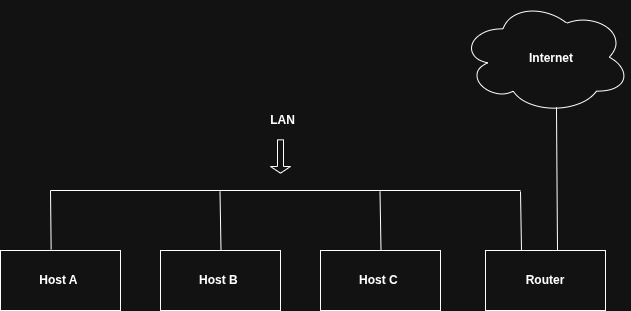

# Redes, Serviços e Segurança

## 1. Fundamentos de Rede em Linux

### 1.1 A questão central das redes

Quando se escreve um endereço numa carta e se a coloca no correio, assume-se que um sistema complexo de classificação, transporte e entrega vai tratar do resto. Não é necessário saber quantos aviões, camiões ou carteiros estão envolvidos. A carta chega. Redes de computadores funcionam por um princípio semelhante: esconde-se a complexidade por baixo de camadas de abstracção, de forma a que uma aplicação possa enviar dados para o outro lado do mundo sem saber nada sobre cabos, routers ou protocolos de baixo nível.

Mas ao contrário do correio, as redes de computadores são engenharia pura. Cada decisão tem uma razão, cada número tem um significado, e quando algo falha, não existe carteiro a quem telefonar. É o administrador de sistemas que tem de perceber exactamente o que aconteceu, em que camada o problema está, e como corrigi-lo.

Para isso, duas perguntas fundamentais precisam de ser respondidas com precisão em qualquer comunicação entre computadores: como é que o emissor sabe para onde enviar os dados, e quando os dados chegam ao destino, como sabe o receptor o que acabou de receber? A resposta não vem de um único mecanismo, mas de um conjunto de componentes organizados em camadas independentes, cada uma responsável por um aspecto específico da comunicação. Compreender estas camadas não é teoria académica. É a diferença entre um administrador que configura serviços às cegas e um que sabe exactamente o que está a fazer e porquê.

### 1.2 A arquitectura em camadas: o modelo de rede

Uma rede funcional é construída sobre um conjunto de camadas empilhadas, onde cada camada depende dos serviços da camada abaixo e oferece serviços à camada acima. No contexto da internet, as camadas relevantes são quatro:

- A **camada de aplicação** contém os protocolos de alto nível que as aplicações usam para comunicar: HTTP para a web, FTP para transferência de ficheiros, SMTP para email, TLS para encriptação. O processamento desta camada acontece no espaço de utilizador.

- A **camada de transporte** define as características de transmissão de dados: verificação de integridade, portas de origem e destino, fragmentação de dados em pacotes e a sua remontagem no destino. Os protocolos mais comuns são o TCP (*Transmission Control Protocol*), que garante entrega ordenada e fiável, e o UDP (*User Datagram Protocol*), mais rápido mas sem garantias de entrega. No Linux, esta camada é gerida principalmente pelo kernel.

- A **camada de rede** define como mover pacotes de um host de origem para um host de destino, possivelmente através de múltiplas redes intermédias. O protocolo que governa a internet é o IP (*Internet Protocol*), nas versões 4 e 6.

- A **camada física** define como transmitir dados brutos através de um meio físico: cabos Ethernet, sinais wireless, fibra óptica. É a camada do hardware.

Quando se envia dados de um computador para outro, os dados percorrem estas camadas do topo para baixo no emissor, atravessam o meio físico, e sobem novamente as camadas no receptor. Este percurso acontece pelo menos duas vezes antes de os dados chegarem à aplicação de destino.

### 1.3 Rede local e acesso à internet

A configuração de rede mais comum em ambientes de escritório, laboratório e virtualização é a rede local com acesso à internet através de um router.

<figure align="center">
  
  <figcaption><b>img 1:</b> Topologia de uma rede local típica </figcaption>
</figure>

Neste modelo, todos os computadores ligados entre si formam uma **LAN** (*Local Area Network*). Um deles é o **router**, um host especial que sabe mover dados entre a rede local e o exterior. A ligação do router à internet chama-se **uplink** ou ligação WAN (*Wide Area Network*).

Cada máquina ligada à rede chama-se **host**. Os hosts numa LAN partilham normalmente o mesmo esquema de endereçamento e têm acesso uns aos outros directamente. Para comunicar com o exterior, enviam o tráfego para o router, que se encarrega de o encaminhar.

### 1.4 Endereçamento IP

#### IPv4

Cada host ligado à internet tem pelo menos um endereço IP. No IPv4, esse endereço é composto por 32 bits representados em quatro grupos de números decimais separados por pontos, como `10.23.2.37`. A esta representação chama-se notação dotted-quad.

Um endereço IP não identifica apenas o host: identifica também a rede a que o host pertence. Esta informação está codificada em conjunto com a máscara de sub-rede.

#### Sub-redes e máscaras

Uma sub-rede é um grupo de hosts cujos endereços IP partilham um prefixo comum. Para definir uma sub-rede são necessárias duas informações: o prefixo de rede e a máscara de sub-rede.

A máscara de sub-rede é um número de 32 bits onde os bits a 1 identificam a parte do endereço que pertence à rede, e os bits a 0 identificam a parte que pertence ao host. Por exemplo, a máscara `255.255.255.0` em binário é:

```
11111111 11111111 11111111 00000000
```

Os primeiros 24 bits identificam a rede, os últimos 8 bits identificam o host dentro dessa rede. Aplicando esta máscara ao endereço `10.23.2.37`, a parte de rede é `10.23.2` e a parte de host é `37`. Qualquer endereço que comece com `10.23.2` pertence à mesma sub-rede.

#### Notação CIDR

A notação CIDR (*Classless Inter-Domain Routing*) é a forma compacta e moderna de representar sub-redes. Em vez de escrever a máscara completa, escreve-se apenas o número de bits a 1 da máscara, precedido de uma barra:

`10.23.2.0/24` é equivalente a `10.23.2.0` com máscara `255.255.255.0`

A tabela seguinte mostra as máscaras mais comuns e as suas representações CIDR:

| Forma longa | Forma CIDR |
|-------------|------------|
| 255.0.0.0 | /8 |
| 255.255.0.0 | /16 |
| 255.240.0.0 | /12 |
| 255.255.255.0 | /24 |
| 255.255.255.192 | /26 |

A máscara `/24` é a mais comum em redes locais de utilizadores. Uma rede `/24` comporta 254 hosts (os endereços com a parte de host a `0` e a `255` são reservados).

#### IPv6

O IPv4 com 32 bits permite cerca de 4,3 mil milhões de endereços, um número que se revelou insuficiente para a escala actual da internet. O IPv6 usa endereços de 128 bits, representados em oito grupos de quatro dígitos hexadecimais separados por dois pontos:

```
2001:0db8:0a0b:12f0:0000:0000:0000:8b6e
```

Os zeros iniciais em cada grupo podem ser omitidos, e um único bloco contíguo de grupos de zeros pode ser substituído por `::`:

```
2001:db8:a0b:12f0::8b6e
```

Os hosts IPv6 têm normalmente dois endereços em simultâneo. O **endereço unicast global** é válido em toda a internet e começa sempre com `2` ou `3`. O **endereço link-local** é válido apenas na rede local e tem sempre o prefixo `fe80::/64`.

A maioria das redes modernas corre em modo **dual-stack**, onde IPv4 e IPv6 coexistem na mesma interface. Os dois protocolos são independentes e a aplicação é que escolhe qual usar para cada ligação.

### 1.5 Rotas e a tabela de encaminhamento

O kernel Linux mantém uma tabela de encaminhamento que define como chegar a cada destino de rede. Para cada pacote enviado, o kernel consulta esta tabela e decide: este destino está na rede local e pode ser alcançado directamente, ou tem de ser enviado para um router intermédio?

Para ver a tabela de encaminhamento actual:

```bash
$ ip route show
default via 10.23.2.1 dev enp0s31f6 proto static metric 100
10.23.2.0/24 dev enp0s31f6 proto kernel scope link src 10.23.2.4 metric 100
```

A segunda linha diz que a rede `10.23.2.0/24` é acessível directamente através da interface `enp0s31f6`. A primeira linha é a **rota por defeito**: qualquer destino que não corresponda a nenhuma outra regra é encaminhado para `10.23.2.1`, que é o router da rede local. Este endereço chama-se **gateway por defeito**.

#### O gateway por defeito

O gateway por defeito é o router através do qual todo o tráfego destinado ao exterior da rede local é enviado. Em notação CIDR, a rota por defeito é `0.0.0.0/0` para IPv4, porque corresponde a qualquer endereço possível. Quando nenhuma outra rota é mais específica, esta é sempre a que se aplica.

Por convenção, o router de uma rede `/24` está normalmente no primeiro endereço utilizável da sub-rede. Numa rede `10.23.2.0/24`, o gateway estará tipicamente em `10.23.2.1`. Trata-se apenas de uma convenção amplamente seguida, não de uma regra técnica.

### 1.6 Interfaces de rede

O kernel Linux mantém uma separação clara entre a camada física e a camada de rede, e liga-as através das **interfaces de rede**. Cada interface tem um nome que identifica o hardware subjacente.

Nas distribuições modernas com systemd, os nomes das interfaces são **preditivos**: derivam da localização física do hardware no sistema, o que garante que o nome não muda entre reboots. Um nome como `enp0s31f6` identifica uma placa Ethernet num slot PCI específico. Os nomes tradicionais `eth0`, `eth1` ainda aparecem em sistemas mais antigos ou em certas configurações de virtualização.

Existem também interfaces especiais sem hardware físico:

`lo` é a interface de loopback, sempre com o endereço `127.0.0.1`. É usada pelo sistema para comunicar consigo próprio. Processos locais comunicam entre si através do loopback sem que os dados saiam da máquina. Esta interface está sempre presente e activa.

Para ver todas as interfaces e os seus endereços:

```bash
$ ip address show
1: lo: <LOOPBACK,UP,LOWER_UP> mtu 65536 qdisc noqueue state UNKNOWN
    link/loopback 00:00:00:00:00:00 brd 00:00:00:00:00:00
    inet 127.0.0.1/8 scope host lo
    inet6 ::1/128 scope host

2: enp0s31f6: <BROADCAST,MULTICAST,UP,LOWER_UP> mtu 1500 qdisc fq_codel state UP
    link/ether 40:8d:5c:fc:24:1f brd ff:ff:ff:ff:ff:ff
    inet 10.23.2.4/24 brd 10.23.2.255 scope global enp0s31f6
    inet6 2001:db8:8500:e:52b6:59cc:74e9:8b6e/64 scope global
    inet6 fe80::d05c:97f9:7be8:bca/64 scope link
```

Cada interface tem um número sequencial. A interface `lo` é sempre a 1. Para cada interface activa, os campos mais importantes a verificar são:

`UP` indica que a interface está activa e operacional. A ausência desta palavra significa que a interface está desactivada.

`link/ether` seguido de seis pares hexadecimais é o **endereço MAC** (*Media Access Control*), o identificador único atribuído ao hardware de rede pelo fabricante. É usado na camada física para identificar dispositivos dentro da mesma rede local.

`inet` seguido de um endereço e máscara em CIDR é o endereço IPv4 da interface.

`inet6` com `scope global` é o endereço IPv6 válido em toda a internet. `inet6` com `scope link` é o endereço link-local, válido apenas na rede local.

A forma abreviada `ip a` produz o mesmo output:

```bash
$ ip a
```

### 1.7 Ferramentas de diagnóstico de rede

Um administrador de sistemas usa regularmente um conjunto de ferramentas para verificar a conectividade, diagnosticar problemas e analisar o comportamento da rede. Estas ferramentas formam um fluxo de diagnóstico progressivo: começa-se por verificar se a interface está activa, depois se há conectividade local, depois se há conectividade com o exterior, e finalmente qual o caminho que o tráfego percorre.

#### ping: verificar conectividade

O `ping` é a ferramenta de diagnóstico mais básica. Envia pacotes ICMP *echo request* para um destino e aguarda a resposta *echo reply*. É o equivalente a bater à porta de um host e ver se responde:

```bash
$ ping -c 4 10.23.2.1
PING 10.23.2.1 (10.23.2.1) 56(84) bytes of data.
64 bytes from 10.23.2.1: icmp_seq=1 ttl=64 time=1.76 ms
64 bytes from 10.23.2.1: icmp_seq=2 ttl=64 time=2.35 ms
64 bytes from 10.23.2.1: icmp_seq=4 ttl=64 time=1.69 ms
64 bytes from 10.23.2.1: icmp_seq=5 ttl=64 time=1.61 ms
```

A opção `-c 4` limita o número de pacotes enviados a 4. Sem ela, o `ping` corre indefinidamente até ser interrompido com `Ctrl+C`.

Os campos mais importantes do output são o número de sequência `icmp_seq` e o tempo de ida e volta `time`. Uma lacuna nos números de sequência, como a que existe entre `2` e `4` no exemplo, indica perda de pacotes. Numa rede local por cabo, o valor esperado é 0% de perda e tempos abaixo de 1ms. Se o destino for inacessível, o router mais próximo responde com um pacote ICMP "host unreachable".

Numa sequência de diagnóstico, o `ping` serve para:

```bash
# 1. Verificar que a interface local está activa (loopback)
$ ping -c 1 127.0.0.1

# 2. Verificar conectividade com o gateway
$ ping -c 4 10.23.2.1

# 3. Verificar conectividade com a internet
$ ping -c 4 8.8.8.8

# 4. Verificar resolução de nomes DNS
$ ping -c 4 google.com
```

Se o passo 3 funciona mas o passo 4 falha, o problema está na resolução de DNS, não na conectividade de rede.

>**Nota:** muitos firewalls e routers bloqueiam pacotes ICMP por razões de segurança. Um host que não responde ao `ping` pode estar activo mas configurado para ignorar estes pacotes. A ausência de resposta não é prova definitiva de inacessibilidade.

#### traceroute: mapear o caminho até ao destino

O `traceroute` mostra cada salto (*hop*) que o tráfego percorre entre o host local e o destino. Para cada router intermédio, mostra o endereço IP, o nome de host (quando disponível) e o tempo de resposta em três medições:

```bash
$ traceroute google.com
traceroute to google.com (142.250.184.110), 30 hops max, 60 byte packets
 1  gateway (192.168.1.1)          1.1 ms   1.3 ms   1.7 ms
 2  * * *
 3  10.200.4.1                    14.6 ms  14.9 ms  15.2 ms
 4  212.48.96.241                 17.6 ms  17.6 ms  17.9 ms
 5  74.125.243.113                22.8 ms  14.2 ms  14.4 ms
 6  142.250.184.110               21.9 ms  21.1 ms  21.6 ms
```

Os asteriscos na linha 2 indicam que esse router não respondeu às sondas do `traceroute`, por configuração ou por firewall. Isto é comum e não significa necessariamente um problema, especialmente nos primeiros saltos dentro da rede do ISP.

O `traceroute` é útil para identificar onde a conectividade falha: se os primeiros saltos respondem mas a partir de certo ponto aparecem apenas asteriscos, o problema está algures nessa parte do percurso.

#### ip: o comando central de configuração de rede

O `ip` é a ferramenta moderna para visualizar e configurar todos os aspectos de rede no Linux. Substituiu os comandos `ifconfig` e `route`, que ainda aparecem em sistemas mais antigos mas estão obsoletos. Os subcomandos mais usados são:

```bash
# Ver todas as interfaces e endereços
$ ip address show
$ ip a

# Ver apenas uma interface específica
$ ip a show enp0s31f6

# Ver a tabela de encaminhamento
$ ip route show
$ ip r

# Ver a tabela de encaminhamento IPv6
$ ip -6 route show

# Adicionar um endereço a uma interface (requer root)
$ sudo ip address add 192.168.1.100/24 dev enp0s31f6

# Activar ou desactivar uma interface
$ sudo ip link set enp0s31f6 up
$ sudo ip link set enp0s31f6 down

# Adicionar uma rota por defeito
$ sudo ip route add default via 192.168.1.1
```

As alterações feitas com `ip` são temporárias: não sobrevivem a um reboot. Para configurações permanentes, usa-se o NetworkManager ou os ficheiros de configuração em `/etc/sysconfig/network-scripts/` em CentOS.

#### ss e netstat: conexões e portas activas

O `ss` (*socket statistics*) é a ferramenta moderna para examinar as conexões de rede activas e as portas em escuta. O `netstat` é o seu predecessor, ainda amplamente usado e disponível na maioria dos sistemas:

```bash
# Ver todas as conexões TCP activas
$ ss -t

# Ver todas as portas em escuta (TCP e UDP)
$ ss -tuln

# Ver portas em escuta com o processo que as abriu (requer root)
$ sudo ss -tulnp

# Equivalente com netstat
$ netstat -tuln
$ sudo netstat -tulnp
```

As opções mais úteis do `ss`:

| Opção | Efeito |
|-------|--------|
| `-t` | Mostrar conexões TCP |
| `-u` | Mostrar conexões UDP |
| `-l` | Mostrar apenas sockets em escuta |
| `-n` | Mostrar números em vez de nomes de serviços |
| `-p` | Mostrar o processo associado a cada socket |

Para um administrador, `ss -tulnp` é o comando mais útil: mostra todas as portas em escuta com o processo responsável por cada uma. Permite verificar quais os serviços activos e em que portas estão a escutar, o que é informação essencial para diagnóstico e para auditoria de segurança:

```bash
$ sudo ss -tulnp
Netid  State   Recv-Q Send-Q  Local Address:Port   Peer Address:Port  Process
tcp    LISTEN  0      128           0.0.0.0:22      0.0.0.0:*          users:(("sshd",pid=1089))
tcp    LISTEN  0      128           0.0.0.0:80      0.0.0.0:*          users:(("nginx",pid=1203))
tcp    LISTEN  0      128           0.0.0.0:3306    0.0.0.0:*          users:(("mysqld",pid=1445))
```

Este output mostra que o servidor tem SSH (porta 22), Nginx (porta 80) e MySQL (porta 3306) em escuta.

