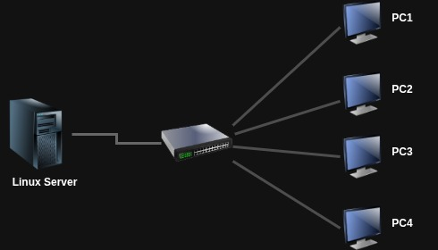

# Laboratório 5 - Redes, Serviços e Segurança

## Objectivos

No fim deste laboratório, deverá ser capaz de:

- Diagnosticar e configurar a rede com `ip`, `ping`, `traceroute` e `ss`.
- Aceder a máquinas remotas e transferir ficheiros em segurança com `ssh`, chaves, `scp` e `rsync`.
- Descarregar conteúdo com `wget` e `curl`.
- Resolver nomes e configurar DNS local (`dig`/`host`/`nslookup`, `/etc/hosts`, `/etc/resolv.conf`).
- Configurar um servidor DHCP com gamas e reservas estáticas, e um cliente DHCP.
- Sincronizar o tempo com `chronyd`.
- Publicar sites com o Apache, incluindo virtual hosts, abrindo o firewall e corrigindo o contexto SELinux.
- Centralizar logs com o `rsyslog`.
- Proteger o servidor com o `firewalld` e o `SELinux`.

## Pré-requisitos

- Ter lido o Capítulo 7.
- Uma máquina virtual com CentOS Stream que fará de **servidor** (a "Linux Server" da topologia). A maioria dos serviços é configurada aqui.
- Uma segunda máquina (a VM com interface gráfica, ou qualquer PC da topologia) que fará de **cliente**. Se só tiver uma máquina, simule o cliente ligando-se a `localhost` (crie um utilizador de teste para o efeito, como sugerido no Capítulo 7).
- Um utilizador comum com privilégios sudo em ambas.

## Topologia simulada

Os exercícios assumem a seguinte topologia: um **servidor Linux** ligado, através de um switch, a quatro clientes (PC1–PC4). O servidor presta os serviços de rede (DHCP, DNS local, web, logs centralizados) e os clientes consomem-nos. Nas máquinas de que dispõe, o "servidor" é a sua VM CentOS e os "clientes" são a segunda VM (ou o próprio `localhost`).

<figure align="center">
  
  <figcaption><b>Topologia do laboratório:</b> o servidor Linux serve os clientes PC1–PC4 através de um switch.</figcaption>
</figure>

---

## Exercícios

### Parte A  (Diagnóstico e configuração de rede)

#### Exercício 1 

1. No servidor, liste as interfaces de rede e os respectivos endereços com `ip a` (ou `ip addr show`). Identifique o nome da interface activa, o seu endereço IPv4 e o endereço MAC.
2. Consulte a tabela de encaminhamento com `ip r` (ou `ip route show`) e identifique a rota por defeito (o gateway).

#### Exercício 2 

Siga o fluxo de diagnóstico progressivo:

1. Verifique o loopback: `ping -c1 127.0.0.1`.
2. Verifique o gateway: `ping -c4 <IP_do_gateway>`.
3. Verifique a internet por IP: `ping -c4 8.8.8.8`.
4. Verifique a resolução de nomes: `ping -c4 google.com`.
5. Se o passo 3 funciona mas o 4 falha, onde está o problema? Trace o caminho até ao exterior com `traceroute google.com`.

#### Exercício 3 

Liste todas as portas em escuta no servidor com o processo responsável por cada uma (`sudo ss -tulnp`). Que serviços estão activos e em que portas? Compare com o equivalente `netstat -tulnp`.

### Parte B  (Acesso remoto e transferência de ficheiros)

#### Exercício 4 

1. A partir do cliente, inicie uma sessão remota no servidor com `ssh utilizador@<IP_servidor>` (ou `ssh utilizador@localhost`). Aceite a fingerprint no primeiro contacto e autentique-se.
2. Sem abrir sessão interactiva, execute um único comando remoto que mostre no cliente o conteúdo do ficheiro `/etc/redhat-release` do servidor (`ssh utilizador@<IP_servidor> cat /etc/redhat-release`).

#### Exercício 5 

Autenticação por chave, sem password:

1. No cliente, gere um par de chaves **sem passphrase** (`ssh-keygen -t ed25519`).
2. Copie a chave pública para a conta no servidor com `ssh-copy-id utilizador@<IP_servidor>`.
3. Volte a ligar-se por `ssh` e confirme que já não é pedida a password. Porque é que a autenticação por chave é mais segura do que a por password?

#### Exercício 6 

1. Copie um ficheiro do cliente para o servidor com `scp ficheiro.txt utilizador@<IP_servidor>:~/`.
2. Copie **recursivamente** um directório do servidor para `/tmp` no cliente, **preservando** as datas de modificação originais (`rsync -a` ou `scp -rp`). Que opção garante essa preservação?
3. Repita a sincronização com `rsync` em modo simulação (`--dry-run`) e observe o que seria transferido sem transferir nada.

#### Exercício 7 

1. Descarregue um ficheiro da internet com `wget <URL>` (por exemplo uma página ou um pequeno ficheiro).
2. Com o `curl`, mostre apenas os cabeçalhos HTTP de resposta de um site (`curl -I <URL>`).
3. Com o `curl`, teste se um serviço está a responder sem imprimir o corpo (`curl -sf <URL>` e verifique `echo $?`).

### Parte C  (Resolução de nomes (DNS))

#### Exercício 8 

1. Resolva um nome com `dig google.com` e leia a secção *ANSWER*. Repita com a forma curta `dig +short google.com`.
2. Faça uma resolução **inversa** de `8.8.8.8` (`dig -x 8.8.8.8`).
3. Consulte o registo `MX` de um domínio e depois repita a consulta usando explicitamente o servidor `8.8.8.8` (`dig MX <domínio> @8.8.8.8`). Compare `host` e `nslookup` no mesmo nome.

#### Exercício 9 

1. Crie em `/etc/hosts` uma entrada que lhe permita comunicar com a máquina local pelo nome `myownhost` e teste com `ping -c1 myownhost`.
2. Acrescente `8.8.8.8` como **último** servidor DNS da sua configuração (via `/etc/resolv.conf` ou `nmcli con mod ... ipv4.dns`). Confirme a ordem de consulta.

### Parte D  (Serviços de rede no servidor)

#### Exercício 10 

Configure o servidor DHCP para a rede da topologia. Edite `/etc/dhcp/dhcpd.conf` para:

1. Distribuir endereços na gama `192.168.192.1`–`192.168.192.55` (ajuste à sua sub-rede) com um **tempo de lease de 2 horas**.
2. Garantir que a máquina com o endereço MAC `00:10:5A:C7:4B:89` recebe **sempre** o endereço `192.168.192.55` (reserva estática por bloco `host`).
3. Validar a sintaxe **antes** de arrancar (`sudo dhcpd -t -cf /etc/dhcp/dhcpd.conf`), depois activar o serviço e abrir a porta no firewall.

#### Exercício 11 

Simule a entrada de uma nova máquina (PC5) na rede, assumindo o SO já instalado:

1. No cliente, coloque a interface a obter configuração por DHCP (via `nmcli`, ou `dhclient <interface>`).
2. Confirme o endereço obtido com `ip a` e verifique que veio da gama definida no servidor.
3. Force a renovação do lease e observe a configuração atribuída (gateway, DNS).

#### Exercício 12 

1. Confirme que o `chronyd` está activo e a sincronizar (`chronyc tracking` e `chronyc sources`).
2. Interprete a qualidade da sincronização (fonte seleccionada, desvio).
3. Confirme/defina o fuso horário do servidor (`timedatectl`, `timedatectl set-timezone ...`).

#### Exercício 13 

Publique um site simples no servidor:

1. Instale o Apache (`sudo dnf install httpd`) e crie em `DocumentRoot` (`/var/www/html`) um ficheiro `index.html` com o texto `My Own Web Server`.
2. Active e arranque o serviço no arranque (`systemctl enable --now httpd`) e abra o serviço `http` no firewall.
3. Confirme localmente com `curl http://localhost` e depois a partir do **cliente** (`curl http://<IP_servidor>`). Confirme também que porta o `httpd` está a escutar (`ss -tlnp`).

#### Exercício 14 

Adicione um virtual host baseado em nome:

1. Crie `/etc/httpd/conf.d/example.conf` com um `<VirtualHost *:80>` que tenha `ServerName joe.example.org`, `DocumentRoot /var/www/html/example.org` e um `DirectoryIndex index.html`.
2. Crie o `DocumentRoot` e um `index.html` com o texto `Welcome to the House of Joe`. Corrija o contexto SELinux com `sudo restorecon -Rv /var/www/html/example.org`.
3. Verifique a sintaxe (`apachectl configtest`), recarregue (`systemctl reload httpd`), acrescente `joe.example.org` à entrada `localhost` em `/etc/hosts` e teste com `curl http://joe.example.org`.

### Parte E  (Segurança e observabilidade)

#### Exercício 15 

1. Veja a zona por defeito e a sua configuração (`firewall-cmd --get-default-zone`, `firewall-cmd --list-all`).
2. Abra o serviço `http` de forma **permanente** e aplique (`--add-service=http --permanent` seguido de `--reload`).
3. Crie uma regra rica que permita SSH **apenas** a partir da sua sub-rede (por exemplo `192.168.192.0/24`) e bloqueie o resto. Confirme com `firewall-cmd --list-all`.

#### Exercício 16 

O SELinux é a causa mais comum de "funciona localmente mas não externamente" no CentOS.

1. Veja o modo actual (`getenforce`, `sestatus`).
2. Observe o contexto dos ficheiros do site (`ls -Z /var/www/html`) e das portas (`semanage port -l | grep http`).
3. Se tiver publicado o Apache numa porta não-standard, autorize-a com `semanage port -a -t http_port_t -p tcp <porta>`; se o Apache precisar de fazer ligações de saída, active o boolean apropriado (`setsebool -P httpd_can_network_connect on`). Explique porque é preferível ajustar o SELinux a desactivá-lo.

#### Exercício 17 

Centralize e vigie os eventos de autenticação:

1. Crie uma regra no `rsyslog` (por exemplo em `/etc/rsyslog.d/`) que envie `authpriv.info` e acima para `/var/log/myauth`, e reinicie o `rsyslog`.
2. Numa sessão, acompanhe o ficheiro em tempo real (`sudo tail -f /var/log/myauth`).
3. Noutra sessão, tente um `ssh` com uma **password errada** para um utilizador válido e observe a mensagem de falha a aparecer no ficheiro.

#### Exercício 18 

Observe tráfego real com o `tcpdump`:

1. Numa sessão, capture o tráfego na porta 80 do servidor (`sudo tcpdump -i any -A port 80`).
2. Noutra sessão (ou a partir do cliente), gere um pedido com `curl http://<IP_servidor>`.
3. Observe o pedido e a resposta HTTP em texto claro. Que conclusão tira sobre a confidencialidade do HTTP face ao HTTPS?

---

## Desafio 

Cenário: transforme a sua VM CentOS no **servidor central da topologia**, prestando serviços a um cliente, e valide cada serviço a partir desse cliente.

1. Configure o servidor DHCP para servir a sub-rede da topologia, com uma reserva estática para o endereço MAC do cliente. Coloque o cliente a obter endereço por DHCP e confirme que recebeu o endereço reservado.
2. Configure a resolução de nomes de modo a que o nome `servidor.lab` aponte para o IP do servidor (via `/etc/hosts` distribuído ou entrada local no cliente). Teste com `ping servidor.lab`.
3. Publique no servidor uma página web que diga `Servidor da topologia operacional` e sirva-a num virtual host `servidor.lab`. Abra o `http` no firewall e corrija o contexto SELinux. Confirme a partir do cliente com `curl http://servidor.lab`.
4. Active a recolha de eventos de autenticação em `/var/log/myauth` e, a partir do cliente, gere um login SSH falhado e um bem-sucedido; confirme ambos no log do servidor.
5. Endureça o servidor: garanta que apenas os serviços necessários (`ssh`, `http`, `dhcp`) estão abertos no `firewalld`, e que o Telnet não está instalado nem activo.
6. Produza um pequeno relatório (`~/relatorio_rede.txt`) com: interfaces e rotas (`ip a`, `ip r`), portas em escuta (`ss -tulnp`), e o estado do `firewalld` e do `SELinux`.

Verifique cada passo à medida que avança. Se algo não funcionar como esperado, investigue antes de consultar a solução.
