# Soluções — Laboratório 3: Acesso ao Sistema e Estrutura de Ficheiros

Este documento contém as soluções explicadas do Laboratório 3. Cada solução mostra os comandos, o resultado esperado, e uma explicação do que se aprende. Incluem-se capturas de ecrã.

> 💡 **Antes de consultar estas soluções, tente resolver os exercícios sozinho.** O valor da prática está no processo de descobrir a resposta. Use as soluções para compreender o que fez, ou para desbloquear quando estiver realmente preso, não para copiar.

---

## Parte A — Acesso e identidade

### Solução Exercício 2

```bash
# 1. Com a conta normal: acesso negado
$ cat /etc/shadow
cat: /etc/shadow: Permission denied

# 2. Com sudo, sem mudar de identidade
$ sudo cat /etc/shadow
[sudo] password for thoveserv:
root:$y$j9T$daS02nfDatQ3F6714...::0:99999:7:::
bin:*:20186:0:99999:7:::
...
thoveserv:$y$j9T$/n46aLbVqZnEd5f...:0:99999:7:::

# 3. Sessão interactiva de root
$ sudo -i
# whoami
root
#
```

O resultado destes passos é visível na captura seguinte:

> *(imagem: saída dos comandos `cat`, `sudo cat` e `sudo -i` sobre `/etc/shadow`)*

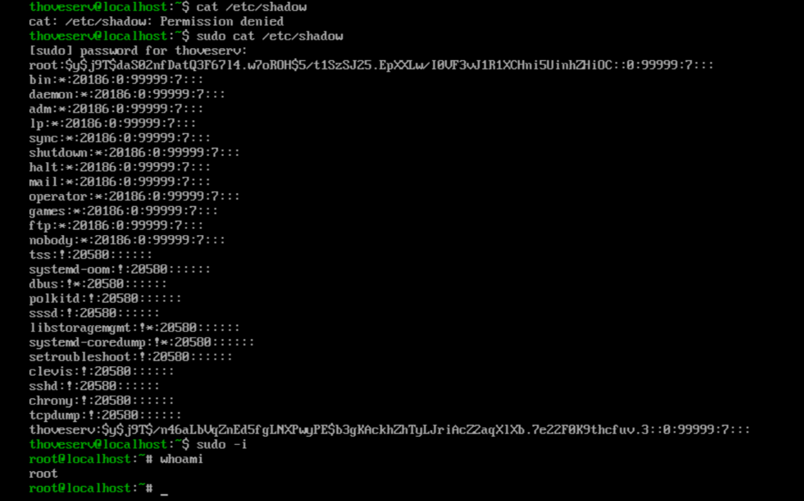

##### 4. **Observações sobre a saída:**

- O primeiro `cat /etc/shadow` devolve `Permission denied`: um utilizador comum não pode ler este ficheiro, que contém as passwords cifradas de todas as contas.
- Com `sudo cat`, o conteúdo aparece. Cada linha corresponde a uma conta; o segundo campo é a password cifrada (contas de sistema mostram `*` ou `!`, que significam que não têm login por password).
- Após `sudo -i`, o prompt muda de `thoveserv@localhost:~$` para `root@localhost:~#`. O símbolo `#` no final do prompt é a convenção que indica uma sessão de root, e o `whoami` confirma-o.
---

### Solução Exercício 3

```bash
# 1. Criar o utilizador
$ sudo useradd Anna

# 2. Definir a password inicial
$ sudo passwd Anna
New password:
BAD PASSWORD: The password fails the dictionary check - it is too simplistic/systematic
Retype new password:
passwd: password updated successfully

# 3. Confirmar a criação da conta
$ sudo cat /etc/passwd
root:x:0:0:Super User:/root:/bin/bash
...
thoveserv:x:1000:1000:thoveserv:/home/thoveserv:/bin/bash
Anna:x:1001:1001::/home/Anna:/bin/bash
```

O resultado destes passos é visível na captura seguinte:

> *(imagem: criação da conta Anna com `useradd`, `passwd` e confirmação em `/etc/passwd`)*

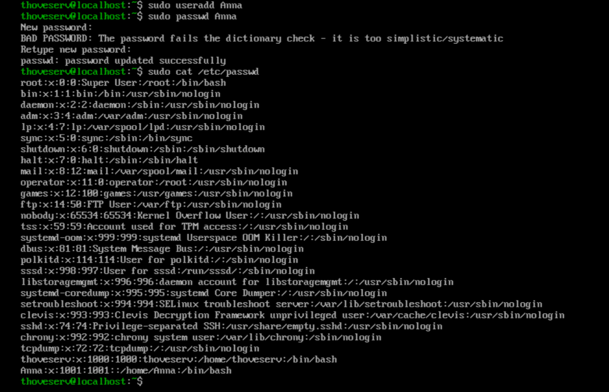

##### 4. **Observações sobre a saída:**

- O `useradd Anna` cria a conta em silêncio, sem produzir qualquer mensagem quando tem sucesso. A ausência de saída é, em Unix, sinal de que correu bem.
- O `passwd Anna` avisa `BAD PASSWORD: ... too simplistic/systematic` porque a password escolhida falhou a verificação de qualidade do sistema (o módulo `pam_pwquality`). Note-se que, por se estar a executar como root via `sudo`, o aviso **não** impede a definição: o root pode impor uma password fraca, e a mensagem seguinte confirma `password updated successfully`. Um utilizador comum a alterar a sua própria password seria obrigado a escolher outra.
- No `/etc/passwd`, a nova conta aparece na última linha: `Anna:x:1001:1001::/home/Anna:/bin/bash`. Os campos, separados por `:`, são o nome (`Anna`), o `x` que indica que a password está no `/etc/shadow`, o UID (`1001`), o GID (`1001`), o campo de comentário (vazio), o directório pessoal (`/home/Anna`) e a shell (`/bin/bash`). O UID 1001 segue-se ao 1000 do primeiro utilizador criado na instalação.

> 💡 Por convenção, os nomes de utilizador em Linux escrevem-se em minúsculas (`anna` em vez de `Anna`). O sistema aceita maiúsculas, mas a prática habitual, e a que evita confusões em scripts e permissões, é usar apenas minúsculas.

---

## Parte B — Navegação

### Solução Exercício 4

```bash
# 1. Descobrir o directório actual
$ pwd
/home/thoveserv

# 2. Navegar para /etc/systemd com caminho absoluto
$ cd /etc/systemd/

# 3. Subir um nível com caminho relativo
$ cd ..

# 4. Saltar directamente para o directório pessoal
$ cd

# 5. Regressar ao directório anterior
$ cd -
/etc
```

O resultado destes passos é visível na captura seguinte:

> *(imagem: navegação com `pwd`, caminhos absolutos e relativos, `cd` e `cd -`)*

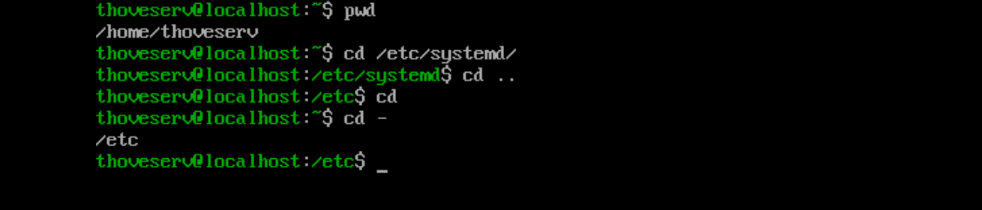

##### 6. **Observações sobre a saída:**

- O `pwd` confirma o ponto de partida, `/home/thoveserv`, o directório pessoal do utilizador.
- O `cd /etc/systemd/` usa um **caminho absoluto** (começa por `/`): funciona a partir de qualquer ponto do sistema.
- O `cd ..` usa um **caminho relativo**: os dois pontos (`..`) referem-se ao directório pai, subindo de `/etc/systemd` para `/etc`. O prompt actualiza-se em conformidade.
- O `cd` sem qualquer argumento salta directamente para o directório pessoal, equivalente a `cd ~`. Repare que o prompt volta a mostrar `~`.
- O `cd -` regressa ao directório onde se estava imediatamente antes (`/etc`) e imprime esse caminho. É o atalho ideal para alternar entre dois directórios sem digitar o caminho completo.

---

## Parte C — Criar e manipular ficheiros

### Solução Exercício 5

```bash
# 1. Criar o directório de trabalho
$ mkdir projectos
$ cd projectos/

# 2. Criar os nove ficheiros vazios
$ touch casa1 casa2 casa3 casa4 casa5 casa6 casa7 casa8 casa9
# (alternativa mais elegante, com expansão de chavetas:)
$ touch casa{1..9}

# Confirmar a criação
$ ls -ls
total 0
0 -rw-r--r--. 1 thoveserv thoveserv 0 Aug 31 04:52 casa1
0 -rw-r--r--. 1 thoveserv thoveserv 0 Aug 31 04:52 casa2
...
0 -rw-r--r--. 1 thoveserv thoveserv 0 Aug 31 04:52 casa9

# 3. Argumento único do ls que lista apenas os nove ficheiros
$ ls casa[1-9]
casa1  casa2  casa3  casa4  casa5  casa6  casa7  casa8  casa9
```

O resultado da criação dos ficheiros é visível na captura seguinte:

> *(imagem: criação do directório `projectos` e dos nove ficheiros `casa1`–`casa9`)*

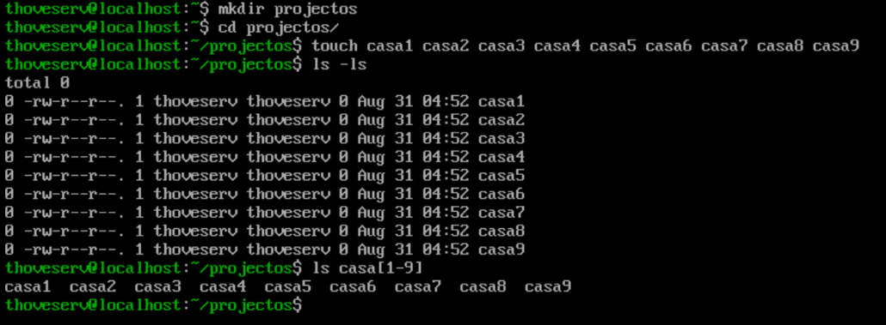

##### **Observações sobre a saída:**

- O `touch` cria ficheiros vazios (0 bytes) quando o nome indicado não existe. Na captura, os nove ficheiros foram criados escrevendo cada nome; a alternativa `casa{1..9}` produz exactamente o mesmo resultado com muito menos digitação, deixando a shell gerar a sequência de 1 a 9.
- No `ls -ls`, todos os ficheiros mostram tamanho `0`, as mesmas permissões (`-rw-r--r--`) e o mesmo timestamp, porque foram todos criados no mesmo instante pelo mesmo comando. A primeira coluna (`0`) é o número de blocos ocupados no disco, também zero por os ficheiros estarem vazios.
- **A resposta à terceira parte do exercício** é o padrão `casa[1-9]`. Os parênteses rectos `[1-9]` correspondem a um único caractere entre 1 e 9, isolando exactamente estes nove ficheiros mesmo que o directório contivesse muitos outros. Um padrão como `casa*` seria menos preciso: apanharia também `casa10`, `casa_backup` ou qualquer outro nome começado por `casa`.

> 💡 A diferença entre `casa[1-9]` e `casa*` é a essência do exercício. O primeiro é cirúrgico (um só dígito de 1 a 9); o segundo é abrangente (qualquer coisa depois de `casa`). Escolher o padrão mais restrito possível é um hábito que evita apanhar ficheiros indesejados, sobretudo quando o padrão é usado com comandos destrutivos como `rm`.

### Solução Exercício 6

```bash
# Estando em ~/projectos

# 1. Criar a hierarquia casas/portas de uma só vez
$ mkdir -p ~/projectos/casas/portas

# 2. Ficheiro em casas/ usando CAMINHO RELATIVO
$ touch casas/moradia.txt

# 3. Ficheiro em portas/ usando CAMINHO ABSOLUTO
$ touch ~/projectos/casas/portas/dobradica.txt

# 4. Criar a estrutura em falta e o terceiro ficheiro
$ mkdir -p exterior/vegetacao
$ touch exterior/vegetacao/paisagem.txt
```

O resultado destes passos é visível na captura seguinte:

> *(imagem: criação da hierarquia de directórios e ficheiros com caminhos absolutos e relativos)*

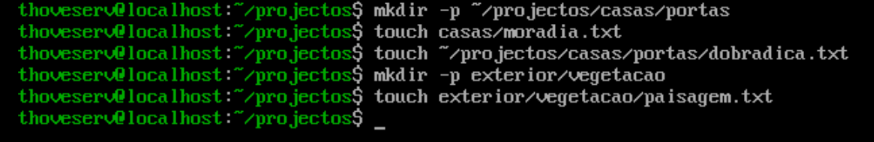

##### **Observações sobre a saída:**

- Nenhum dos comandos produz saída: tanto o `mkdir` como o `touch` são silenciosos quando têm sucesso. Em Unix, a ausência de mensagem é sinal de que tudo correu bem. A captura mostra a *sequência* de comandos, não um resultado, precisamente porque não há resultado visível a mostrar.
- O `mkdir -p ~/projectos/casas/portas` cria os dois níveis (`casas` e `portas`) de uma só vez. A opção `-p` cria todos os directórios intermédios em falta e, além disso, não devolve erro se algum já existir.
- O `touch casas/moradia.txt` usa um **caminho relativo**: funciona porque o utilizador está em `~/projectos`, pelo que `casas/` é interpretado a partir daí. O `touch ~/projectos/casas/portas/dobradica.txt` usa um **caminho absoluto** (o `~` expande para `/home/thoveserv`): funcionaria a partir de qualquer directório. Ambos os estilos chegam ao mesmo sítio, e saber alternar entre eles é o objectivo do exercício.
- O terceiro ficheiro exigiu criar primeiro a estrutura `exterior/vegetacao`, que ainda não existia. Sem o `mkdir -p` prévio, o `touch exterior/vegetacao/paisagem.txt` falharia com `No such file or directory`, porque o `touch` cria ficheiros mas **não** cria os directórios que os contêm.

> 💡 O `touch` cria ficheiros, mas nunca directórios. Se o caminho até ao ficheiro ainda não existir, é preciso criá-lo primeiro com `mkdir -p`. Confundir os dois papéis é um dos erros mais comuns de quem começa: tentar criar `a/b/c.txt` com um único `touch` sem que `a/b/` exista.

### Solução Exercício 7

```bash
# Copiar casa1 e casa5 para o directório casas/
$ cp casa1 casa5 ./casas/
```

##### **Observações sobre a saída:**

- O `cp` aceita múltiplas origens seguidas de um destino: aqui, `casa1` e `casa5` são copiados para `./casas/` num único comando. Quando o último argumento é um directório, o `cp` coloca lá dentro todas as origens indicadas.
- O `./` em `./casas/` refere-se explicitamente ao directório actual, mas é opcional: `cp casa1 casa5 casas/` teria o mesmo efeito, já que um caminho que não começa por `/` é sempre relativo ao directório actual.
- Como acontece com a maioria das operações de ficheiro bem-sucedidas, o `cp` não produz qualquer saída. Para confirmar, pode listar-se o destino: `ls casas/` deve mostrar agora `casa1` e `casa5` a par de `moradia.txt` e do subdirectório `portas`.

> 💡 Ao copiar, os originais **permanecem** no sítio: `cp` duplica. Para *mover* (deixando de existir na origem), usa-se o `mv`. Confundir os dois é comum no início.

---

### Solução Exercício 8

```bash
# Cópia recursiva de /usr/share/doc preservando atributos
$ cp -rp /usr/share/doc ~/projectos/
```

##### **Observações sobre a saída:**

- Este exercício exige duas coisas: copiar um directório inteiro (com todo o seu conteúdo) e preservar as datas e permissões originais. Cada uma corresponde a uma opção do `cp`.
- A opção `-r` (*recursive*) torna a cópia recursiva, ou seja, copia o directório e tudo o que ele contém, a qualquer profundidade. Sem ela, o `cp` recusaria copiar um directório.
- A opção `-p` (*preserve*) mantém os atributos originais: permissões, dono, grupo e, sobretudo, as datas de modificação. Sem ela, os ficheiros copiados ficariam com a data actual e com as permissões ajustadas pela `umask`, perdendo a informação original.
- Uma alternativa equivalente e mais concisa é `cp -a` (*archive*), que combina `-r`, `-p` e ainda a preservação de ligações simbólicas. Para duplicar árvores de ficheiros fielmente, `cp -a` é frequentemente a escolha preferida.

> 💡 A cópia demora e não mostra progresso: `/usr/share/doc` contém muitos ficheiros. A ausência de saída não significa que bloqueou; significa que está a trabalhar. Só o regresso do prompt indica que terminou.

---

### Solução Exercício 9

```bash
# Listagem recursiva de todo o conteúdo, paginada
$ ls -R ~/projectos | less
```

##### **Observações sobre a saída:**

- A opção `-R` (*recursive*) faz o `ls` descer por todos os subdirectórios, listando o conteúdo de cada um. Numa estrutura profunda como a que resultou dos exercícios anteriores (agravada pela cópia de `/usr/share/doc`), a saída é longa demais para caber num só ecrã.
- O operador **pipe** (`|`) encaminha a saída do `ls` directamente para a entrada do `less`, que a apresenta página a página. Sem o `less`, a listagem passaria toda de uma vez, deixando visível apenas o fim.
- Dentro do `less`, navega-se com as setas e a barra de espaços (avançar uma página), `b` (recuar), `/` seguido de um termo (pesquisar), e `q` para sair.

> 💡 O padrão `comando | less` é um dos mais úteis da linha de comandos: aplica-se a qualquer comando cuja saída seja demasiado extensa para o ecrã, transformando-a numa leitura navegável. Reaparece constantemente ao longo deste guia.

### Solução Exercício 10

```bash
# Remover casa6, casa7 e casa8 sem confirmação
$ rm -f casa6 casa7 casa8
```

O resultado dos exercícios 10 a 12 é visível numa única captura, apresentada após o Exercício 12.

##### **Observações sobre a saída:**

- A opção `-f` (*force*) suprime qualquer pedido de confirmação e não devolve erro se algum dos ficheiros não existir. O `rm` remove os três ficheiros indicados de uma só vez, em silêncio.
- Sem o `-f`, e dependendo da configuração do sistema (é comum o `rm` estar definido como um alias `rm -i`), o comando poderia pedir confirmação para cada ficheiro. O `-f` garante uma remoção directa, útil em scripts, mas a usar com consciência.

>  O `-f` remove a rede de segurança. Combinado com um nome errado ou um wildcard mal formado, apaga sem perguntar e sem forma de recuperar. Nunca há lixeira no `rm`.

---

### Solução Exercício 11

```bash
# Mover casa3 e casa4 para casas/portas/
$ mv casa3 casa4 casas/portas/
```

##### **Observações sobre a saída:**

- Tal como o `cp`, o `mv` aceita múltiplas origens seguidas de um destino: quando o último argumento é um directório, todas as origens são movidas para lá dentro.
- A diferença essencial em relação ao `cp` é que o `mv` **não duplica**: `casa3` e `casa4` deixam de existir em `~/projectos` e passam a existir apenas em `casas/portas/`. Uma verificação com `ls` confirmaria que já não estão no directório de origem.
- O `mv` serve também para **renomear**: `mv nome_antigo nome_novo` no mesmo directório muda simplesmente o nome do ficheiro. Mover e renomear são, para o Unix, a mesma operação.

---

### Solução Exercício 12

```bash
# Remover o directório casas/portas/ e todo o seu conteúdo
$ rm -rf casas/portas/
```

O resultado dos exercícios 10 a 12 é visível na captura seguinte:

> *(imagem: remoção com `rm -f`, movimentação com `mv`, e remoção recursiva com `rm -rf`)*

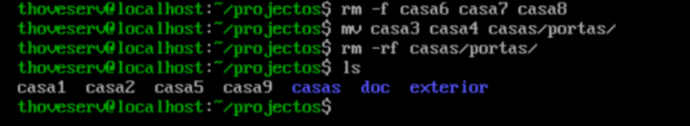

##### **Observações sobre a saída:**

- A opção `-r` (*recursive*) permite ao `rm` remover um directório e tudo o que ele contém, descendo por toda a sua estrutura. Sem ela, o `rm` recusa-se a apagar directórios. A opção `-f` acrescenta a supressão de confirmações, tal como no Exercício 10.
- Repare que este comando apaga não só o directório `portas/`, mas também os ficheiros `casa3` e `casa4` que lá tinham sido movidos no exercício anterior. Uma vez removidos desta forma, não há qualquer possibilidade de os recuperar.
- Uma alternativa, se o objectivo fosse apenas remover um directório **vazio**, seria o `rmdir`. Mas como `portas/` continha ficheiros, só o `rm -r` (ou `rm -rf`) o consegue remover de uma vez.

>  O `rm -rf` é o comando mais perigoso desta lista, e um dos mais perigosos do Linux. Apaga recursivamente e sem confirmação. Um erro no caminho, sobretudo com privilégios de root, pode destruir grandes porções do sistema num instante. A regra de ouro: **ler o comando duas vezes antes de premir Enter**, e desconfiar sempre que o alvo do `rm -rf` for algo próximo da raiz (`/`) ou construído com wildcards. Um hábito seguro é listar primeiro com `ls` o que se vai apagar.

## Parte D — Wildcards

### Solução Exercício 13

```bash
# 1. Ficheiros que começam por "casa"
$ ls casa*
casa1  casa2  casa9

casas:
casa1  casa5  moradia.txt

# 2. Apenas os que terminam num dígito
$ ls casa[0-9]
casa1  casa2  casa9

# 3. "casa" seguido de exactamente um caractere
$ ls casa?
casa1  casa2  casa9

casas:
casa1  casa5  moradia.txt
```

O comportamento dos três padrões é visível na captura seguinte:

> *(imagem: comparação de `casa*`, `casa[0-9]` e `casa?` e o efeito sobre o directório `casas`)*

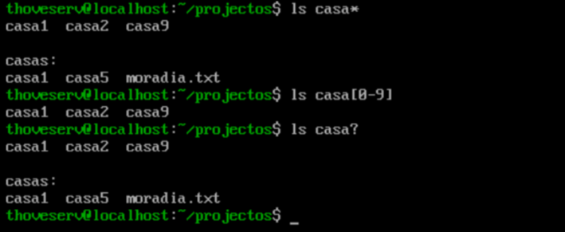

##### **Observações sobre a saída:**

Esta é uma das capturas mais reveladoras do laboratório, porque expõe uma subtileza importante. Repare que **dois dos três padrões apanharam o directório `casas`**, e um não.

- **`casa*`** corresponde a "casa" seguido de *qualquer coisa*, incluindo `casas`. Como `casas` é um directório, o `ls` não se limita a listá-lo: mostra o seu **conteúdo** (`casa1 casa5 moradia.txt`), daí o bloco `casas:` que aparece na saída. O `*` é o padrão mais abrangente e, por isso, o menos preciso.

- **`casa[0-9]`** corresponde a "casa" seguido de *um único dígito de 0 a 9*. O directório `casas` termina em `s`, que não é um dígito, por isso **fica de fora**. Este é o único dos três padrões que isola exactamente os ficheiros pretendidos, sem apanhar `casas`.

- **`casa?`** corresponde a "casa" seguido de *exactamente um caractere qualquer*. Ora, `casas` é precisamente "casa" mais um caractere (`s`), por isso também é apanhado, e o `ls` volta a mostrar o seu conteúdo. O `?` é mais restrito que o `*` (só um caractere, não vários), mas não distingue letras de dígitos.

- **A lição central:** dos três, apenas `casa[0-9]` diz exactamente o que se pretende, "casa seguido de um número". O `*` e o `?` são cómodos, mas apanham mais do que o esperado. Escolher o padrão mais específico possível é o que separa um comando previsível de um comando que faz surpresas.

> 💡 O bloco `casas:` na saída não é um erro: é o `ls` a mostrar o conteúdo de um directório que o padrão apanhou. Se quiser que o `ls` liste os directórios como entradas (sem descer ao seu conteúdo), acrescente a opção `-d`: `ls -d casa*` mostraria `casas` como um nome, não o que está lá dentro.

## Parte E — Localizar ficheiros

### Solução Exercício 14

```bash
# 1. Localizar sshd_config a partir da raiz, com find
$ sudo find / -name sshd_config
/etc/ssh/sshd_config

# 2. Todos os ficheiros .conf em /etc (wildcard protegido com aspas)
$ sudo find /etc/ -name '*.conf'
...
/etc/man_db.conf
/etc/rsyncd.conf
/etc/nsswitch.conf
/etc/locale.conf
/etc/vconsole.conf

# 3. O mesmo sshd_config, agora com locate
$ sudo locate sshd_config
/etc/ssh/sshd_config
/etc/ssh/sshd_config.d
/etc/ssh/sshd_config.d/01-permitrootlogin.conf
/etc/ssh/sshd_config.d/40-redhat-crypto-policies.conf
/etc/ssh/sshd_config.d/50-redhat.conf
/usr/share/man/man5/sshd_config.5.gz
```

Os resultados dos três comandos são visíveis nas capturas seguintes:

> *(imagem: `find / -name sshd_config` devolve uma única correspondência exacta)*

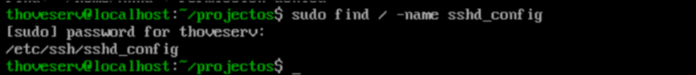

> *(imagem: `find /etc -name '*.conf'` lista os ficheiros de configuração)*

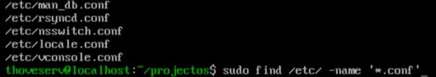

> *(imagem: `locate sshd_config` devolve várias correspondências de caminho)*

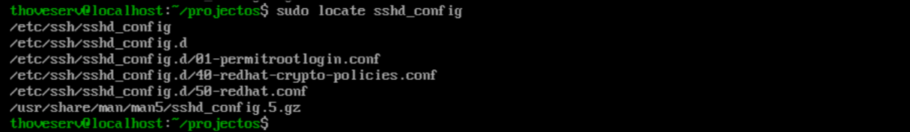

##### **Observações sobre a saída:**

- **`find / -name sshd_config`** percorre todo o sistema, a partir da raiz, à procura de ficheiros cujo **nome seja exactamente** `sshd_config`. Devolve uma única linha: `/etc/ssh/sshd_config`. O `sudo` é necessário porque `find /` atravessa directórios que só o root pode ler, e sem ele apareceriam vários erros de `Permission denied`.

- **`find /etc/ -name '*.conf'`** usa um wildcard, e aqui está o ponto crítico: as **aspas simples** em `'*.conf'` são obrigatórias. Sem elas, a shell tentaria expandir o `*.conf` no directório actual *antes* de o `find` arrancar, e o comando faria outra coisa completamente diferente. Com as aspas, o `*.conf` chega intacto ao `find`, que o interpreta como "qualquer nome terminado em `.conf`". A saída na captura mostra apenas o fim de uma lista mais longa.

- **`locate sshd_config`** resolve o mesmo problema do primeiro comando, mas por uma via oposta, e o contraste é revelador. Onde o `find` devolveu **uma** correspondência, o `locate` devolveu **seis**. A razão: o `locate` procura o termo em **qualquer parte do caminho**, não apenas no nome exacto. Por isso apanhou também o directório `sshd_config.d`, os três ficheiros lá dentro, e até a página de manual `sshd_config.5.gz`. Além disso, foi praticamente instantâneo, porque consultou um índice em vez de percorrer o disco.

- **Quando usar cada um:** o `locate` é imbatível em velocidade e ideal quando não se sabe onde procurar, mas só conhece ficheiros que já existiam na última actualização do seu índice (`updatedb`), e é menos preciso por corresponder ao caminho inteiro. O `find` é mais lento mas encontra sempre tudo, incluindo ficheiros acabados de criar, e permite critérios muito além do nome (tamanho, data, dono, permissões).

> 💡 O contraste entre as capturas 1 e 3 resume a diferença: mesma pesquisa (`sshd_config`), o `find` devolveu a correspondência exacta do nome, o `locate` devolveu tudo o que continha esse texto no caminho. Nenhum está "certo" ou "errado", respondem a perguntas ligeiramente diferentes.

## Parte G — Gestão de pacotes

### Solução Exercício 16

```bash
# 1. Procurar o pacote nos repositórios
$ dnf search tree
...
tree.x86_64 : File system tree viewer
...

# 2. Instalar o pacote
$ sudo dnf install tree
Package tree-2.1.0-8.el10.x86_64 is already installed.
Nothing to do.
Complete!

# 3. Visualizar a estrutura de ~/projectos com o tree
$ tree ~/projectos/
...
391 directories, 1652 files

# 4. Descobrir a que pacote pertence o comando tree
$ rpm -qf /usr/bin/tree
tree-2.1.0-8.el10.x86_64

# 5. Remover o pacote
$ sudo dnf remove tree
...
Removed:
  tree-2.1.0-8.el10.x86_64
Complete!
```

##### **Observações sobre a saída:**

**Procura (`dnf search tree`)**

> *(imagem: resultados de `dnf search tree` agrupados por tipo de correspondência)*

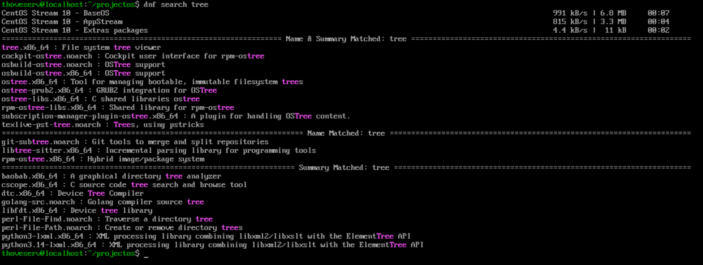

A captura mostra o `dnf` a sincronizar primeiro os metadados dos três repositórios do CentOS Stream 10 (BaseOS, AppStream, Extras) e depois a apresentar os resultados **agrupados por relevância**: "Name & Summary Matched" (o termo aparece no nome e na descrição), "Name Matched" e "Summary Matched". O primeiro resultado, `tree.x86_64 : File system tree viewer`, é o que procuramos. Note-se que a pesquisa não exige `sudo`: consultar os repositórios é uma operação de leitura.

**Instalação (`sudo dnf install tree`)**

> *(imagem: `dnf install` reporta que o pacote já está instalado)*

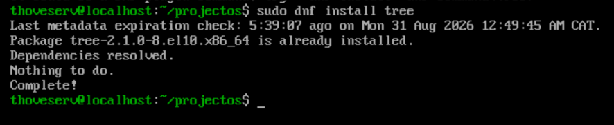

Neste sistema, o `tree` já estava instalado, por ser uma ferramenta comum. O `dnf` reconhece isso (`is already installed`), não faz nada (`Nothing to do`) e termina. Numa instalação real de raiz, o `dnf` apresentaria aqui a transacção completa: o pacote, as dependências, o espaço necessário, e pediria confirmação. A instalação exige `sudo`, porque altera o sistema.

**Utilização (`tree ~/projectos/`)**

> *(imagem: saída do `tree` terminando em 391 directórios e 1652 ficheiros)*

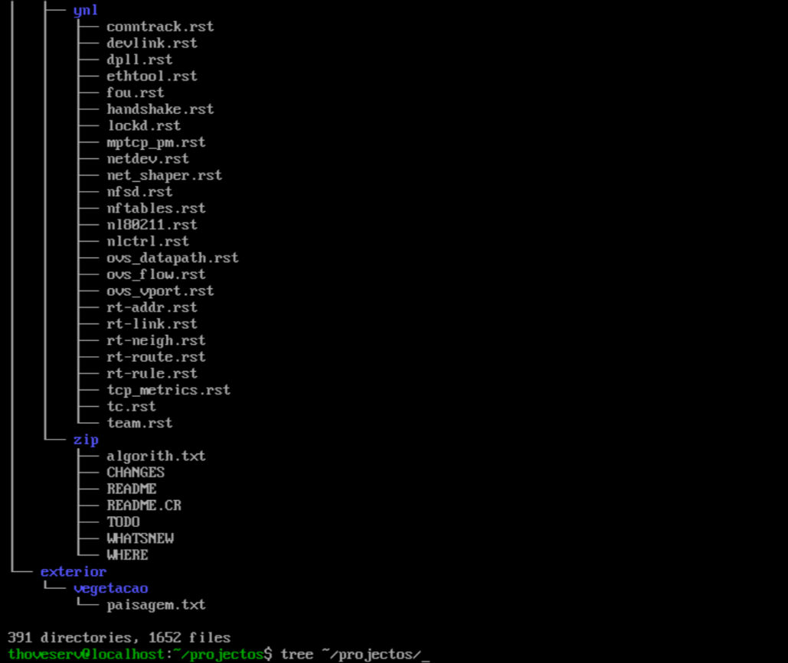

O `tree` mostra a árvore de directórios de forma visual e hierárquica. O total no fim, `391 directories, 1652 files`, é elevado porque `~/projectos` contém a cópia de `/usr/share/doc` feita no Exercício 8. É uma boa demonstração de como o `tree` torna legível uma estrutura que seria confusa com `ls -R`.

**Origem (`rpm -qf /usr/bin/tree`)**

> *(imagem: `rpm -qf` identifica o pacote de origem do comando)*

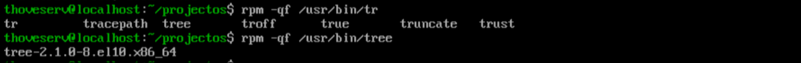

O `rpm -qf` (*query file*) responde à pergunta "de que pacote veio este ficheiro?". Passando-lhe o caminho do executável (`/usr/bin/tree`), devolve o pacote exacto, com versão: `tree-2.1.0-8.el10.x86_64`. É uma consulta de diagnóstico muito útil quando se encontra um ficheiro no sistema e se quer saber de onde veio. (Na captura vê-se também, acima, a lista que a tecla `TAB` gerou ao completar `/usr/bin/tr`.)

**Remoção (`sudo dnf remove tree`)**

> *(imagem: transacção de remoção do `dnf` com resumo e confirmação)*

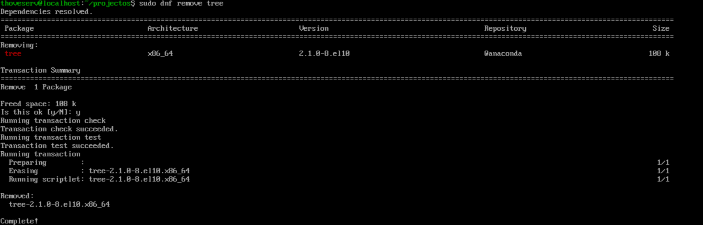

Ao contrário da instalação (que aqui não teve nada a fazer), a remoção mostra a transacção completa: uma tabela com o pacote a remover, a sua versão, o repositório de origem (`@anaconda`, indicando que veio da instalação inicial) e o espaço a libertar (`108 k`). O `dnf` pede confirmação (`Is this ok [y/N]`), executa as verificações de transacção, apaga o pacote e confirma com `Removed` e `Complete!`.

> 💡 Repare na diferença de segurança entre as operações: `dnf search` não precisa de `sudo` (só lê), enquanto `install` e `remove` precisam (alteram o sistema). E note que o `dnf` sempre apresenta o que vai fazer e pede confirmação antes de alterar seja o que for, uma rede de segurança que o `rpm` de baixo nível não oferece.
